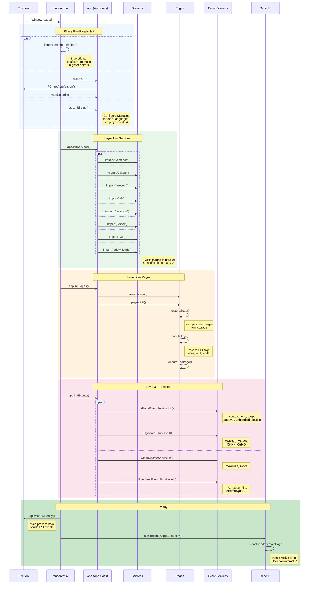

# Bootstrap Sequence

How the renderer window initializes from Electron launch to interactive UI.
Each phase completes before the next starts — no race conditions.



## Guard Flags

Each `init*()` method has a boolean guard preventing re-initialization:

```
_initialized         → app.init()
_setupInitialized    → app.initSetup()
_servicesInitialized → app.initServices()
_pagesInitialized    → app.initPages()
_eventsInitialized   → app.initEvents()
```

## Key Timing Dependencies

- **Services before Pages** — `pages.init()` needs `fs.wait()` to be ready
- **Pages before Events** — `RendererEventsService` needs `pages` to delegate to
- **Events before windowReady** — main process waits for ready signal before sending `eMovePageIn`
- **windowReady before React** — ensures no flash of empty state
