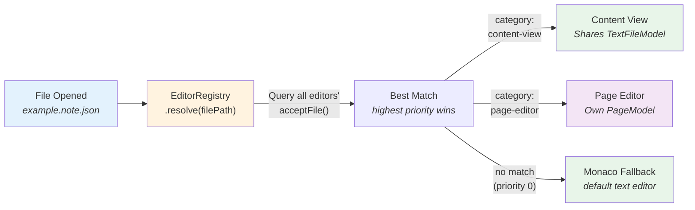
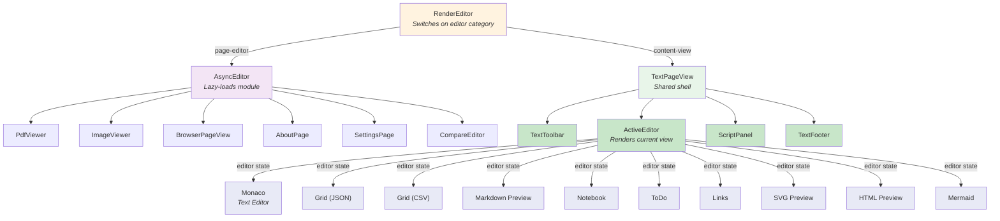
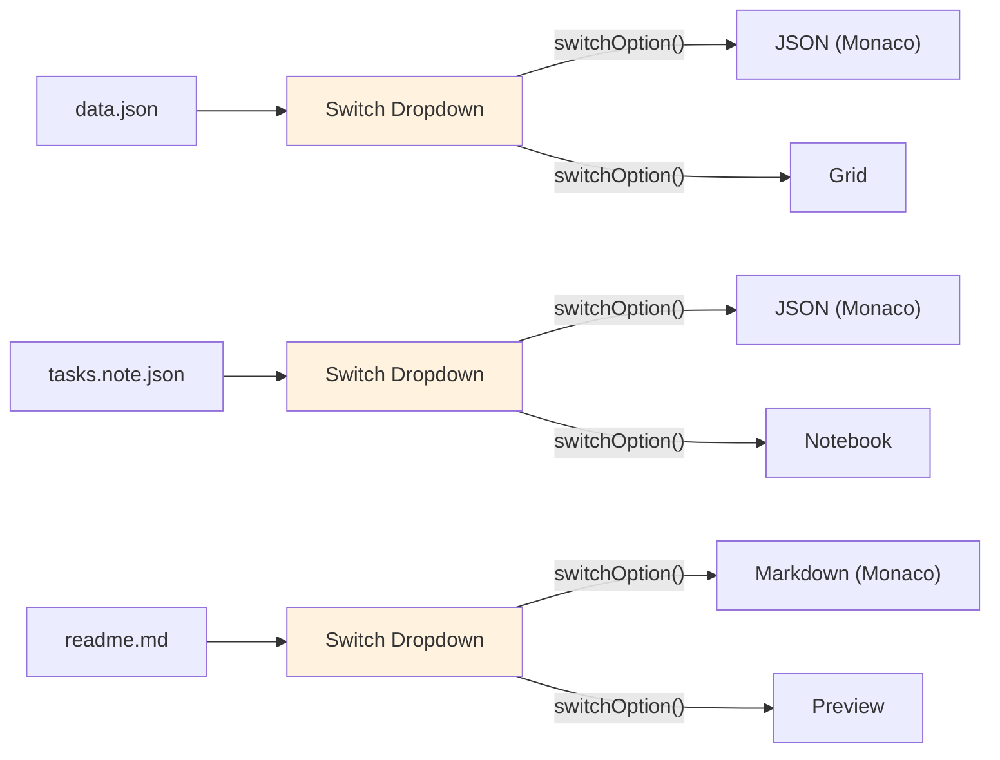

# Editor System

How files are resolved to editors, and how the two editor categories render differently.

## Editor Resolution

## Rendering Architecture

## Resolution Priority

| Priority | Meaning | Example |
|----------|---------|---------|
| **20** | Filename pattern match | `*.note.json` → notebook-view |
| **100** | Extension match | `.pdf` → pdf-view |
| **0** | Default fallback | `*` → monaco |
| **-1** | Not applicable | Editor rejects this file |

## Editor Switch (Content Views Only)

Content views can switch between each other within the same `TextPageView`:

The `page.editor` property on `TextFileModel` state controls which content view renders.
