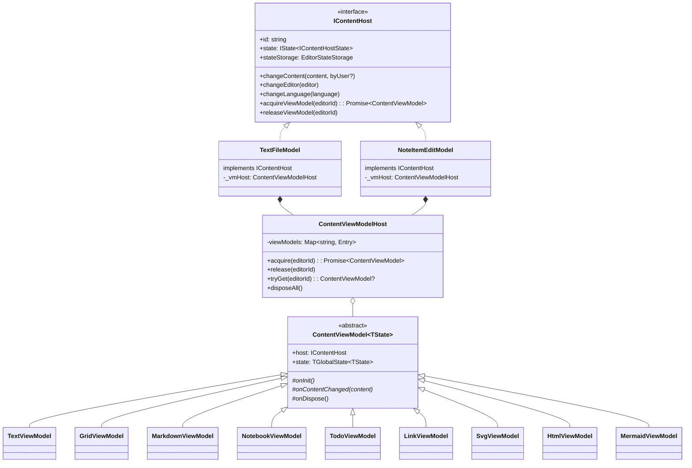
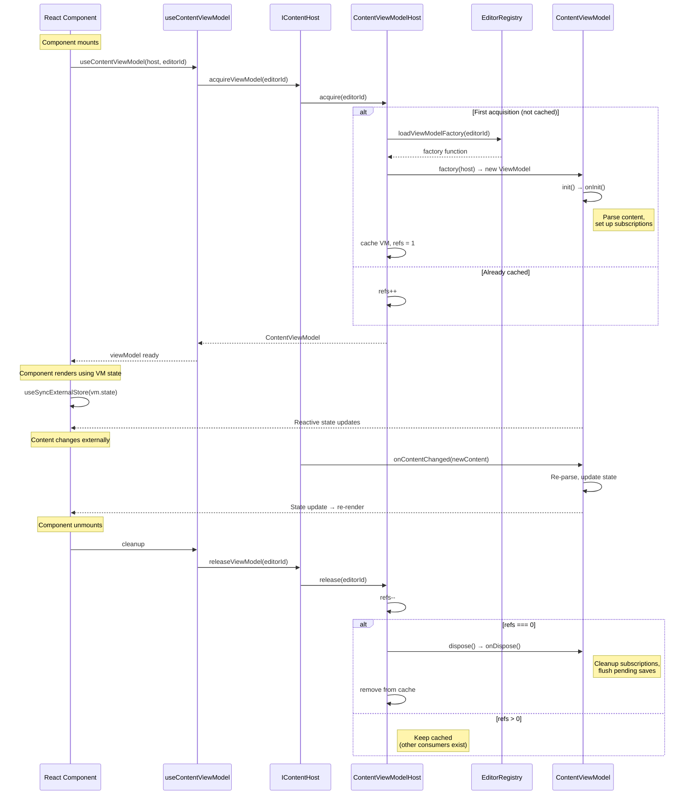
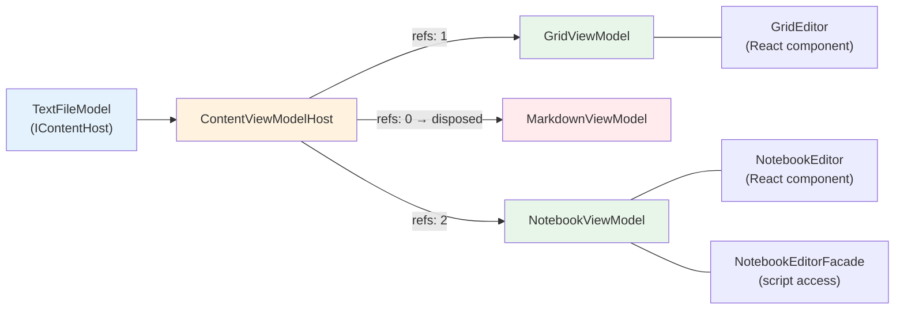

# ContentViewModel Lifecycle

How content-view editors manage their view state through ref-counted ViewModels.

## Class Hierarchy

## Acquire / Release Lifecycle

## Multiple Consumers

A ViewModel can have multiple consumers simultaneously (e.g., NotebookEditor + NotebookEditorFacade):

## Key Rules

1. **Never construct ViewModels directly** — always go through `host.acquireViewModel()`
2. **Always release** — every `acquire` must be paired with a `release`
3. **`tryGet()` doesn't increment refs** — use for read-only peeking (e.g., toolbar state)
4. **`disposeAll()` on host dispose** — TextFileModel calls this when the page tab closes
