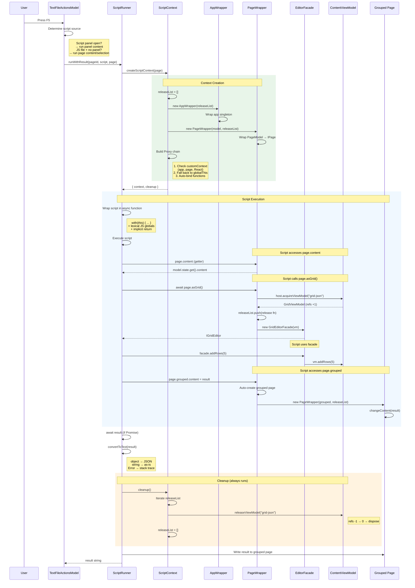
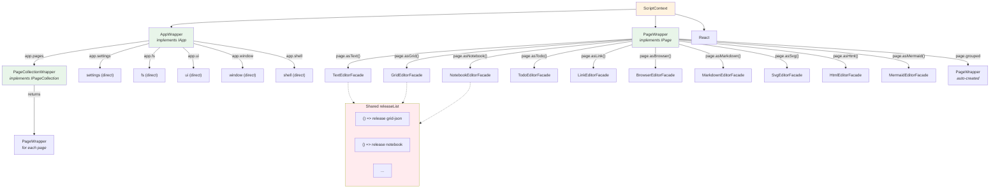
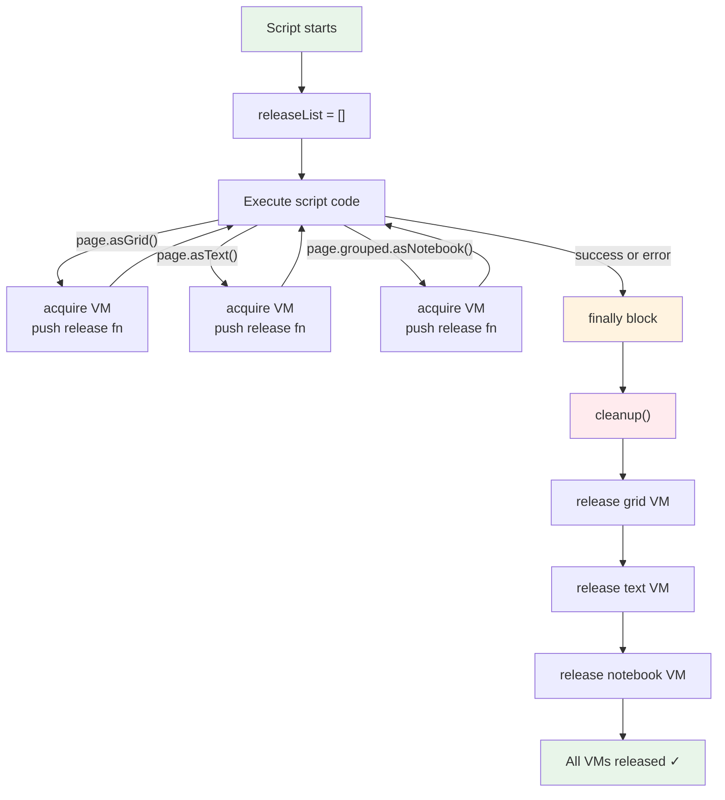

# Script Execution Flow

How a user script goes from F5 keystroke to result display, through wrappers, facades, and auto-cleanup.

## Full Execution Flow

## Wrapper Architecture

## Auto-Release Guarantee

The `finally` block in `ScriptRunner.run()` ensures cleanup runs even if the script throws.
Every ViewModel acquired through any path (direct page, grouped page, app.pages collection) is tracked in the same `releaseList`.
