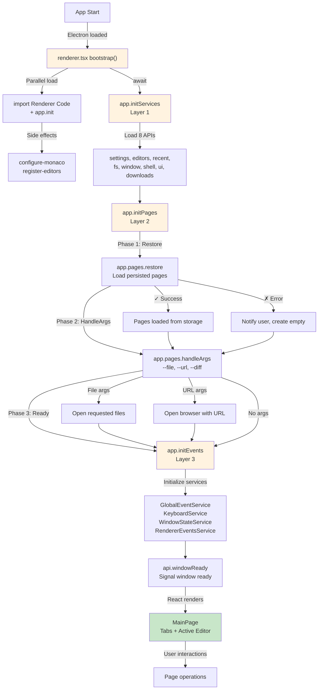
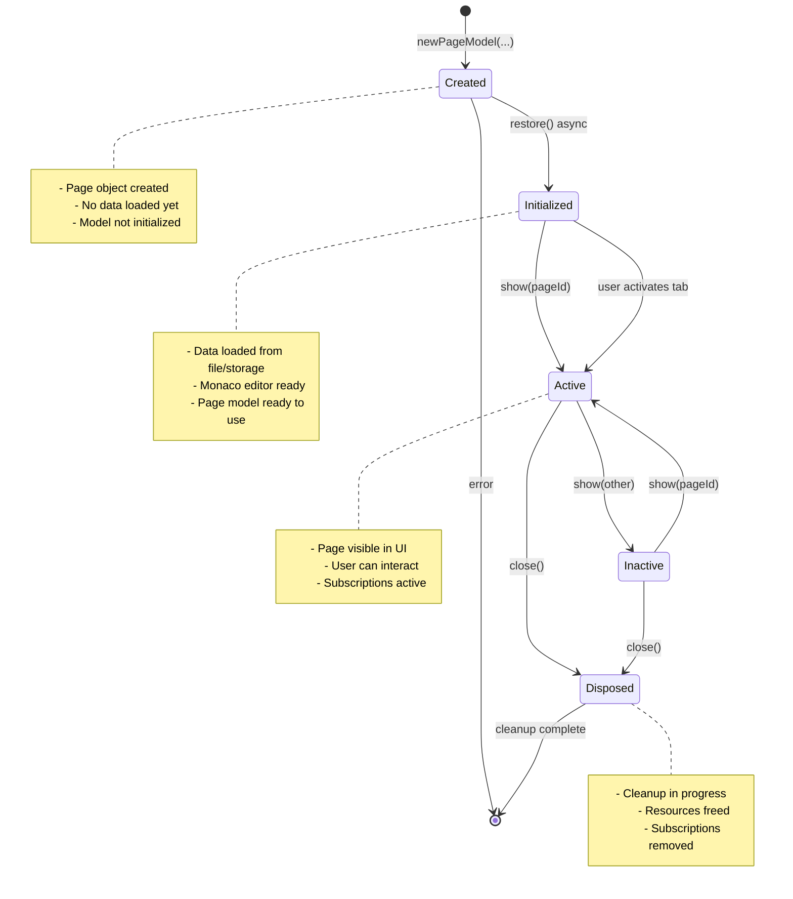
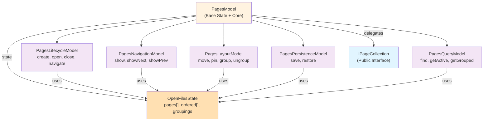

# Pages Architecture

How pages (tabs) work in persephone. Covers the window bootstrap lifecycle,
page lifecycle, action taxonomy, and internal submodel structure.

**Source code:** [`/src/renderer/api/pages/`](../../src/renderer/api/pages/)
**Type declarations:** [`/src/renderer/api/types/pages.d.ts`](../../src/renderer/api/types/pages.d.ts)

---

## 1. Window Bootstrap Lifecycle

The renderer initializes in a strict 3-layer sequence before React renders.
This ensures all systems are ready before the UI appears — no race conditions,
no flash of empty state.



**Layer 1 — Services** (`app.initServices()`): Loads 8 core APIs in parallel via dynamic imports: settings, editors, recent, fs, window, shell, ui, downloads. After this layer, the notification system is ready for error reporting.

**Layer 2 — Pages** (`app.initPages()`): Restores pages from persistent storage, then processes CLI arguments (`--file`, `--url`, `--diff`). Ensures at least one page exists.

**Layer 3 — Events** (`app.initEvents()`): Initializes 4 internal event services (GlobalEventService, KeyboardService, WindowStateService, RendererEventsService) that subscribe to DOM events and IPC channels.

**Ready signal** (`api.windowReady()`): Tells the main process this window is fully initialized. The main process waits for this before sending IPC events like `eMovePageIn` (page transfer between windows). This is critical for multi-window operations.

**Implementation:** [`/src/renderer.tsx`](../../src/renderer.tsx), [`/src/renderer/api/app.ts`](../../src/renderer/api/app.ts)

---

## 2. Page Lifecycle State Machine



**Key transitions:**
- **Created → Initialized:** `restore()` loads content from file or persistent storage. For text files this reads content through the content pipe (primary pipe for source, cache pipe for unsaved modifications). Pipe state (`IPipeDescriptor`) is restored from persisted page state. If no pipe exists (legacy state), one is created from `filePath`.
- **Initialized ↔ Active:** Controlled by `show(pageId)`. Only one page is active at a time (or two when grouped side-by-side).
- **Active/Inactive → Disposed:** `close()` prompts save if modified, then disposes all resources (content pipes, editor model, script context, navigation panel, cache files).

### Close flow detail

The full close chain for a page:

1. `page.close(undefined)` — from `TDialogModel`
2. → `canClose()` — if set (TextPageModel sets it). Calls `confirmRelease(closing: true)` which checks secondary editor models for unsaved changes, then checks the page's own unsaved changes. If the user cancels, returns false and the close is aborted.
3. → `onClose()` — set by `attachPage()` in `PagesModel`
4. → `detachPage(page)` — unsubscribes state listener, clears `onClose` callback
5. → `removePage(page)` — removes from `pages[]` and `ordered[]`
6. → `page.dispose()` — disposes NavigationData (including secondary editor models), content pipes, and deletes cache files

For multi-window transfer, `movePageOut()` calls `detachPage()` (step 4) WITHOUT calling `dispose()` (step 6). This preserves cache files on disk so the target window can reconstruct the page.

**Portal-based rendering:** Pages are rendered through `AppPageManager` (`src/renderer/components/page-manager/AppPageManager.tsx`) using React portals with imperatively managed placeholder divs. Each page gets a stable placeholder that is never destroyed until the page closes. This prevents iframes, webviews, and canvas elements from reloading when pages are closed, reordered, grouped, or ungrouped. Placeholders are never reparented (moved between containers) — grouping is achieved purely via CSS absolute positioning within the same container. See `GroupContainer` and `ImperativeSplitter` in the same folder.

---

## 3. Page Actions Taxonomy

All page operations are categorized into 5 groups, each handled by a dedicated submodel.

```mermaid
graph TD
    API["IPageCollection<br/>(Public API)"]

    API --> Q["Queries<br/>(Read-Only)"]
    API --> L["Lifecycle<br/>(Create/Destroy)"]
    API --> N["Navigation<br/>(Visibility)"]
    API --> LAY["Layout<br/>(Arrangement)"]
    API --> P["Persistence<br/>(Storage)"]

    Q --> Q1["pages: IPage[]"]
    Q --> Q2["active: IPage | null"]
    Q --> Q3["find(id)"]
    Q --> Q4["getGrouped(id)"]

    L --> L1["create(type)→IPage"]
    L --> L2["open(path)→Promise"]
    L --> L3["close(id)→Promise"]
    L --> L4["navigate(id, path)"]

    N --> N1["show(id)"]
    N --> N2["showNext()"]
    N --> N3["showPrev()"]

    LAY --> LAY1["move(id, idx)"]
    LAY --> LAY2["pin(id)"]
    LAY --> LAY3["unpin(id)"]
    LAY --> LAY4["group(l, r)"]
    LAY --> LAY5["ungroup(id)"]

    P --> P1["restore()→Promise"]
    P --> P2["save()→Promise"]

    style API fill:#e1f5ff
    style Q fill:#f3e5f5
    style L fill:#f3e5f5
    style N fill:#f3e5f5
    style LAY fill:#f3e5f5
    style P fill:#f3e5f5
```



**Public interface:** [`/src/renderer/api/types/pages.d.ts`](../../src/renderer/api/types/pages.d.ts) — `IPageCollection` and `IPageInfo`

---

## 4. Internal Submodel Architecture

The pages system uses category-based decomposition. `PagesModel` holds shared state, composes 5 submodels for specific operation categories, and delegates all public methods through a flat API.



**Files:**

| Submodel | File | Responsibility |
|----------|------|----------------|
| Base | [`PagesModel.ts`](../../src/renderer/api/pages/PagesModel.ts) | Shared state (`pages[]`, `ordered[]`, `groupings`), core helpers |
| Lifecycle | [`PagesLifecycleModel.ts`](../../src/renderer/api/pages/PagesLifecycleModel.ts) | create, open, close, navigate, movePageIn/Out |
| Navigation | [`PagesNavigationModel.ts`](../../src/renderer/api/pages/PagesNavigationModel.ts) | show, showNext, showPrev |
| Layout | [`PagesLayoutModel.ts`](../../src/renderer/api/pages/PagesLayoutModel.ts) | moveTab, pin/unpin, group/ungroup |
| Persistence | [`PagesPersistenceModel.ts`](../../src/renderer/api/pages/PagesPersistenceModel.ts) | save/restore window state to disk |
| Query | [`PagesQueryModel.ts`](../../src/renderer/api/pages/PagesQueryModel.ts) | find, activePage, getGrouped, isLastPage |

`PagesModel` delegates all submodel methods as its own (46 public methods). Exported as a singleton:

```typescript
import { pagesModel } from "../api/pages";
```

---

## 5. Internal vs. Public Operations

### Public (in IPageCollection, exposed to scripts)

- `all`, `activePage`, `find()`, `getGrouped()` — queries
- `openFile()`, `addEmpty()`, `addEditor()` — lifecycle
- `show()`, `showNext()`, `showPrevious()` — navigation
- `moveTab()`, `pin()`, `unpin()`, `group()`, `ungroup()` — layout

### Internal (not in .d.ts, private implementation)

- `movePageIn()` / `movePageOut()` — multi-window drag-drop (IPC-driven)
- `attachPage(page)` — subscribes to page state changes for auto-save, sets `onClose` callback that runs the dispose chain (`detachPage` → `removePage` → `dispose`)
- `detachPage(page)` — unsubscribes and clears `onClose` WITHOUT disposing. Used by `movePageOut()` (multi-window transfer) and `navigatePageTo()` to preserve page resources
- `removePage(page)` — removes from `pages[]` and `ordered[]` arrays
- `fixGrouping()` / `fixCompareMode()` — invariant repair
- `checkEmptyPage()` — auto-create empty page when last one closes
- `addEmptyPageWithNavPanel(folderPath)` — creates an empty page with a pre-attached NavigationData (used by sidebar double-click and archive browsing). Intentionally skips `restore()` to avoid a race condition where the async restore would see `hasNavigator=true` and create a new NavigationData that overwrites the one we just attached.
- `openFileAsArchive(filePath)` — opens an archive for browsing. Creates an empty page with NavigationData root set to the archive root. Reuses existing tab if the archive is already open. ZIP archives use `!` separator (e.g., `doc.zip!word/document.xml`) via `archive-service.ts`; `.asar` archives use the regular path directly (e.g., `app.asar`) via Electron's native fs patching — see `file-path.ts`.
- `save()` / `restore()` — persistence (called by bootstrap, not by scripts)
- Submodel instances — private composition detail

---

## 6. Error Handling

```
During restore (initialization):  catch and notify, don't crash
During user actions:              throw, let caller handle
```

- **Initialization errors** (restore, handleArgs): caught in `app.initPages()`, user gets a notification, an empty page is created as fallback.
- **User action errors** (open file, navigate): the method throws, and the caller (keyboard service, renderer events service, or UI component) catches and shows a notification.

---

## 7. Multi-Window Page Transfer

When a tab is dragged to another window:

1. **Tab drag** — `PageTab.handleDragEnd()` detects the drop landed outside the window bounds. Sends `PageDragData` to the main process via `api.addDragEvent()`.
2. **Main process** — `DragModel` collects drag events (debounced 100ms) from source and target windows, then calls `movePageToWindow()` in [`open-windows.ts`](../../src/main/open-windows.ts).
3. **Source window** — receives `eMovePageOut` IPC event:
   - `movePageOut(pageId)` calls `page.saveState()` to flush NavigationData cache to disk
   - Calls `detachPage()` — unsubscribes but does NOT dispose. **Cache files survive.**
   - Calls `removePage()` — removes from arrays
4. **Target window** — receives `eMovePageIn` IPC event (main process awaits `whenReady` first):
   - `movePageIn(data)` creates a new PageModel from the serialized `Partial<IPageState>`
   - Calls `applyRestoreData()` — reconstructs pipe from descriptor, restores `sourceLink`
   - Calls `restore()` — reads content through pipe; if `hasNavigator` is set, creates new `NavigationData` and restores from the **same cache files** using the page ID

**Why it works:** Cache files are keyed by page ID. The source window preserves them (no `dispose()`), and the target window reads them using the same ID. NavigationData (including tree expansion, search state, secondary descriptors, and secondary editor model descriptors) is fully reconstructed from cache.

**Critical dependency:** The target window must have called `api.windowReady()` before the main process sends `eMovePageIn`. The main process holds a `whenReady` promise per window and awaits it before forwarding events.

**Implementation:** [`/src/main/open-windows.ts`](../../src/main/open-windows.ts) (main process), [`/src/main/drag-model.ts`](../../src/main/drag-model.ts) (debouncing), [`PagesLifecycleModel.ts`](../../src/renderer/api/pages/PagesLifecycleModel.ts) (renderer), [`PageTab.tsx`](../../src/renderer/ui/tabs/PageTab.tsx) (drag handlers)

## 8. Well-Known Pages

Some pages are **singletons** — they should exist as a single instance and be found by a stable ID rather than a random UUID. The well-known pages system provides this.

**Source:** [`/src/renderer/api/pages/well-known-pages.ts`](../../src/renderer/api/pages/well-known-pages.ts)

### How it works

1. **Registry:** Well-known pages are defined in `well-known-pages.ts` with a fixed ID, editor, language, and title:
   ```typescript
   registerWellKnownPage({
       id: "mcp-ui-log",
       editor: "log-view",
       language: "jsonl",
       title: "MCP Log",
   });
   ```

2. **Get-or-create:** Use `pagesModel.requireWellKnownPage(id)` to get the page:
   - If a page with this ID exists → focuses and returns it
   - If not → creates a new page with the predefined config and the well-known ID (not a UUID)
   - The existing `addPage()` deduplication ensures no duplicates

3. **Session restore:** Well-known pages are persisted with their fixed ID. On restore, they're recreated with the same ID. Next `requireWellKnownPage()` call finds the restored page.

### Current well-known pages

| ID | Editor | Purpose |
|----|--------|---------|
| `mcp-ui-log` | `log-view` | MCP `ui_push` log — shared between MCP handler and script execution |
| `mcp-server-log` | `log-view` | MCP server incoming request log — logs every incoming MCP command with method, params, result, error, duration. Capped at 200 entries. Opened by clicking the MCP indicator in the title bar. |

### Pre-existing singleton pages

About and Settings pages use a similar pattern with hardcoded IDs directly in their modules:
- `ABOUT_PAGE_ID = "about-page"` in `AboutPage.tsx`
- `SETTINGS_PAGE_ID = "settings-page"` in `SettingsPage.tsx`

These work as singletons through the same `addPage()` deduplication — `newEmptyPageModel()` always creates with the same ID.

### When to use well-known pages

Use this pattern when:
- A page should be a **singleton** (one instance at a time)
- Multiple code paths need to **find the same page** (e.g., MCP handler and ScriptContext both need the same log page)
- The page has a **fixed configuration** (editor, language, title) that callers shouldn't need to know

Do NOT use for:
- User-created pages (scripts, file open) — these should have unique UUIDs
- Pages that can be opened multiple times (browser tabs, text files)

### Adding a new well-known page

1. Add a `registerWellKnownPage()` call in `well-known-pages.ts`
2. Use `await pagesModel.requireWellKnownPage("your-id")` wherever you need the page
3. No other changes needed — `addPage()` handles deduplication automatically

**Note:** `requireWellKnownPage` is an internal API — not exposed to scripts or the MCP handler's `create_page` command.

---

## 9. NavigationData — Stable Browsing Context

NavigationData is a long-lived object that **survives page navigation**. It holds the sidebar state: tree providers, panel selection, search state, and secondary editors.

**Source:** [`/src/renderer/ui/navigation/NavigationData.ts`](../../src/renderer/ui/navigation/NavigationData.ts)

### Lifecycle

1. **Created** when a page first opens with a navigator (Folder View toggle, archive open, or restored from session)
2. **Transferred** during `navigatePageTo()` — detached from the old model (before dispose), attached to the new model (after creation). NavigationData is NOT recreated; the same instance moves between page models.
3. **Persisted** to cache files via `flushSave()` (debounced). Restored by page ID on app restart or multi-window transfer.
4. **Disposed** when the tab closes: `PageModel.dispose()` → `NavigationData.dispose()` → disposes tree providers, secondary providers, and secondary editor models.

### What it owns

```
NavigationData
  ├── treeProvider              // Primary FileTreeProvider (Explorer panel)
  ├── selectionState            // TOneState — reactive, shared between PageNavigator and CategoryEditor
  ├── treeState                 // Tree expansion state (persisted)
  ├── secondaryDescriptor       // Archive metadata (type, sourceUrl, label)
  ├── secondaryProvider         // Lazily created ZipTreeProvider
  ├── secondarySelectionState   // Separate reactive selection for secondary panel
  ├── secondaryTreeState        // Secondary tree expansion state
  ├── secondaryModels[]         // Secondary editor PageModel instances (EPIC-016)
  ├── activePanel               // "explorer", "search", "secondary", or a secondary model ID
  ├── searchState               // FileSearch state (query, results, filters)
  └── pageNavigatorModel        // Sidebar open/close/width state
```

### Navigation transfer pattern

In `navigatePageTo()` ([`PagesLifecycleModel.ts`](../../src/renderer/api/pages/PagesLifecycleModel.ts)):

```
1. navigationData = oldModel.navigationData    // extract reference
2. ... create newModel (with sourceLink) ...
3. oldModel.beforeNavigateAway(newModel)       // old model decides to keep/clear secondaryEditor
4. survivesAsSecondary = navigationData.secondaryModels.includes(oldModel)
5. oldModel.navigationData = null              // detach (prevents dispose)
6. if (!survivesAsSecondary) oldModel.dispose()  // skip dispose if model survives in sidebar
7. detachPage(oldModel)
8. newModel.navigationData = navigationData    // transfer
9. navigationData.updateId(newModel.id)        // update cache key
```

The `beforeNavigateAway(newModel)` hook (step 3) lets the old model inspect `newModel.sourceLink` to decide whether to keep itself as a secondary editor. The base implementation clears `secondaryEditor` (model is removed and disposed). Subclasses like ZipPageModel override to check `newModel.sourceLink?.metadata?.sourceId === this.id` — if the new page was opened from this archive, the zip tree panel survives.

---

## 10. Secondary Editor Models (EPIC-016)

NavigationData holds a `secondaryModels[]` array of full PageModel instances that act as sidebar editors. These survive page navigation (same as NavigationData itself) and provide richer functionality than standalone tree providers.

### PageModel integration

The `secondaryEditor` getter/setter on PageModel manages membership automatically:
- **Set** `model.secondaryEditor = "zip-tree"` → adds the model to `secondaryModels[]`
- **Clear** `model.secondaryEditor = undefined` → removes the model from `secondaryModels[]` (without dispose)

The `beforeNavigateAway(newModel)` lifecycle hook is called during `navigatePageTo()`. The base implementation clears `secondaryEditor`; subclasses override to conditionally keep their secondary editor based on `newModel.sourceLink`.

### Management API

- `addSecondaryModel(model)` — adds a page model to the array
- `removeSecondaryModel(model)` — removes, disposes, and falls back `activePanel` if needed
- `removeSecondaryModelWithoutDispose(model)` — removes without disposing (used by `secondaryEditor` setter when clearing)
- `findSecondaryModel(pageId)` — lookup by page ID
- `confirmSecondaryRelease()` — iterates models with unsaved changes, prompts user via `confirmRelease()`
- `restoreSecondaryModels(ownerModel)` — restores from `pendingSecondaryDescriptors`, deduplicates against the owner model

### Secondary Editor Registry

**Source:** [`/src/renderer/ui/navigation/secondary-editor-registry.ts`](../../src/renderer/ui/navigation/secondary-editor-registry.ts)

Maps `secondaryEditor` string values to React sidebar components via dynamic imports. Each registration provides an `id`, `label`, and `loadComponent()` factory. PageNavigator uses this registry to resolve which sidebar component to render for each secondary model.

### Persistence

Secondary model state is saved as descriptors (`SecondaryModelDescriptor[]`) in the NavigationData cache. Each descriptor contains the model's serialized `IPageState` (from `getRestoreData()`). On restore, descriptors are stored as `pendingSecondaryDescriptors`. `restoreSecondaryModels(ownerModel)` processes them — if a descriptor's ID matches the owner page, the existing instance is reused (no duplicate).

### Dispose

When a tab closes, `NavigationData.dispose()` disposes all secondary models. Before dispose, `confirmSecondaryRelease()` checks for unsaved changes — this is called via `PageModel.confirmRelease(closing: true)` in the tab close flow.
