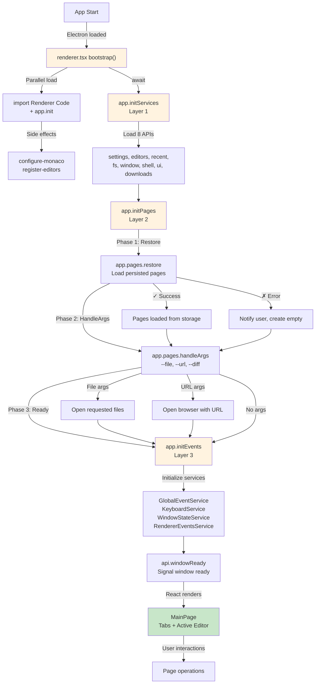
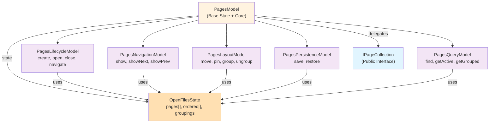

# Pages Architecture

How pages (tabs) work in persephone. Covers the window bootstrap lifecycle,
page lifecycle, action taxonomy, and internal submodel structure.

**Source code:** [`/src/renderer/api/pages/`](../../src/renderer/api/pages/)
**Type declarations:** [`/src/renderer/api/types/pages.d.ts`](../../src/renderer/api/types/pages.d.ts)

---

## 1. Window Bootstrap Lifecycle

The renderer initializes in a strict 3-layer sequence before React renders.
This ensures all systems are ready before the UI appears — no race conditions,
no flash of empty state.



**Layer 1 — Services** (`app.initServices()`): Loads 8 core APIs in parallel via dynamic imports: settings, editors, recent, fs, window, shell, ui, downloads. After this layer, the notification system is ready for error reporting.

**Layer 2 — Pages** (`app.initPages()`): Restores pages from persistent storage, then processes CLI arguments (`--file`, `--url`, `--diff`). Ensures at least one page exists.

**Layer 3 — Events** (`app.initEvents()`): Initializes 4 internal event services (GlobalEventService, KeyboardService, WindowStateService, RendererEventsService) that subscribe to DOM events and IPC channels.

**Ready signal** (`api.windowReady()`): Tells the main process this window is fully initialized. The main process waits for this before sending IPC events like `eMovePageIn` (page transfer between windows). This is critical for multi-window operations.

**Implementation:** [`/src/renderer.tsx`](../../src/renderer.tsx), [`/src/renderer/api/app.ts`](../../src/renderer/api/app.ts)

---

## 2. Page/Editor Architecture

**Diagram:** [`diagrams/6-page-architecture.mmd`](diagrams/6-page-architecture.mmd)

Every tab is a `PageModel` — a stable container that owns the browsing context (sidebar, secondary editors) and contains an `EditorModel` as its main content.

```
PageModel (one per tab — stable identity, never changes during navigation)
├── id: string                          // stable UUID — tab key, React key, cache key
├── state: TOneState<IPageState>        // reactive: { pinned, hasSidebar, mainEditorId }
├── mainEditor: EditorModel | null      // the content (swapped during navigation)
├── secondaryEditors: EditorModel[]     // sidebar panels (ExplorerEditorModel, ZipEditorModel, etc.)
├── pageNavigatorModel                  // sidebar open/close/width
├── activePanel: string                 // which panel is expanded
├── findExplorer() / createExplorer()   // ExplorerEditorModel helpers
├── toggleNavigator() / canOpenNavigator() // sidebar toggle (creates Explorer if needed)
├── close()                             // checks unsaved changes, calls onClose
├── dispose()                           // disposes all owned resources
└── saveState() / restoreSidebar()      // persistence

EditorModel (the content inside a page — replaceable during navigation)
├── id: string                          // editor instance identity
├── state: TOneState<IEditorState>      // editor state (content, language, filePath, pipe, etc.)
├── page: PageModel | null              // back-reference to containing page
├── pipe: IContentPipe                  // content source
├── modified: boolean                   // has unsaved changes
├── setPage(page) / onMainEditorChanged() // lifecycle hooks
├── beforeNavigateAway(newEditor)       // secondary survival check
├── restore() / dispose()               // editor lifecycle
└── getRestoreData() / applyRestoreData() // serialization
```

**Source:** [`PageModel.ts`](../../src/renderer/api/pages/PageModel.ts), [`EditorModel.ts`](../../src/renderer/editors/base/EditorModel.ts)

### Page lifecycle

- **Created:** `new PageModel()` + `page.mainEditor = editor` + `editor.setPage(page)` (or `mainEditor = null` for empty pages with sidebar only)
- **Initialized:** `editor.restore()` loads content; `page.restoreSidebar()` loads sidebar from cache
- **Active/Inactive:** `show(pageId)` moves page to end of `ordered[]`
- **Navigation:** `await page.setMainEditor(newEditor)` — full lifecycle swap (beforeNavigateAway, dispose old, notify secondaries)
- **Closed:** `page.close()` → checks unsaved → `onClose()` → `detachPage` → `removePage` → `page.dispose()`

### Close flow detail

1. `page.close()` — on PageModel
2. → `confirmSecondaryRelease()` — checks secondary editors for unsaved changes
3. → `mainEditor.confirmRelease()` — checks main editor (TextFileModel prompts save dialog)
4. → `onClose()` — set by `attachPage()` in PagesModel
5. → `detachPage(page)` — unsubscribes state listeners, clears `onClose`
6. → `removePage(page)` — removes from `pages[]` and `ordered[]`
7. → `page.dispose()` — disposes secondary editors, tree providers, navigator model, then main editor (content pipes, cache files)

For multi-window transfer, `movePageOut()` calls `detachPage()` WITHOUT calling `dispose()`. Cache files survive for the target window.

**Portal-based rendering:** Pages are rendered through `AppPageManager` (`src/renderer/components/page-manager/AppPageManager.tsx`) using React portals with imperatively managed placeholder divs. Each page gets a stable placeholder that is never destroyed until the page closes. This prevents iframes, webviews, and canvas elements from reloading when pages are closed, reordered, grouped, or ungrouped. Placeholders are never reparented (moved between containers) — grouping is achieved purely via CSS absolute positioning within the same container. See `GroupContainer` and `ImperativeSplitter` in the same folder.

---

## 3. Page Actions Taxonomy

All page operations are categorized into 5 groups, each handled by a dedicated submodel.

```mermaid
graph TD
    API["IPageCollection<br/>(Public API)"]

    API --> Q["Queries<br/>(Read-Only)"]
    API --> L["Lifecycle<br/>(Create/Destroy)"]
    API --> N["Navigation<br/>(Visibility)"]
    API --> LAY["Layout<br/>(Arrangement)"]
    API --> P["Persistence<br/>(Storage)"]

    Q --> Q1["pages: IPage[]"]
    Q --> Q2["active: IPage | null"]
    Q --> Q3["find(id)"]
    Q --> Q4["getGrouped(id)"]

    L --> L1["create(type)→IPage"]
    L --> L2["open(path)→Promise"]
    L --> L3["close(id)→Promise"]
    L --> L4["navigate(id, path)"]

    N --> N1["show(id)"]
    N --> N2["showNext()"]
    N --> N3["showPrev()"]

    LAY --> LAY1["move(id, idx)"]
    LAY --> LAY2["pin(id)"]
    LAY --> LAY3["unpin(id)"]
    LAY --> LAY4["group(l, r)"]
    LAY --> LAY5["ungroup(id)"]

    P --> P1["restore()→Promise"]
    P --> P2["save()→Promise"]

    style API fill:#e1f5ff
    style Q fill:#f3e5f5
    style L fill:#f3e5f5
    style N fill:#f3e5f5
    style LAY fill:#f3e5f5
    style P fill:#f3e5f5
```



**Public interface:** [`/src/renderer/api/types/pages.d.ts`](../../src/renderer/api/types/pages.d.ts) — `IPageCollection` and `IPageInfo`

---

## 4. Internal Submodel Architecture

The pages system uses category-based decomposition. `PagesModel` holds shared state, composes 5 submodels for specific operation categories, and delegates all public methods through a flat API.



**Files:**

| Submodel | File | Responsibility |
|----------|------|----------------|
| Base | [`PagesModel.ts`](../../src/renderer/api/pages/PagesModel.ts) | Shared state (`pages[]`, `ordered[]`, `groupings`), core helpers |
| Lifecycle | [`PagesLifecycleModel.ts`](../../src/renderer/api/pages/PagesLifecycleModel.ts) | create, open, close, navigate, movePageIn/Out |
| Navigation | [`PagesNavigationModel.ts`](../../src/renderer/api/pages/PagesNavigationModel.ts) | show, showNext, showPrev |
| Layout | [`PagesLayoutModel.ts`](../../src/renderer/api/pages/PagesLayoutModel.ts) | moveTab, pin/unpin, group/ungroup |
| Persistence | [`PagesPersistenceModel.ts`](../../src/renderer/api/pages/PagesPersistenceModel.ts) | save/restore window state to disk |
| Query | [`PagesQueryModel.ts`](../../src/renderer/api/pages/PagesQueryModel.ts) | find (by any ID: page, mainEditor, or secondary), activePage, getGrouped, isLastPage |

`PagesModel` delegates all submodel methods as its own (46 public methods). Exported as a singleton:

```typescript
import { pagesModel } from "../api/pages";
```

---

## 5. Internal vs. Public Operations

### Public (in IPageCollection, exposed to scripts)

- `all`, `activePage`, `find()`, `getGrouped()` — queries
- `openFile()`, `addEmpty()`, `addEditor()` — lifecycle
- `show()`, `showNext()`, `showPrevious()` — navigation
- `moveTab()`, `pin()`, `unpin()`, `group()`, `ungroup()` — layout

### Internal (not in .d.ts, private implementation)

- `movePageIn()` / `movePageOut()` — multi-window drag-drop (IPC-driven)
- `attachPage(page)` — subscribes to page state changes for auto-save, sets `onClose` callback that runs the dispose chain (`detachPage` → `removePage` → `dispose`)
- `detachPage(page)` — unsubscribes and clears `onClose` WITHOUT disposing. Used by `movePageOut()` (multi-window transfer) and `navigatePageTo()` to preserve page resources
- `removePage(page)` — removes from `pages[]` and `ordered[]` arrays
- `fixGrouping()` / `fixCompareMode()` — invariant repair
- `checkEmptyPage()` — auto-create empty page when last one closes
- `addEmptyPageWithNavPanel(folderPath)` — creates a PageModel with `mainEditor = null` and an initialized sidebar (Explorer panel). Used by sidebar double-click and archive browsing. The page renders just the sidebar with an empty content area.
- `openFileAsArchive(filePath)` — opens an archive for browsing. Creates a PageModel with sidebar root set to the archive root. Reuses existing tab if the archive is already open. ZIP archives use `!` separator (e.g., `doc.zip!word/document.xml`) via `archive-service.ts`; `.asar` archives use the regular path directly (e.g., `app.asar`) via Electron's native fs patching — see `file-path.ts`.
- `save()` / `restore()` — persistence (called by bootstrap, not by scripts)
- Submodel instances — private composition detail

---

## 6. Error Handling

```
During restore (initialization):  catch and notify, don't crash
During user actions:              throw, let caller handle
```

- **Initialization errors** (restore, handleArgs): caught in `app.initPages()`, user gets a notification, an empty page is created as fallback.
- **User action errors** (open file, navigate): the method throws, and the caller (keyboard service, renderer events service, or UI component) catches and shows a notification.

### ID resolution

`PagesQueryModel.findPage(id)` accepts any associated ID — page ID, mainEditor ID, or secondary editor ID. All IDs are unique UUIDs, so this is unambiguous. Methods like `getGroupedPage()`, `groupTabs()`, and `isGrouped()` resolve their inputs through `findPage()` first, so callers don't need to worry about which ID type they're passing. This eliminates a class of bugs where code passes editor IDs to methods that internally use page IDs for grouping map lookups.

---

## 7. Multi-Window Page Transfer

When a tab is dragged to another window:

1. **Tab drag** — `PageTab.handleDragEnd()` detects the drop landed outside the window bounds. Sends `PageDragData` to the main process via `api.addDragEvent()`.
2. **Main process** — `DragModel` collects drag events (debounced 100ms) from source and target windows, then calls `movePageToWindow()` in [`open-windows.ts`](../../src/main/open-windows.ts).
3. **Source window** — receives `eMovePageOut` IPC event:
   - `movePageOut(pageId)` calls `page.saveState()` to flush sidebar cache to disk
   - Calls `detachPage()` — unsubscribes but does NOT dispose. **Cache files survive.**
   - Calls `removePage()` — removes from arrays
4. **Target window** — receives `eMovePageIn` IPC event with `PageDescriptor` (main process awaits `whenReady` first):
   - `movePageIn(data)` creates a new PageModel with the **same page ID** from the descriptor
   - Creates an EditorModel from `desc.editor`, calls `applyRestoreData()` and `restore()`
   - If `desc.hasSidebar`, restores sidebar from cache (keyed by page ID) including secondary editors

**Why it works:** The `PageDragData` sent by `PageTab.getDragData()` includes a full `PageDescriptor` with `id`, `pinned`, `modified`, `hasSidebar`, and serialized editor state. Cache files are keyed by page ID. The source window preserves them (no `dispose()`), and the target window reads them using the same ID. Sidebar state (tree expansion, search, secondary editor descriptors) is fully reconstructed from cache. The page ID is preserved across the transfer.

**Critical dependency:** The target window must have called `api.windowReady()` before the main process sends `eMovePageIn`. The main process holds a `whenReady` promise per window and awaits it before forwarding events.

**Implementation:** [`/src/main/open-windows.ts`](../../src/main/open-windows.ts) (main process), [`/src/main/drag-model.ts`](../../src/main/drag-model.ts) (debouncing), [`PagesLifecycleModel.ts`](../../src/renderer/api/pages/PagesLifecycleModel.ts) (renderer), [`PageTab.tsx`](../../src/renderer/ui/tabs/PageTab.tsx) (drag handlers)

## 8. Well-Known Pages

Some pages are **singletons** — they should exist as a single instance and be found by a stable ID rather than a random UUID. The well-known pages system provides this.

**Source:** [`/src/renderer/api/pages/well-known-pages.ts`](../../src/renderer/api/pages/well-known-pages.ts)

### How it works

1. **Registry:** Well-known pages are defined in `well-known-pages.ts` with a fixed ID, editor, language, and title:
   ```typescript
   registerWellKnownPage({
       id: "mcp-ui-log",
       editor: "log-view",
       language: "jsonl",
       title: "MCP Log",
   });
   ```

2. **Get-or-create:** Use `pagesModel.requireWellKnownPage(id)` to get the page:
   - If a page with this ID exists → focuses and returns it
   - If not → creates a new page with the predefined config and the well-known ID (not a UUID)
   - The existing `addPage()` deduplication ensures no duplicates

3. **Session restore:** Well-known pages are persisted with their fixed ID. On restore, they're recreated with the same ID. Next `requireWellKnownPage()` call finds the restored page.

### Current well-known pages

| ID | Editor | Purpose |
|----|--------|---------|
| `mcp-ui-log` | `log-view` | MCP `ui_push` log — shared between MCP handler and script execution |
| `mcp-server-log` | `log-view` | MCP server incoming request log — logs every incoming MCP command with method, params, result, error, duration. Capped at 200 entries. Opened by clicking the MCP indicator in the title bar. |

### Pre-existing singleton pages

About and Settings pages use a similar pattern with hardcoded IDs directly in their modules:
- `ABOUT_PAGE_ID = "about-page"` in `AboutPage.tsx`
- `SETTINGS_PAGE_ID = "settings-page"` in `SettingsPage.tsx`

These work as singletons through the same `addPage()` deduplication — `newEmptyEditorModel()` always creates with the same ID.

### When to use well-known pages

Use this pattern when:
- A page should be a **singleton** (one instance at a time)
- Multiple code paths need to **find the same page** (e.g., MCP handler and ScriptContext both need the same log page)
- The page has a **fixed configuration** (editor, language, title) that callers shouldn't need to know

Do NOT use for:
- User-created pages (scripts, file open) — these should have unique UUIDs
- Pages that can be opened multiple times (browser tabs, text files)

### Adding a new well-known page

1. Add a `registerWellKnownPage()` call in `well-known-pages.ts`
2. Use `await pagesModel.requireWellKnownPage("your-id")` wherever you need the page
3. No other changes needed — `addPage()` handles deduplication automatically

**Note:** `requireWellKnownPage` is an internal API — not exposed to scripts or the MCP handler's `create_page` command.

---

## 9. PageModel — Sidebar and Navigation Context

PageModel is the tab container that owns the sidebar layout (open/close/width via `pageNavigatorModel`), panel selection (`activePanel`), and secondary editors. Explorer state (tree provider, selection, search) is owned by `ExplorerEditorModel` in `secondaryEditors[]`. PageModel survives navigation — when the user navigates to a new file, only `page.mainEditor` changes while the PageModel (and its sidebar) stays intact.

**Source:** [`/src/renderer/api/pages/PageModel.ts`](../../src/renderer/api/pages/PageModel.ts)

### Navigation pattern

In `navigatePageTo()` ([`PagesLifecycleModel.ts`](../../src/renderer/api/pages/PagesLifecycleModel.ts)):

```
1. page = findPage(pageId)                    // PageModel stays in arrays
2. oldEditor.confirmRelease()                 // check for unsaved changes
3. ... create newEditor (with sourceLink) ...
4. await page.setMainEditor(newEditor)        // full lifecycle swap (see below)
5. resubscribeEditor(page)                    // re-subscribe for persistence
6. auto-select preview editor (if textFile)
7. onShow / onFocus / saveState
```

**Step 4** — `page.setMainEditor(newEditor)` is the high-level editor swap method on PageModel. It consolidates the lifecycle:
- Calls `oldEditor.beforeNavigateAway(newEditor)` — old editor decides to keep/clear its `secondaryEditor`
- Checks secondary survival: if old editor is in `secondaryEditors[]`, it's kept alive
- Otherwise, defers old editor disposal (`setTimeout` to let React unmount the view first)
- Sets `newEditor.setPage(page)`, updates `mainEditorId` for UI re-render
- Calls `notifyMainEditorChanged()` — secondary editors react, cleanup runs
- Registers new editor's secondary panel if it has one

**Note:** The raw `mainEditor` setter (without lifecycle) is still used for low-level operations: persistence restore, `addPage()`, and `dispose()`. `setMainEditor()` is the high-level method for navigation.

**`beforeNavigateAway(newEditor)`** lets the old editor inspect `newEditor.sourceLink` to decide whether to keep itself as a secondary editor. The base implementation clears `secondaryEditor`. Subclasses like ZipEditorModel override to check `newEditor.sourceLink?.metadata?.sourceId === this.id`.

**`notifyMainEditorChanged()`** calls `onMainEditorChanged(newMainEditor)` on each secondary editor. Each editor reacts independently: ExplorerEditorModel clears selection if the new editor wasn't opened from Explorer, ZipEditorModel checks if the new main editor was opened from its archive — if not, it clears `secondaryEditor` and is cleaned up.

---

## 10. Secondary Editor System

PageModel holds a `secondaryEditors[]` array of EditorModel instances that appear as sidebar panels in PageNavigator. This is a major subsystem with its own lifecycle — see the dedicated document for full details.

**Full documentation:** [Secondary Editor System](secondary-editors.md)

**Quick summary:**
- Secondary editors register by setting `model.secondaryEditor = ["panel-id"]` — the setter automatically manages `PageModel.secondaryEditors[]`
- **Pattern A** (separate model): A dedicated EditorModel subclass, e.g., ExplorerEditorModel
- **Pattern B** (mainEditor as secondary): The mainEditor registers itself in `secondaryEditors[]` simultaneously, e.g., ZipEditorModel when browsing an archive
- Lifecycle hooks: `beforeNavigateAway()`, `onMainEditorChanged()`, `onPanelExpanded()`
- Portal-based headers: panel components use `createPortal()` to render into CollapsiblePanel headers
- Persistence: saved as `SecondaryModelDescriptor[]` in sidebar cache, with deduplication for Pattern B
