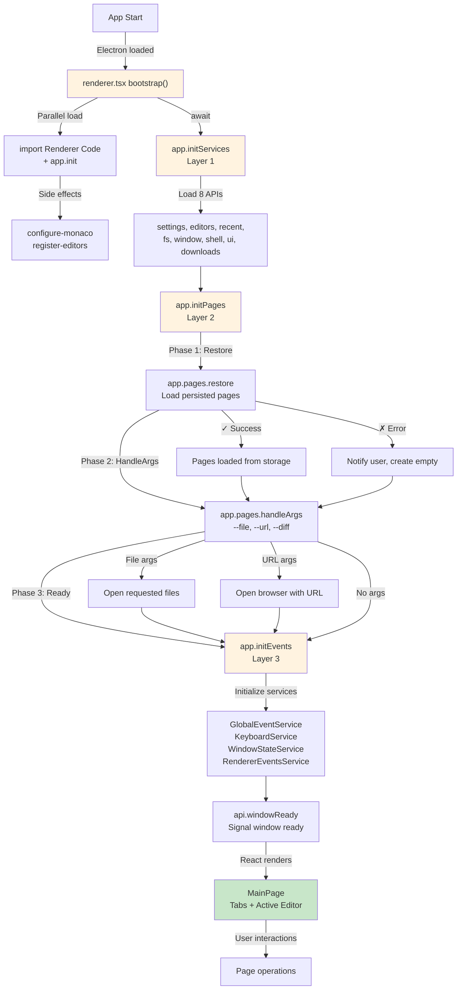
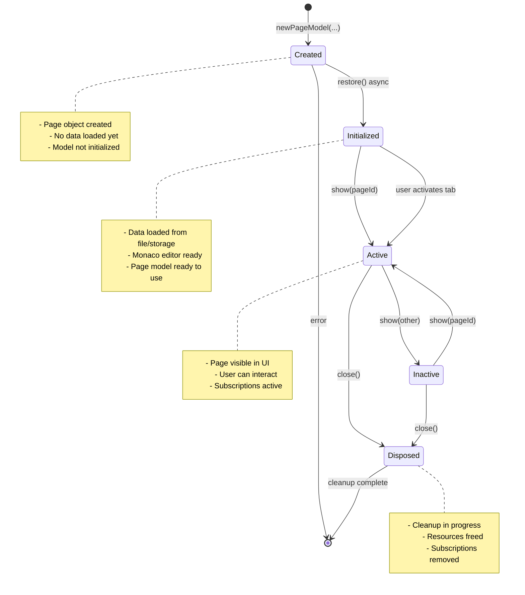
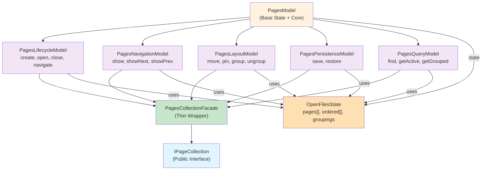

# Pages Architecture

How pages (tabs) work in js-notepad. Covers the window bootstrap lifecycle,
page lifecycle, action taxonomy, and internal submodel structure.

**Source code:** [`/src/renderer/api/pages/`](../../src/renderer/api/pages/)
**Type declarations:** [`/src/renderer/api/types/pages.d.ts`](../../src/renderer/api/types/pages.d.ts)

---

## 1. Window Bootstrap Lifecycle

The renderer initializes in a strict 3-layer sequence before React renders.
This ensures all systems are ready before the UI appears — no race conditions,
no flash of empty state.



**Layer 1 — Services** (`app.initServices()`): Loads 8 core APIs in parallel via dynamic imports: settings, editors, recent, fs, window, shell, ui, downloads. After this layer, the notification system is ready for error reporting.

**Layer 2 — Pages** (`app.initPages()`): Restores pages from persistent storage, then processes CLI arguments (`--file`, `--url`, `--diff`). Ensures at least one page exists.

**Layer 3 — Events** (`app.initEvents()`): Initializes 4 internal event services (GlobalEventService, KeyboardService, WindowStateService, RendererEventsService) that subscribe to DOM events and IPC channels.

**Ready signal** (`api.windowReady()`): Tells the main process this window is fully initialized. The main process waits for this before sending IPC events like `eMovePageIn` (page transfer between windows). This is critical for multi-window operations.

**Implementation:** [`/src/renderer.tsx`](../../src/renderer.tsx), [`/src/renderer/api/app.ts`](../../src/renderer/api/app.ts)

---

## 2. Page Lifecycle State Machine



**Key transitions:**
- **Created → Initialized:** `restore()` loads content from file or persistent storage. For text files this creates the Monaco model, starts the file watcher, and reads cached data.
- **Initialized ↔ Active:** Controlled by `show(pageId)`. Only one page is active at a time (or two when grouped side-by-side).
- **Active/Inactive → Disposed:** `close()` prompts save if modified, then disposes all resources (file watcher, editor model, script context, navigation panel, cache files).

**Multi-window transfer:** A page can be serialized and transferred to another window via IPC. The source window calls `movePageOut()` (removes from collection without disposing), and the target window calls `movePageIn()` (reconstructs from serialized data). See [`PagesLifecycleModel`](../../src/renderer/api/pages/PagesLifecycleModel.ts).

---

## 3. Page Actions Taxonomy

All page operations are categorized into 5 groups, each handled by a dedicated submodel.

```mermaid
graph TD
    API["IPageCollection<br/>(Public API)"]

    API --> Q["Queries<br/>(Read-Only)"]
    API --> L["Lifecycle<br/>(Create/Destroy)"]
    API --> N["Navigation<br/>(Visibility)"]
    API --> LAY["Layout<br/>(Arrangement)"]
    API --> P["Persistence<br/>(Storage)"]

    Q --> Q1["pages: IPage[]"]
    Q --> Q2["active: IPage | null"]
    Q --> Q3["find(id)"]
    Q --> Q4["getGrouped(id)"]

    L --> L1["create(type)→IPage"]
    L --> L2["open(path)→Promise"]
    L --> L3["close(id)→Promise"]
    L --> L4["navigate(id, path)"]

    N --> N1["show(id)"]
    N --> N2["showNext()"]
    N --> N3["showPrev()"]

    LAY --> LAY1["move(id, idx)"]
    LAY --> LAY2["pin(id)"]
    LAY --> LAY3["unpin(id)"]
    LAY --> LAY4["group(l, r)"]
    LAY --> LAY5["ungroup(id)"]

    P --> P1["restore()→Promise"]
    P --> P2["save()→Promise"]

    style API fill:#e1f5ff
    style Q fill:#f3e5f5
    style L fill:#f3e5f5
    style N fill:#f3e5f5
    style LAY fill:#f3e5f5
    style P fill:#f3e5f5
```



**Public interface:** [`/src/renderer/api/types/pages.d.ts`](../../src/renderer/api/types/pages.d.ts) — `IPageCollection` and `IPageInfo`

---

## 4. Internal Submodel Architecture

The pages system uses category-based decomposition. A base model holds shared state, and 5 submodels handle specific operation categories. A thin facade composes them into the public `PagesModel`.



**Files:**

| Submodel | File | Responsibility |
|----------|------|----------------|
| Base | [`PagesModel.ts`](../../src/renderer/api/pages/PagesModel.ts) | Shared state (`pages[]`, `ordered[]`, `groupings`), core helpers |
| Lifecycle | [`PagesLifecycleModel.ts`](../../src/renderer/api/pages/PagesLifecycleModel.ts) | create, open, close, navigate, movePageIn/Out |
| Navigation | [`PagesNavigationModel.ts`](../../src/renderer/api/pages/PagesNavigationModel.ts) | show, showNext, showPrev |
| Layout | [`PagesLayoutModel.ts`](../../src/renderer/api/pages/PagesLayoutModel.ts) | moveTab, pin/unpin, group/ungroup |
| Persistence | [`PagesPersistenceModel.ts`](../../src/renderer/api/pages/PagesPersistenceModel.ts) | save/restore window state to disk |
| Query | [`PagesQueryModel.ts`](../../src/renderer/api/pages/PagesQueryModel.ts) | find, activePage, getGrouped, isLastPage |

**Facade** re-exports all submodel methods under a single `PagesModel` class. Consumers import it as:

```typescript
import { pagesModel } from "../api/pages";
```

---

## 5. Internal vs. Public Operations

### Public (in IPageCollection, exposed to scripts)

- `all`, `activePage`, `find()`, `getGrouped()` — queries
- `openFile()`, `addEmpty()`, `addEditor()` — lifecycle
- `show()`, `showNext()`, `showPrevious()` — navigation
- `moveTab()`, `pin()`, `unpin()`, `group()`, `ungroup()` — layout

### Internal (not in .d.ts, private implementation)

- `movePageIn()` / `movePageOut()` — multi-window drag-drop (IPC-driven)
- `attachPage()` / `detachPage()` / `removePage()` — state management
- `fixGrouping()` / `fixCompareMode()` — invariant repair
- `checkEmptyPage()` — auto-create empty page when last one closes
- `save()` / `restore()` — persistence (called by bootstrap, not by scripts)
- Submodel instances — private composition detail

---

## 6. Error Handling

```
During restore (initialization):  catch and notify, don't crash
During user actions:              throw, let caller handle
```

- **Initialization errors** (restore, handleArgs): caught in `app.initPages()`, user gets a notification, an empty page is created as fallback.
- **User action errors** (open file, navigate): the method throws, and the caller (keyboard service, renderer events service, or UI component) catches and shows a notification.

---

## 7. Multi-Window Page Transfer

When a tab is dragged to another window:

1. **Source window:** `movePageOut(pageId)` serializes the page data and removes it from the collection (no dispose — resources are transferred, not destroyed).
2. **Main process:** Routes the serialized data to the target window via IPC.
3. **Target window:** `movePageIn(data)` reconstructs the page model from serialized data and adds it to the collection.

**Critical dependency:** The target window must have called `api.windowReady()` before the main process sends `eMovePageIn`. The main process holds a `whenReady` promise per window and awaits it before forwarding events.

**Implementation:** [`/src/main/open-windows.ts`](../../src/main/open-windows.ts) (main process), [`PagesLifecycleModel.ts`](../../src/renderer/api/pages/PagesLifecycleModel.ts) (renderer)
