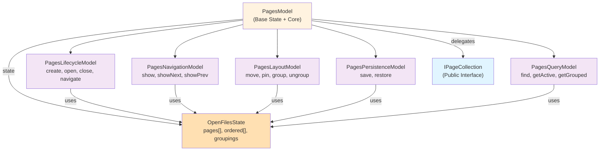
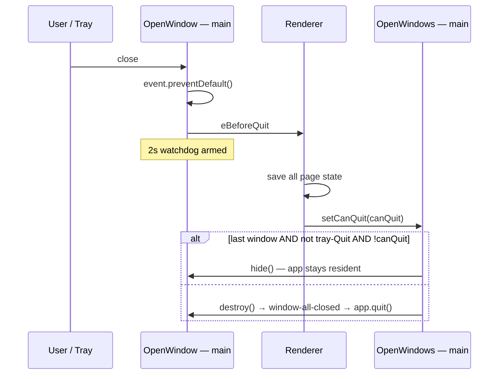

# Pages Architecture

How pages (tabs) work in persephone. Covers the window bootstrap lifecycle,
page lifecycle, action taxonomy, and internal submodel structure.

**Source code:** [`/src/renderer/api/pages/`](../../src/renderer/api/pages/)
**Type declarations:** [`/src/renderer/api/types/pages.d.ts`](../../src/renderer/api/types/pages.d.ts)

---

## 1. Window Bootstrap Lifecycle

The renderer initializes in a strict 3-layer sequence before the application mount runs.
This ensures all systems are ready before the UI appears — no race conditions,
no flash of empty state. `renderer.ts` returns the `mount(container)` callback from
`renderer/index.ts`; the shell is native and React content is mounted only in the explicit
Excalidraw island.

```mermaid
graph TD
    A["App Start"] -->|Electron loaded| B["renderer.ts bootstrap()"]
    B -->|Parallel load| C["import Renderer Code<br/>+ app.init"]
    C -->|Side effects| C1["configure-monaco<br/>register-editors"]
    B -->|await| D["app.initServices<br/>Layer 1"]
    D -->|Load 8 APIs| D1["settings, editors, recent,<br/>fs, window, shell, ui, downloads"]
    D1 --> E["app.initPages<br/>Layer 2"]
    E -->|Phase 1: Restore| E1["app.pages.restore<br/>Load persisted pages"]
    E1 -->|Phase 2: HandleArgs| E2["app.pages.handleArgs<br/>--file, --url, --diff"]
    E2 -->|Phase 3: Ready| F["app.initEvents<br/>Layer 3"]
    F -->|Initialize services| F1["GlobalEventService<br/>KeyboardService<br/>WindowStateService<br/>RendererEventsService"]
    F1 --> G["api.windowReady<br/>Signal window ready"]
    G -->|mount(container)| H["MainPageView<br/>Tabs + Active Editor"]
    H -->|User interactions| I["Page operations"]

    E1 -->|✓ Success| E1a["Pages loaded from storage"]
    E1 -->|✗ Error| E1b["Notify user, create empty"]
    E1a --> E2
    E1b --> E2
    E2 -->|File args| E2a["Open requested files"]
    E2 -->|URL args| E2b["Open browser with URL"]
    E2a --> F
    E2b --> F
    E2 -->|No args| F

    style B fill:#fff3e0
    style D fill:#fff3e0
    style E fill:#fff3e0
    style F fill:#fff3e0
    style H fill:#c8e6c9
```

**Layer 1 — Services** (`app.initServices()`): Loads 8 core APIs in parallel via dynamic imports: settings, editors, recent, fs, window, shell, ui, downloads. After this layer, the notification system is ready for error reporting.

**Layer 2 — Pages** (`app.initPages()`): Restores pages from persistent storage, then processes CLI arguments (`--file`, `--url`, `--diff`). Ensures at least one page exists.

Saving is suppressed for the whole of the restore. Restore attaches pages one at a time, and each `attachPage` subscribes the page and its editors to the debounced save, so a save that fired mid-restore would serialise an empty or partial page list over the real session — normally harmless because a later save wins, but permanent if the window is closed or reloaded inside that window. `PagesPersistenceModel` gates both the debounced wrapper and `saveState` itself, because some call sites save without the debounce. The gate re-schedules rather than drops, so a suppressed save still runs once restore completes.

The gate tracks *restore in progress* and nothing else, and is released in a `finally`. A descriptor that fails to restore is an expected outcome — restore drops it and carries on, and a `schemaVersion` bump discards every page by design — so persistence must keep working afterwards. Switching saving off because a descriptor was rejected would turn a one-time loss of open pages into a session that never persists again.

**Layer 3 — Events** (`app.initEvents()`): Initializes 4 internal event services (GlobalEventService, KeyboardService, WindowStateService, RendererEventsService) that subscribe to DOM events and IPC channels.

**Ready signal** (`api.windowReady()`): Tells the main process this window is fully initialized. The main process waits for this before sending IPC events like `eMovePageIn` (page transfer between windows). This is critical for multi-window operations.

**Implementation:** [`/src/renderer.ts`](../../src/renderer.ts), [`/src/renderer/api/app.ts`](../../src/renderer/api/app.ts)

---

## 2. Page/Editor Architecture

**Diagram:** [`diagrams/6-page-architecture.mmd`](diagrams/6-page-architecture.mmd)

Every tab is a `PageModel` — a stable container that owns the browsing context (sidebar, secondary views) and contains an `EditorModel` as its main content.

```
PageModel (one per tab — stable identity, never changes during navigation)
├── id: string                          // stable UUID — tab key, cache key
├── state: TOneState<IPageState>        // reactive: { pinned, hasSidebar, mainEditorId }
├── mainEditor: EditorModel | null      // the content (swapped during navigation)
├── secondaryViews: EditorModel[]     // sidebar panels (ExplorerEditorModel, ArchiveEditorModel, etc.)
├── secondaryViewsModel                  // sidebar open/close/width
├── activePanel: string                 // which panel is expanded
├── findExplorer() / createExplorer()   // ExplorerEditorModel helpers
├── findEditorByFilePath(path)          // existing editor on this page for a file (navigation reuse)
├── toggleNavigator() / canOpenNavigator() // sidebar toggle (creates Explorer if needed)
├── close()                             // checks unsaved changes, calls onClose
├── dispose()                           // disposes all owned resources
└── saveState() / restoreSidebar()      // persistence

EditorModel (the content inside a page — replaceable during navigation)
├── id: string                          // editor instance identity
├── state: TOneState<IEditorState>      // editor state (content, language, filePath, pipe, etc.)
├── page: PageModel | null              // back-reference to containing page
├── pipe: IContentPipe                  // content source
├── modified: boolean                   // has unsaved changes
├── setPage(page) / onMainEditorChanged() // lifecycle hooks
├── beforeNavigateAway(newEditor)       // secondary survival check
├── survivesNavigation(sourceLink)      // skip save-prompt when editor stays on page
├── keepAliveOnNavigation()             // stay attached with no view (busy Board handle)
├── restore() / dispose()               // editor lifecycle
└── getRestoreData() / applyRestoreData() // serialization
```

**Source:** [`PageModel.ts`](../../src/renderer/api/pages/PageModel.ts), [`EditorModel.ts`](../../src/renderer/editors/base/EditorModel.ts)

Three page concerns live in their own modules rather than in `PageModel`:
[`editor-switch.ts`](../../src/renderer/editors/base/editor-switch.ts) implements the
switch-widget transition (`switchMainEditor` — the page keeps a dynamic-import delegate, so
the board/registry switching machinery stays out of the page model);
[`page-explorer.ts`](../../src/renderer/editors/explorer/page-explorer.ts) provisions the
sidebar Explorer (`toggleNavigator`, auto-init beside a mandatory sidebar — constructing an
`ExplorerEditor` is an editor concern, so it lives beside the editor); and
[`NavBackStack.ts`](../../src/renderer/api/pages/NavBackStack.ts) is the Markdown
back-navigation stack the page owns, mirrors into `navBackCount`, and persists.

### Page lifecycle

- **Created:** `new PageModel()` + `page.mainEditor = editor` + `editor.setPage(page)` (or `mainEditor = null` for empty pages with sidebar only)
- **Initialized:** `editor.restore()` loads content; `page.restoreSidebar()` loads sidebar from cache
- **Active/Inactive:** `show(pageId)` moves page to end of `ordered[]`
- **Navigation:** `await page.setMainEditor(newEditor)` — full lifecycle swap (beforeNavigateAway, dispose old, notify secondaries)
- **Closed:** `page.close()` → checks unsaved → `onClose()` → `detachPage` → `removePage` → `page.dispose()`

### Close flow detail

1. `page.close()` — on PageModel
2. → `confirmSecondaryRelease()` — checks secondary views for unsaved changes
3. → `mainEditor.confirmRelease()` — checks main editor (TextFileModel prompts save dialog)
4. → `onClose()` — set by `attachPage()` in PagesModel
5. → `detachPage(page)` — unsubscribes state listeners, clears `onClose`
6. → `removePage(page)` — removes from `pages[]` and `ordered[]`
7. → `page.dispose()` — disposes secondary views, tree providers, navigator model, then main editor (content pipes, cache files)

For multi-window transfer, `movePageOut()` calls `detachPage()` WITHOUT calling `dispose()`. Cache files survive for the target window.

**Native placeholder rendering:** Pages are hosted by `AppPageManagerView` in
`src/renderer/components/page-manager/`. The native view owns one stable `data-name="page-slot"`
placeholder per page and appends each placeholder directly to its manager root. A page view is
constructed only after its page becomes active (or has been active before), then its root is
mounted directly in the placeholder. `PageSlot` has one native arm, and `PageManagerView` uses the
same native slot contract for browser internal tabs; there is no page-manager React arm. Native
page views dispose synchronously after the placeholder is detached. This prevents iframes,
webviews, and canvas elements from reloading when pages are closed, reordered, grouped, or
ungrouped. Placeholders are never reparented (moved between containers) — grouping is achieved
purely via CSS absolute positioning among siblings in the same container. See `GroupContainer` and
`ImperativeSplitter` in the same folder.
`PageSlot` treats page-view construction and mounting as one rollback scope: if `onMount()`
fails, the partially built view and its registered resources are rolled back before the error is
re-thrown.

**Main editor view keyed by model id:** `PageContentView` owns a `RenderEditorView` for the
current editor model (`src/renderer/ui/app/PageContentView.ts`). Its identity includes the model
instance ID and whether the editor uses the background ornament. Navigating to another model
disposes and recreates the editor view; updates for the same model are forwarded to
`AsyncEditorView`, which loads and mounts the editor module's required native `View`. This keeps
Monaco and other stateful editor bodies from being reused with the wrong model.

`PageContentView` uses `display: contents`, so its `SecondaryViewsView` root and `contentRoot`
are direct flex siblings in the page slot. `Pages.css` does not reorder those children; DOM order
is therefore layout order, with the sidebar before the editor. When a sidebar is created after the
content is already mounted, `PageContentView.sync()` inserts it before `contentRoot`; when there
is no content root yet, the null insertion target retains normal append semantics.

When a state notification retires an editor view, the host root is detached immediately and the
captured view is disposed through `afterDispatch()` after the outermost notification and any nested
updates settle. `PageModel` separately tracks promises for asynchronous editor disposal and awaits
that set during page teardown; the dispatch boundary provides ordering, not completion of async
cleanup. On a close path, the empty-page replacement check likewise runs from the caller after
page disposal has settled.

---

## 3. Page Actions Taxonomy

All page operations are categorized into 5 groups, each handled by a dedicated submodel.


```mermaid
graph TD
    API["IPageCollection<br/>(Public API)"]

    API --> Q["Queries<br/>(Read-Only)"]
    API --> L["Lifecycle<br/>(Create/Destroy)"]
    API --> N["Navigation<br/>(Visibility)"]
    API --> LAY["Layout<br/>(Arrangement)"]
    API --> P["Persistence<br/>(Storage)"]

    Q --> Q1["pages: IPage[]"]
    Q --> Q2["active: IPage | null"]
    Q --> Q3["find(id)"]
    Q --> Q4["getGrouped(id)"]

    L --> L1["create(type)→IPage"]
    L --> L2["open(path)→Promise"]
    L --> L3["close(id)→Promise"]
    L --> L4["navigate(id, path)"]

    N --> N1["show(id)"]
    N --> N2["showNext()"]
    N --> N3["showPrev()"]

    LAY --> LAY1["move(id, idx)"]
    LAY --> LAY2["pin(id)"]
    LAY --> LAY3["unpin(id)"]
    LAY --> LAY4["group(l, r)"]
    LAY --> LAY5["ungroup(id)"]

    P --> P1["restore()→Promise"]
    P --> P2["save()→Promise"]

    style API fill:#e1f5ff
    style Q fill:#f3e5f5
    style L fill:#f3e5f5
    style N fill:#f3e5f5
    style LAY fill:#f3e5f5
    style P fill:#f3e5f5
```

**Public interface:** [`/src/renderer/api/types/pages.d.ts`](../../src/renderer/api/types/pages.d.ts) — `IPageCollection` and `IPageInfo`

Compare mode is a layout state over a grouped pair of text-file pages. The path-based
`openDiff({ firstPath, secondPath })` operation groups the pages and enters compare mode; the
script-facing `pages.compare` node reports active left/right pairs and provides validated
`enter(pageId)` / `exit(pageId)` operations. Its curated compare controls are scoped to the left
page slot, where the compare surface is mounted.

---

## 4. Internal Submodel Architecture

The pages system uses category-based decomposition. `PagesModel` holds shared state, composes 5 submodels for specific operation categories, and delegates all public methods through a flat API.


```mermaid
graph TD
    Base["PagesModel<br/>(Base State + Core)"]

    Base --> LC["PagesLifecycleModel<br/>create, open, close, navigate"]
    Base --> Nav["PagesNavigationModel<br/>show, showNext, showPrev"]
    Base --> Lay["PagesLayoutModel<br/>move, pin, group, ungroup"]
    Base --> Persist["PagesPersistenceModel<br/>save, restore"]
    Base --> Query["PagesQueryModel<br/>find, getActive, getGrouped"]

    Base -->|delegates| IPC["IPageCollection<br/>(Public Interface)"]

    Base -->|state| S["OpenFilesState<br/>pages[], ordered[], groupings"]
    LC -->|uses| S
    Nav -->|uses| S
    Lay -->|uses| S
    Persist -->|uses| S
    Query -->|uses| S

    style Base fill:#fff3e0
    style LC fill:#f3e5f5
    style Nav fill:#f3e5f5
    style Lay fill:#f3e5f5
    style Persist fill:#f3e5f5
    style Query fill:#f3e5f5
    style IPC fill:#e1f5ff
    style S fill:#ffe0b2
```

**Files:**

| Submodel | File | Responsibility |
|----------|------|----------------|
| Base | [`PagesModel.ts`](../../src/renderer/api/pages/PagesModel.ts) | Shared state (`pages[]`, `ordered[]`, `groupings`), core helpers |
| Lifecycle | [`PagesLifecycleModel.ts`](../../src/renderer/api/pages/PagesLifecycleModel.ts) | create, open, close, navigate, movePageIn/Out |
| Navigation | [`PagesNavigationModel.ts`](../../src/renderer/api/pages/PagesNavigationModel.ts) | show, showNext, showPrev |
| Layout | [`PagesLayoutModel.ts`](../../src/renderer/api/pages/PagesLayoutModel.ts) | moveTab, pin/unpin, group/ungroup |
| Persistence | [`PagesPersistenceModel.ts`](../../src/renderer/api/pages/PagesPersistenceModel.ts) | save/restore window state to disk |
| Query | [`PagesQueryModel.ts`](../../src/renderer/api/pages/PagesQueryModel.ts) | find (by any ID: page, mainEditor, or secondary), findPageByFilePath, activePage, getGrouped, isLastPage |

Two lifecycle concerns live in their own modules rather than in `PagesLifecycleModel`:
[`PageNavigator.ts`](../../src/renderer/api/pages/PageNavigator.ts) implements `navigatePageTo`
as named steps (the lifecycle keeps a one-line delegate), and
[`browser-pages.ts`](../../src/renderer/editors/browser/browser-pages.ts) implements
`showBrowserPage` / `openUrlInBrowserTab` beside the browser editor — reached via dynamic
import so the startup-loaded pages model never statically imports the browser chunk.

`PagesModel` delegates all submodel methods as its own (46 public methods). Exported as a singleton:

```typescript
import { pagesModel } from "../api/pages";
```

---

## 5. Internal vs. Public Operations

### Public (in IPageCollection, exposed to scripts)

- `all`, `activePage`, `find()`, `getGrouped()` — queries
- `openFile()`, `addEmpty()`, `addEditor()` — lifecycle
- `show()`, `showNext()`, `showPrevious()` — navigation
- `moveTab()`, `pin()`, `unpin()`, `group()`, `ungroup()` — layout

### Internal (not in .d.ts, private implementation)

- `movePageIn()` / `movePageOut()` — multi-window drag-drop (IPC-driven)
- `attachPage(page)` — subscribes to page state changes for auto-save, sets `onClose` callback that runs the dispose chain (`detachPage` → `removePage` → `dispose`)
- `detachPage(page)` — unsubscribes and clears `onClose` WITHOUT disposing. Used by `movePageOut()` (multi-window transfer) and `navigatePageTo()` to preserve page resources
- `removePage(page)` — removes from `pages[]` and `ordered[]` arrays
- `fixGrouping()` — invariant repair
- `checkEmptyPage()` — auto-create empty page when last one closes
- `addEmptyPageWithNavPanel(folderPath)` — creates a PageModel with `mainEditor = null` and an initialized sidebar (Explorer panel). Used by sidebar double-click, archive browsing, the "Open Folder" menu, the "Open Folder" item in the Tools & Editors list, the folder-tree context menu, opening a link that points to a directory, and a folder path arriving from the command line or Explorer's "Open with persephone" folder context menu. The page renders just the sidebar with an empty content area.
- `openFileAsArchive(filePath)` — opens an archive for browsing. Creates a PageModel with sidebar root set to the archive root. Reuses existing tab if the archive is already open. ZIP archives use `!` separator (e.g., `doc.zip!word/document.xml`) via `archive-service.ts`; `.asar` archives use the regular path directly (e.g., `app.asar`) via Electron's native fs patching — see `file-path.ts`.
- `openLinks(links, title?)` — creates a link collection page. A `LinkEditor` with `.link.json` content is added as a Pattern A secondary view (never mainEditor). The Categories panel appears in the sidebar; clicking a link navigates the page's main area to that file. Accepts `(ILink | string)[]` — strings are converted to LinkItems with auto-generated titles.
- `save()` / `restore()` — persistence (called by bootstrap, not by scripts)
- Submodel instances — private composition detail

---

## 6. Error Handling

```
During restore (initialization):  catch and notify, don't crash
During user actions:              throw, let caller handle
```

- **Initialization errors** (restore, handleArgs): caught in `app.initPages()`, user gets a notification, an empty page is created as fallback.
- **User action errors** (open file, navigate): the method throws, and the caller (keyboard service, renderer events service, or UI component) catches and shows a notification.

### ID resolution

`PagesQueryModel.findPage(id)` accepts any associated ID — page ID, mainEditor ID, or secondary view ID. All IDs are unique UUIDs, so this is unambiguous. Methods like `getGroupedPage()`, `groupTabs()`, and `isGrouped()` resolve their inputs through `findPage()` first, so callers don't need to worry about which ID type they're passing. This eliminates a class of bugs where code passes editor IDs to methods that internally use page IDs for grouping map lookups.

---

## 7. Multi-Window Page Transfer

When a tab is dragged to another window:

1. **Tab drag** — `PageTab.handleDragEnd()` detects the drop landed outside the window bounds. Sends `PageDragData` to the main process via `api.addDragEvent()`.
2. **Main process** — `DragModel` collects drag events (debounced 100ms) from source and target windows, then calls `movePageToWindow()` in [`open-windows.ts`](../../src/main/open-windows.ts).
3. **Source window** — receives `eMovePageOut` IPC event:
   - `movePageOut(pageId)` calls `page.saveState()` to flush sidebar cache to disk
   - Calls `detachPage()` — unsubscribes but does NOT dispose. **Cache files survive.**
   - Calls `removePage()` — removes from arrays
4. **Target window** — receives `eMovePageIn` IPC event with `PageDescriptor` (main process awaits `whenReady` first):
   - `movePageIn(data)` creates a new PageModel with the **same page ID** from the descriptor
   - Creates an EditorModel from `desc.editor`, calls `applyRestoreData()` and `restore()`
   - If `desc.hasSidebar`, restores sidebar from cache (keyed by page ID) including secondary views

**Why it works:** The `PageDragData` sent by `PageTab.getDragData()` includes a full `PageDescriptor` with `id`, `pinned`, `modified`, `hasSidebar`, and serialized editor state. Cache files are keyed by page ID. The source window preserves them (no `dispose()`), and the target window reads them using the same ID. Sidebar state (tree expansion, search, secondary view descriptors) is fully reconstructed from cache. The page ID is preserved across the transfer.

**Critical dependency:** The target window must have called `api.windowReady()` before the main process sends `eMovePageIn`. The main process holds a `whenReady` promise per window and awaits it before forwarding events.

**Implementation:** [`/src/main/open-windows.ts`](../../src/main/open-windows.ts) (main process), [`/src/main/drag-model.ts`](../../src/main/drag-model.ts) (debouncing), [`PagesLifecycleModel.ts`](../../src/renderer/api/pages/PagesLifecycleModel.ts) (renderer), [`PageTabView.ts`](../../src/renderer/ui/tabs/PageTabView.ts) (drag handlers)

## 8. Well-Known Pages

Some pages are **singletons** — they should exist as a single instance and be found by a stable ID rather than a random UUID. The well-known pages system provides this.

**Source:** [`/src/renderer/api/pages/well-known-pages.ts`](../../src/renderer/api/pages/well-known-pages.ts)

### How it works

1. **Registry:** Well-known pages are defined in `well-known-pages.ts` with a fixed ID, editor, language, and title:
   ```typescript
   registerWellKnownPage({
       id: "mcp-ui-log",
       editor: "log-view",
       language: "jsonl",
       title: "MCP Log",
   });
   ```

2. **Get-or-create:** Use `pagesModel.requireWellKnownPage(id)` to get the page:
   - If a page with this ID exists → focuses and returns it
   - If not → creates a new page with the predefined config and the well-known ID (not a UUID)
   - The existing `addPage()` deduplication ensures no duplicates

3. **Session restore:** Well-known pages are persisted with their fixed ID. On restore, they're recreated with the same ID. Next `requireWellKnownPage()` call finds the restored page.

### Current well-known pages

| ID | Editor | Purpose |
|----|--------|---------|
| `mcp-ui-log` | `log-view` | MCP Log page — shared by `pages.logView` and script `ui` |
| `mcp-server-log` | `log-view` | MCP server incoming request log — logs every incoming MCP command with method, params, result, error, duration. Capped at 200 entries. Opened by clicking the MCP indicator in the title bar. |

The `pages.logView` collection property is the non-blocking object-model path to `mcp-ui-log`.
It reuses the page's `LogViewEditor` and accepts the same normalized entry forms as script `ui`,
but returns from `push()` immediately with entry and dialog IDs. Inline dialogs remain visible in
Log View for the user to answer; `dialogResult(id)` distinguishes an unresolved dialog from its
resolved entry. Agents use this non-blocking path through `call`.

### Standalone singleton pages

About, Settings, Mneme Config, Storybook, and Tools & Editors pages use a similar pattern with
hardcoded IDs directly in their modules:
- `ABOUT_PAGE_ID = "about-page"` in `AboutEditor.ts`
- `SETTINGS_PAGE_ID = "settings-page"` in `SettingsPage.ts`

These work as singletons through the same `addPage()` deduplication. Each `showXPage()` method
passes a lazy page-ID loader to the lifecycle model, which resolves it and constructs the editor
inside one `guard(...)` call. This keeps failures in either the editor module import or
`editorRegistry.createEditor()` on the same user-visible failure path. A failed standalone open
therefore leaves the page list unchanged and reports the failure as a notification; the helper's
result is `undefined` in that case, so callers must check before using the page.

The page-ID loader is intentional: the ID constant often lives in the same lazily loaded module as
the editor, and importing it before entering the guard would leave that first failure unreported.

The About singleton also owns a runtime guide-browser location. Its left version card remains
stable while the right pane switches between the guide contents tree and a selected guide. Plain
`showAboutPage()` reuses the existing About page and preserves that browser location; the explicit
`showAboutPage({ atContents: true })` entry point resets it to the contents tree. The browser's
guide history and agent-guide filter are runtime state rather than persisted page content. The
`about-view` scripting facade exposes `open`, `back`, `current`, `elements`, and `highlight` for
this fixed page; opening a guide in a tab uses the normal content pipeline.

### When to use well-known pages

Use this pattern when:
- A page should be a **singleton** (one instance at a time)
- Multiple code paths need to **find the same page** (e.g., MCP handler and ScriptContext both need the same log page)
- The page has a **fixed configuration** (editor, language, title) that callers shouldn't need to know

Do NOT use for:
- User-created pages (scripts, file open) — these should have unique UUIDs
- Pages that can be opened multiple times (browser tabs, text files)

### Adding a new well-known page

1. Add a `registerWellKnownPage()` call in `well-known-pages.ts`
2. Use `await pagesModel.requireWellKnownPage("your-id")` wherever you need the page
3. No other changes needed — `addPage()` handles deduplication automatically

**Note:** `requireWellKnownPage` is an internal API — not exposed to scripts or MCP call paths.

---

## 9. PageModel — Sidebar and Navigation Context

PageModel is the tab container that owns the sidebar layout (open/close/width via `secondaryViewsModel`), panel selection (`activePanel`), and secondary views. Explorer state (tree provider, selection, search) is owned by `ExplorerEditorModel` in `secondaryViews[]`. PageModel survives navigation — when the user navigates to a new file, only `page.mainEditor` changes while the PageModel (and its sidebar) stays intact.

**Source:** [`/src/renderer/api/pages/PageModel.ts`](../../src/renderer/api/pages/PageModel.ts)

### Mandatory sidebar and auto-Explorer

`PageModel.sidebarMandatory` is a computed boolean. It is `true` when any secondary view other than the file Explorer is contributing panels. This happens for Link, Archive, Notebook, and Rest Client editors when their panels are open.

When `sidebarMandatory` is `true`:
- `setSecondaryViewsState({ open: false })` is ignored — the close request is silently clamped to `open: true`.
- The sidebar close ✕ button and the toggle affordance are hidden.

This is enforced in `_enforceMandatoryOpen()`, called whenever panel editors attach or detach. It also calls `_maybeAutoInitExplorer()`.

**`_maybeAutoInitExplorer()`** — when the sidebar becomes mandatory and no Explorer exists yet, this method queues a microtask to auto-create an Explorer rooted at the panel editor's file folder (resolved via `_explorerRootForPanels()`). The deferred-microtask design means a persisted Explorer that is re-attached synchronously during session restore is always found by the guard (`findExplorer()` returns it), so no duplicate is created. If the panel editor has no file path (e.g., a new unsaved file), the Explorer is not created.

### Navigation pattern

In `navigatePageTo()` ([`PageNavigator.ts`](../../src/renderer/api/pages/PageNavigator.ts) — each step below is a named function there):

```
1. page = findPage(pageId)                    // PageModel stays in arrays
2. survivesNavigation? skip confirmRelease    // else check for unsaved changes
3. reuse a surviving navigation-singleton?    // short-circuit (see below)
4. reuse an editor already open for this file? // short-circuit (see below)
5. ... create newEditor (with sourceLink) ...
6. await page.setMainEditor(newEditor)        // full lifecycle swap (see below)
7. resubscribeEditor(page)                    // re-subscribe for persistence
8. auto-select preview editor (if textFile)
9. onShow / onFocus / saveState
```

**Step 2 — save-prompt gate.** `confirmRelease()` prompts to save unsaved changes, but it fires *before* the page knows whether the old editor will actually be released. An editor that demotes to a sidebar panel instead of being disposed (see Step 6) is not losing anything, so prompting would be spurious. The optional `survivesNavigation(sourceLink)` hook lets the old editor declare it will stay on the page; when it returns `true`, the prompt is skipped. The base implementation returns `false` (prompt as before). `LinkEditor` returns `true` when the editor is modified (a dirty collection survives *any* navigation so unsaved work is never lost) or when the incoming `sourceLink.sourceId` identifies one of its own panel clicks — the same `modified || own-source` predicate that drives its `beforeNavigateAway` / `onMainEditorChanged` panel-survival decision, keeping the gate and the survival outcome consistent. The save prompt still fires on a genuine close, which routes through `confirmRelease()` on a separate path.

**Step 3 — navigation-singleton reuse.** A Pattern B editor that survives navigation (`GitTreeEditorModel` and `MnemeRootEditorModel`) is a **per-page singleton**: navigating *back* to it must reuse the surviving instance, not build a second one (duplicates would pile up as redundant surviving panels). Two optional `EditorModel` hooks express this — declared like the existing optional `hasTextSelection?()`:

- `matchesNavigationTarget?(target, filePath)` — the editor returns `true` when a navigation request names the same logical resource it already represents. `GitTreeEditorModel` matches a `git-tree` target whose decoded `repoRoot` equals its own; `MnemeRootEditorModel` matches a `mneme-root` target whose root folder equals its own (so a *different* Mneme root opens a second instance + panel).
- `onNavigationReuse?()` — called after the reused instance is promoted back to main, so it can refresh data that may have gone stale. `GitTreeEditorModel` calls `refresh()`.

`navigatePageTo()` scans `page.editors` for a `matchesNavigationTarget` hit *before* creating an editor. On a hit it promotes that instance with `setMainEditor` (or just refreshes if it is already main) and returns — no duplicate is created. The hooks are generic; any future survivable singleton editor can opt in without touching the page layer.

A third optional hook, `revealFragment?(fragment)`, follows the same shape for in-document anchors. When the opening link carried a `#fragment` (extracted by the Layer 1 parsers — see [content-pipeline.md](content-pipeline.md)), `navigatePageTo()` and `openFile()` call it on the editor they land on. Unlike the other navigation hints it is applied on **every** exit of both methods, reuse short-circuits included, because an anchor link into an already-open document is still a jump request. `MarkdownEditor` implements it by queueing an `anchor` event on its `ComponentQueue`, which buffers until the view mounts, so the call is safe before the body exists.

**Step 4 — already-open-file reuse.** Independent of the singleton hooks, the page may already hold an editor whose backing file *is* the navigation target — most commonly a modified editor that survived an earlier navigation and now lingers as a sidebar panel (e.g. a dirty `LinkEditor`). Re-selecting that file (an Explorer click on the same path) should restore that very instance, with its unsaved edits and panels, not spawn a second one beside it. `PageModel.findEditorByFilePath(filePath)` finds such an editor — unwrapping text-bearing editors to their content host, where `filePath` lives, so it matches the same property `mainEditor` exposes. `navigatePageTo()` promotes the match back to main with `setMainEditor` and returns; an explicit content-host `target` must still match the existing editor's `editorId`, so "open this file in a different view" is never hijacked. The unused incoming pipe is disposed.

**Step 6** — `page.setMainEditor(newEditor)` is the high-level editor swap method on PageModel. It consolidates the lifecycle:
- Calls `oldEditor.beforeNavigateAway(newEditor)` — old editor decides to keep/clear its `secondaryView`
- Checks survival: a panel contributor (`contributesPanels()`) demotes to the sidebar; a `keepAliveOnNavigation()` editor stays attached with **no view at all** — an invisible ownership handle. The one current keep-alive editor is a **busy Board**: its spawned processes must outlive its iframe, so the model stays on the page to tie their lifetime to the page (page close disposes it, which reaps the jobs). Re-navigating to the same board promotes the surviving handle back to main via the `matchesNavigationTarget` singleton reuse (Step 3). A `movePageOut` (cross-window transfer) disposes keep-alive editors — their processes never transfer. Session restore drops a persisted non-main board descriptor entirely (busy is transient; its processes died with the app), so no zombie handle survives a restart.
- Otherwise, disposes the old native view after the replacement is attached
- Sets `newEditor.setPage(page)`, updates `mainEditorId`, and notifies subscribers so the editor view swaps
- Calls `notifyMainEditorChanged()` — secondary views react, cleanup runs
- Registers new editor's secondary panel if it has one

**Note:** The raw `mainEditor` setter (without lifecycle) is still used for low-level operations: persistence restore, `addPage()`, and `dispose()`. `setMainEditor()` is the high-level method for navigation.

**Step 9 — navigation does not steal sidebar focus.** All three exits of `navigatePageTo()` send `onShow` unconditionally but gate `onFocus` on `!isFocusInSidebar()` ([`core/utils/focus-utils.ts`](../../src/renderer/core/utils/focus-utils.ts) — true when `document.activeElement` is inside the secondary-views container). Rationale: `onFocus` drives editor autofocus (the native `TextChromeView` refocuses the page root + `model.focus()`), which is wanted on page *activation* — tab switch, new page — but not on *navigation* driven from a sidebar panel (an Explorer tree click), where the user is still working in the panel (e.g. walking the tree with the keyboard). Activation paths (`showPage`, page-close fallback, the new-tab `openFile` flow) send `onFocus` unconditionally, so keyboard-driven tab switches focus the editor even when the sidebar held focus. Editors with mount-time autofocus (Monaco, Grid) apply the same `isFocusInSidebar()` guard, since a fresh mount happens on navigation too.

**`beforeNavigateAway(newEditor)`** lets the old editor inspect `newEditor.sourceLink` to decide whether to keep itself as a secondary view. The base implementation clears `secondaryView`. Subclasses like ArchiveEditorModel override to check `newEditor.sourceLink?.sourceId === this.id`.

**`notifyMainEditorChanged()`** calls `onMainEditorChanged(newMainEditor)` on each secondary view. Each editor reacts independently: ExplorerEditorModel clears selection if the new editor wasn't opened from Explorer, ArchiveEditorModel checks if the new main editor was opened from its archive — if not, it clears `secondaryView` and is cleaned up.

### Markdown in-page navigation

The Markdown ("Preview") view navigates **within the current page** when the user clicks a link to a local markdown file, keeps a per-page **back history** so the user can return to the previously-viewed document, and scrolls to `#fragment` anchors.

- **Interception.** `MarkdownBodyView` installs a capture-phase native click listener on its scroll container. A plain left-click on an anchor whose resolved href is a local markdown file — detected by `isLocalMarkdownHref` (`src/renderer/editors/markdown/markdown-nav.ts`: a `file://` URL ending in `.md`/`.markdown`, fragment ignored for the extension test) — is intercepted: the handler pushes the current document onto the page's back stack and dispatches `openRawLink` with `pageId` set (so the pipeline navigates this page in place rather than opening a new tab) and `target: "md-view"` (so the target stays in the rendered Preview). A **same-document** link (a bare `#fragment`) is intercepted too, but only scrolls — it is not a document change, so nothing is pushed onto the back stack and no link event is dispatched. Every other link — non-markdown files, `http(s)`, images, `mailto:` — is left untouched and keeps its normal behavior. The interceptor is disabled for notebook-embedded Markdown, where same-document anchors are consequently not handled.
- **History storage.** `PageModel` owns the back stack — a [`NavBackStack`](../../src/renderer/api/pages/NavBackStack.ts) instance behind the `pushNavBack` / `popNavBack` delegates declared on the `IPageHost` contract. It lives on the page, not the editor, so it survives the editor swaps each in-place navigation creates. `IPageState.navBackCount` mirrors the stack depth and drives the Back button's visibility. The stack is **persisted** as `PageDescriptor.navBack` (`NavEntry[]` in [`/src/shared/persistence.ts`](../../src/shared/persistence.ts)) and re-seeded in `PagesPersistenceModel.restorePage` via `seedNavBack`, so history survives app restart and window-to-window transfer.
- **Back.** `MarkdownEditor.navigateBack()` (wired to the Back button in the Markdown toolbar) pops the stack and re-opens that entry in place — going straight through `openRawLink`, so it does not push a new entry. History is not cleared on unrelated in-page navigation; it lives for the page's lifetime.
- **Anchors.** A cross-document anchor arrives as the `fragment` navigation hint and reaches the editor through `revealFragment`, which queues an `anchor` event on the editor's `ComponentQueue`; a same-document one is handled directly by the click interceptor. `MarkdownBodyView` retries the queued scroll command over a short `requestAnimationFrame` ladder while its `MarkdownBlockView` is rendering. Heading ids come from the `rehypeHeadingIds` plugin (sibling of `rehypeHighlight`), which slugs heading text GitHub-style and disambiguates duplicates with `-1`, `-2`; author-supplied ids arriving as raw HTML are never overwritten.
- `BrowserPanelHost` (the other `IPageHost`) implements the back-stack methods as inert no-ops — it has no main-editor navigation.

Anchor resolution is deliberately tolerant, trying three passes in order: the exact id, a case-insensitive id, then the slug of the fragment against the slug of each heading's text. The third pass is what absorbs the difference between anchor dialects — Azure DevOps writes `#rtb.rul.2` for a heading GitHub would slug as `rtbrul2` — since slugifying both sides makes them meet. All queries are scoped to the block's root element rather than `document`, because several Markdown views can be mounted at once and the Minimap additionally clones the rendered content, so ids are not unique document-wide. A fragment that matches nothing leaves the document at the top with no error.

Two timing details matter. The scroll is **synchronous and instant** (not the smooth, microtask-deferred scroll the search uses), because an anchor is a starting position rather than a movement, and because the caller needs the resulting `scrollTop` immediately. `MarkdownBodyView` records that value into its scroll-restore projection: every navigation sends `onFocus` right after `revealFragment`, and the view's scroll-restore would otherwise snap the reader straight back to the top. Since the queued event can also arrive before the native block has committed its DOM, a failed lookup is retried over a short `requestAnimationFrame` ladder before giving up silently.

---

The About guide pane reuses `MarkdownBodyView` through the narrower `MarkdownBodyModel` host
interface, with guide contents supplied by the shared renderer `GuideIndex`. It is not a
`PageModel` or `MarkdownEditor`; its Back action is the guide-browser history, while **Open in
tab** sends the guide's `persephone-guide://` identity through the ordinary Markdown content
pipeline.

## 10. Secondary Editor System

PageModel holds a `secondaryViews[]` array of EditorModel instances that appear as sidebar panels in SecondaryViews. This is a major subsystem with its own lifecycle — see the dedicated document for full details.

**Full documentation:** [Secondary Editor System](secondary-views.md)

**Quick summary:**
- Secondary views register by setting `model.secondaryView = ["panel-id"]` — the setter automatically manages `PageModel.secondaryViews[]`
- **Pattern A** (separate model): A dedicated EditorModel subclass, e.g., ExplorerEditorModel
- **Pattern B** (mainEditor as secondary): The mainEditor registers itself in `secondaryViews[]` simultaneously, e.g., ArchiveEditorModel when browsing an archive
- Lifecycle hooks: `beforeNavigateAway()`, `onMainEditorChanged()`, `onPanelExpanded()`
- Header contract: the panel stack owns each header element and passes it to the panel view as `headerHost`
- Persistence: saved as `SecondaryModelDescriptor[]` in sidebar cache, with deduplication for Pattern B

---

## 11. Window Shutdown, Tray, and Quit

Closing a window is a round-trip, not an event. The main process cannot let a window
die until the renderer has flushed its page state to disk, so every close is refused
once and then completed on the renderer's reply.


```mermaid
sequenceDiagram
    participant U as User / Tray
    participant W as OpenWindow — main
    participant R as Renderer
    participant OW as OpenWindows — main

    U->>W: close
    W->>W: event.preventDefault()
    W->>R: eBeforeQuit
    Note over W: 2s watchdog armed
    R->>R: save all page state
    R->>OW: setCanQuit(canQuit)
    alt last window AND not tray-Quit AND !canQuit
        OW->>W: hide() — app stays resident
    else
        OW->>W: destroy() → window-all-closed → app.quit()
    end
```

**The close is always prevented first.** `OpenWindow`'s `close` handler calls
`event.preventDefault()` and sends `eBeforeQuit`; the window is only ever really
disposed of through `OpenWindow.close()` → `win.destroy()`, which bypasses the
`close` event entirely.

**Hiding is what keeps the app alive.** A hidden `BrowserWindow` still counts as
open, so `window-all-closed` does not fire and `app.quit()` is never reached —
which is the whole mechanism behind close-to-tray. Destroying the last window
instead lets `window-all-closed` run, and the `will-quit` handler tears down every
background service (Tor, child commands, board ports, the named pipe, the MCP HTTP
server, the video stream server, Mneme). The `window.close-to-tray` setting is
simply a choice between those two paths.

**Policy rides on the reply, because main cannot read settings.** The main process
never loads `appSettings.json` — settings live in the renderer. Rather than mirror
the value over a second IPC channel and keep it in sync per window, the renderer
resolves it at the moment it answers and sends the decision in `setCanQuit`'s
boolean. Nothing to synchronize, and no startup race: whichever window is closing
has the current value by definition.

**Three guards decide the outcome**, all in `OpenWindows.setCanQuit`:

| Guard | Effect |
|---|---|
| `doQuit` | Set only by tray → Quit; overrides everything so Quit always exits |
| `isLastWindow` | Non-last windows always really close; only the last one can hide |
| `canQuit` | The renderer-resolved `window.close-to-tray` setting |

**An unresponsive renderer force-closes.** If no reply arrives within 2 s the
watchdog calls `OpenWindow.close()` directly, skipping all three guards — so a hung
last window is destroyed and the app quits regardless of the setting. This is
deliberate: hiding a renderer that never answered would leave a frozen window behind
the tray icon, looking like a working background app until the user clicks it.

**Whether a closed window is remembered** is decided in `OpenWindows.windowOnClose`.
A secondary window's persisted state (`openFiles<index>.json`) survives only if some
page is **modified or pinned**; otherwise the file is deleted and the window slot is
dropped. The last window is exempt from the check entirely — its state is always
kept, which is what makes a normal quit restore the session. Remembered windows are
reopenable from the app bar's "Open Tabs" menu.

**Implementation:** [`/src/main/open-window.ts`](../../src/main/open-window.ts),
[`/src/main/open-windows.ts`](../../src/main/open-windows.ts),
[`/src/main/tray-setup.ts`](../../src/main/tray-setup.ts),
[`/src/main/window-states.ts`](../../src/main/window-states.ts),
[`/src/renderer/api/window.ts`](../../src/renderer/api/window.ts) (`signalReadyToQuit`)
