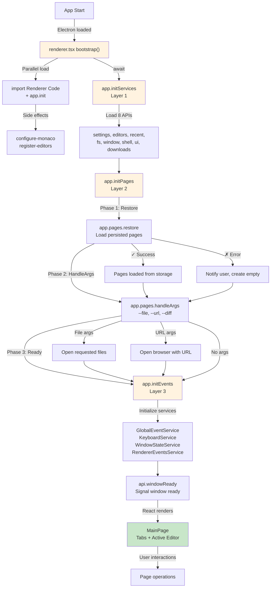
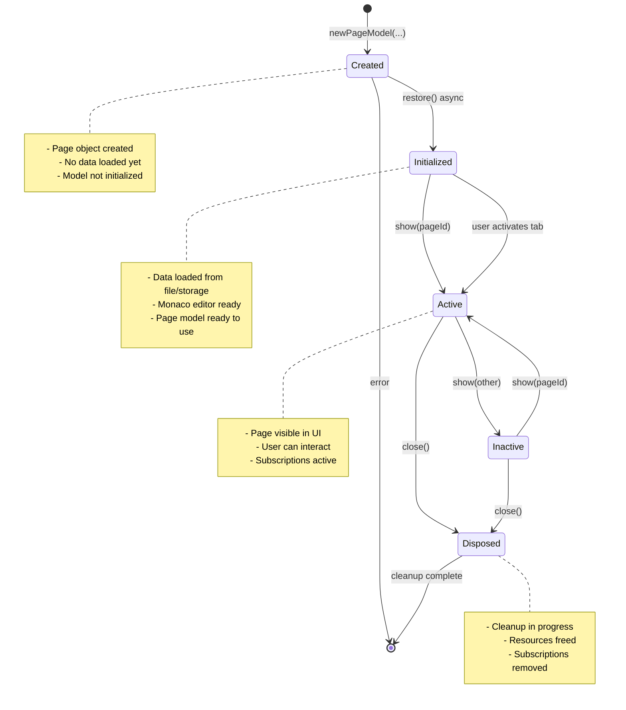
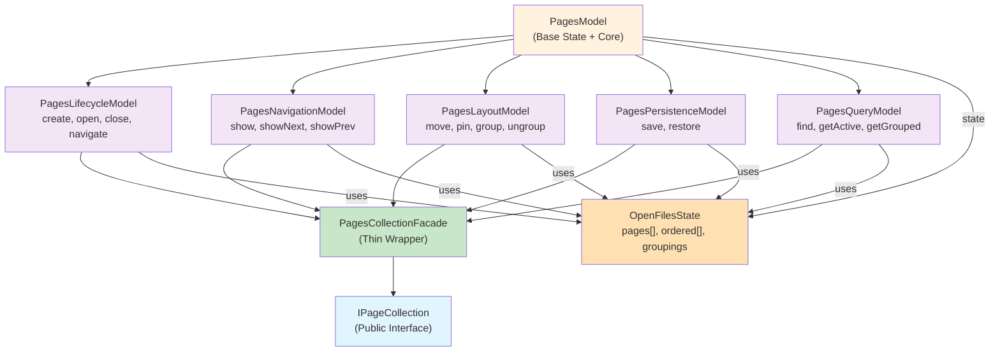

# Phase 4 Design — Window & Page Lifecycle

## 1. Window Bootstrap Lifecycle



**Key Changes (US-049):**
- ✅ Removed `MainPage useEffect` — Bootstrap now in `renderer.tsx` before React renders
- ✅ Removed `EventHandler` component — Event subscriptions moved to 4 internal services
- ✅ Added `app.initServices()` — Layer 1: Load 8 APIs (including downloads)
- ✅ Added `app.initPages()` — Layer 2: Restore pages + handle CLI args
- ✅ Added `app.initEvents()` — Layer 3: Subscribe to all events
- ✅ Explicit 3-phase sequence orchestrated from `app.ts`, not React lifecycle

## 2. Page Lifecycle State Machine



## 3. Page Actions Taxonomy

```mermaid
graph TD
    API["IPageCollection<br/>(Public API)"]

    API --> Q["Queries<br/>(Read-Only)"]
    API --> L["Lifecycle<br/>(Create/Destroy)"]
    API --> N["Navigation<br/>(Visibility)"]
    API --> LAY["Layout<br/>(Arrangement)"]
    API --> P["Persistence<br/>(Storage)"]

    Q --> Q1["pages: IPage[]"]
    Q --> Q2["active: IPage | null"]
    Q --> Q3["find(id)"]
    Q --> Q4["getGrouped(id)"]

    L --> L1["create(type)→IPage"]
    L --> L2["open(path)→Promise"]
    L --> L3["close(id)→Promise"]
    L --> L4["navigate(id, path)"]

    N --> N1["show(id)"]
    N --> N2["showNext()"]
    N --> N3["showPrev()"]

    LAY --> LAY1["move(id, idx)"]
    LAY --> LAY2["pin(id)"]
    LAY --> LAY3["unpin(id)"]
    LAY --> LAY4["group(l, r)"]
    LAY --> LAY5["ungroup(id)"]

    P --> P1["restore()→Promise"]
    P --> P2["save()→Promise"]

    style API fill:#e1f5ff
    style Q fill:#f3e5f5
    style L fill:#f3e5f5
    style N fill:#f3e5f5
    style LAY fill:#f3e5f5
    style P fill:#f3e5f5
```



## 4. Internal Submodel Architecture



## 5. Action Categorization & Submodel Mapping

### PagesLifecycleModel
**Responsibility:** Page creation, opening files, closing, navigation to new content

```typescript
class PagesLifecycleModel {
  // Public API
  create(type: string): PageModel;
  async open(filePath: string, options?: OpenOptions): Promise<PageModel>;
  async close(pageId: string): Promise<boolean>;
  async navigate(pageId: string, newFilePath: string): Promise<boolean>;

  // Internal ops that other submodels use
  private createPageFromFile(filePath: string): Promise<PageModel>;
  private attachPage(page: PageModel): void;
  private detachPage(page: PageModel): void;
  private removePage(page: PageModel): void;
  private replacePage(old: PageModel, new: PageModel): void;
  private closeFirstPageIfEmpty(): void;
}
```

### PagesNavigationModel
**Responsibility:** Manage which page is visible/focused

```typescript
class PagesNavigationModel {
  // Public API
  show(pageId: string): void;
  showNext(): void;
  showPrev(): void;

  // Internal
  private onPageShowRequested(page: PageModel): void;
}
```

### PagesLayoutModel
**Responsibility:** Tab reordering, pinning, grouping

```typescript
class PagesLayoutModel {
  // Public API
  move(pageId: string, toIndex: number): void;
  pin(pageId: string): void;
  unpin(pageId: string): void;
  group(leftId: string, rightId: string): void;
  ungroup(pageId: string): void;

  // Internal
  private moveTabByIndex(from: number, to: number): void;
  private fixGrouping(): void;
  private fixCompareMode(): void;
  private validateGrouping(left: string, right: string): boolean;
}
```

### PagesPersistenceModel
**Responsibility:** Load/save window state to storage

```typescript
class PagesPersistenceModel {
  // Public API
  async restore(): Promise<void>;
  async save(): Promise<void>;

  // Internal
  private restoreState(): Promise<void>;
  private saveState(): Promise<void>;
  private saveStateDebounced(): void;
  private restoreModel(data: Partial<IPage>): Promise<PageModel | null>;
}
```

### PagesQueryModel
**Responsibility:** Read-only queries on page collection

```typescript
class PagesQueryModel {
  // Public API
  find(pageId?: string): PageModel | undefined;
  get pages(): PageModel[];
  get active(): PageModel | undefined;
  getGrouped(pageId: string): PageModel | undefined;
  isLastPage(pageId?: string): boolean;
}
```

## 6. Public Interface Definitions

### IPageCollection (Public API)

```typescript
interface IPageCollection {
  // Queries (read-only)
  readonly pages: IPage[];
  readonly active: IPage | null;
  find(pageId: string): IPage | null;
  getGrouped(pageId: string): IPage | null;

  // Lifecycle (create/destroy)
  create(type: string): IPage;
  open(filePath: string): Promise<IPage>;
  close(pageId: string): Promise<boolean>;
  navigate(pageId: string, newFilePath: string): Promise<boolean>;

  // Navigation (visibility)
  show(pageId: string): void;
  showNext(): void;
  showPrev(): void;

  // Layout (arrangement)
  move(pageId: string, toIndex: number): void;
  pin(pageId: string): void;
  unpin(pageId: string): void;
  group(leftId: string, rightId: string): void;
  ungroup(pageId: string): void;

  // Persistence (storage)
  restore(): Promise<void>;
  save(): Promise<void>;

  // Bootstrap (internal but exposed for window setup)
  readonly onShow: IEvent<IPage>;
  readonly onFocus: IEvent<IPage>;
}
```

### IPage (Public Page Interface)

```typescript
interface IPage {
  // Identity
  readonly id: string;
  readonly type: string;  // "textFile", "browserPage", "imageFile", ...

  // State
  readonly title: string;
  readonly modified: boolean;
  readonly pinned: boolean;
  readonly filePath?: string;  // For file-based pages

  // Content access (conditional)
  asText(): ITextEditor | null;
  asBrowser(): IBrowserEditor | null;
  asGrid(): IGridEditor | null;
  asMarkdown(): IMarkdownEditor | null;
  asNotebook(): INotebookEditor | null;
  // etc. per editor type
}
```

## 7. File Organization

```
/src/renderer/api/
├── pages.ts                        # Public singleton: pages = new PagesCollectionFacade(...)
├── pages/
│   ├── types.d.ts                 # IPageCollection, IPage interfaces
│   ├── PagesModel.ts               # Base state + core operations
│   ├── PagesLifecycleModel.ts      # create, open, close, navigate
│   ├── PagesNavigationModel.ts     # show, showNext, showPrev
│   ├── PagesLayoutModel.ts         # move, pin, group
│   ├── PagesPersistenceModel.ts    # restore, save
│   ├── PagesQueryModel.ts          # find, pages, active, getGrouped
│   └── PagesCollectionFacade.ts    # Thin wrapper → IPageCollection interface
└── page.ts                         # IPage implementation (thin wrapper over PageModel)
```

## 8. Bootstrap Sequence (Updated for US-049)

**File:** `/src/renderer.tsx`

```typescript
async function bootstrap() {
    // Load initial bundle + get version (parallel)
    const [mainExports] = await Promise.all([
        import("./renderer/index"),     // Side effects: configure-monaco, register-editors
        app.init(),                     // Get app version via IPC
    ]);

    // Layer 1: Initialize all core services (8 APIs including downloads)
    await app.initServices();
    // ✓ settings, editors, recent, fs, window, shell, ui, downloads ready

    // Layer 2: Restore pages from storage + handle CLI arguments
    await app.initPages();
    // ✓ Pages restored, CLI args processed (--file, --url, --diff)

    // Layer 3: Subscribe to all events
    await app.initEvents();
    // ✓ GlobalEventService, KeyboardService, WindowStateService, RendererEventsService active

    // Signal main process that window is ready
    setTimeout(() => api.windowReady(), 0);

    // Render React UI (all systems initialized)
    setContent(<mainExports.default />);
}
```

**Key Points:**
- ✅ **No React lifecycle dependencies** — Bootstrap sequence is explicit and testable
- ✅ **No MainPage useEffect** — Pages initialization happens before React renders
- ✅ **No EventHandler component** — Event subscriptions moved to internal services
- ✅ **Parallel operations** — Renderer bundle load + app.init() run together
- ✅ **Guard code** — Each `initXxx()` method has guards preventing re-initialization

**Inside app.ts:**

```typescript
// Layer 1: Initialize external APIs
async initServices(): Promise<void> {
    if (this._servicesInitialized) return;
    this._servicesInitialized = true;

    const [{ settings }, { editors }, { recent }, { fs }, win, { shell }, { ui }, { downloads }]
        = await Promise.all([...]);

    this._downloads = downloads;
    await this._downloads.init();  // Initialize downloads tracking
}

// Layer 2: Restore pages + handle CLI args
async initPages(options?: { handleArgs?: boolean }): Promise<void> {
    if (this._pagesInitialized) return;
    this._pagesInitialized = true;

    // TODO: Placeholder for US-050 — will restore persisted pages here
}

// Layer 3: Subscribe to all events
async initEvents(): Promise<void> {
    if (this._eventsInitialized) return;
    this._eventsInitialized = true;

    const [{ GlobalEventService }, { KeyboardService }, ...] = await Promise.all([...]);
    const globalEvents = new GlobalEventService();
    // ... initialize 4 internal event services in parallel
}
```

## 9. Error Handling Pattern

```typescript
// During restore (initialization): catch and notify, don't crash
async restore(): Promise<void> {
  try {
    const pages = await loadPersistedPages();
    // Process pages
  } catch (err) {
    ui.notify(`Failed to restore pages: ${err.message}`, "error");
    // Create empty page as fallback
    this.addEmptyPage();
  }
}

// During user actions: throw, let caller handle
async open(filePath: string): Promise<IPage> {
  if (!await fs.exists(filePath)) {
    throw new Error(`File not found: ${filePath}`);
  }
  // ...
  return page;
}

// Caller handles user action error
try {
  const page = await pages.open(filePath);
} catch (err) {
  ui.notify(`Failed to open: ${err.message}`, "error");
}
```

## 10. Internal vs. Public Operations

### ✅ Public (in IPageCollection & .d.ts)
- `create(type)` - scripts should create pages
- `open(path)` - scripts should open files
- `close(id)` - scripts should close pages
- `navigate(id, path)` - scripts should navigate
- `show(id)` - UI and scripts activate page
- `move(id, idx)` - UI reorders tabs
- `pin(id)` - UI pins tabs
- `group(l, r)` - UI groups pages
- `restore()` - bootstrap phase
- `pages`, `active`, `find()` - queries

### ❌ Internal (NOT in .d.ts, private in implementation)
- `attachPage()` - subscription management
- `detachPage()` - cleanup
- `removePage()` - state removal
- `fixGrouping()` - invariant repair
- `checkEmptyPage()` - internal heuristic
- `movePageIn()` - changed to internal only (not "move" public method)
- `movePageOut()` - changed to internal only (not public)
- Submodel instances (LifecycleModel, LayoutModel, etc.) - private
- Event subscriptions (onShow, onFocus) - stay but marked internal in .d.ts

### ⚠️ Special: Multi-Window Operations
Decision: `movePageOut()` / `movePageIn()` stay **internal only** (not on IPageCollection.d.ts)
- These are implementation details of multi-window drag-drop
- Scripts don't need to manipulate windows directly
- UI handles drag-drop via internal events

---

## Summary of Design Choices Implemented

✅ **Window Bootstrap:** Explicit 3-layer architecture (Services → Pages → Events) — **IMPLEMENTED in US-049**
✅ **Services Layer:** 8 APIs loaded including downloads as Phase 3b infrastructure — **IMPLEMENTED in US-049**
✅ **Event Services:** 4 internal services (GlobalEventService, KeyboardService, WindowStateService, RendererEventsService) — **IMPLEMENTED in US-049**
✅ **Pages Layer:** Restore + handleArgs structure (implementation planned for US-050)
✅ **Public API:** Option C (action/query split)
✅ **Internal Organization:** Option B (category submodels) via AVGridModel pattern
✅ **Multi-window:** `movePageOut`/`movePageIn` stay internal
✅ **Error Handling:** Throw on user actions, catch on initialization
✅ **Persistence:** Automatic with debounce, explicit `save()` available

**Status:** US-049 bootstrap infrastructure complete. Ready for US-050 (Pages API implementation).
