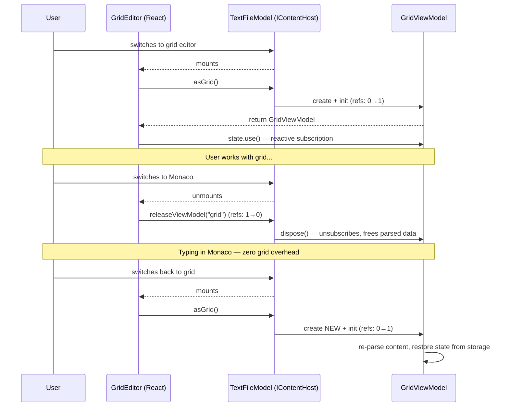
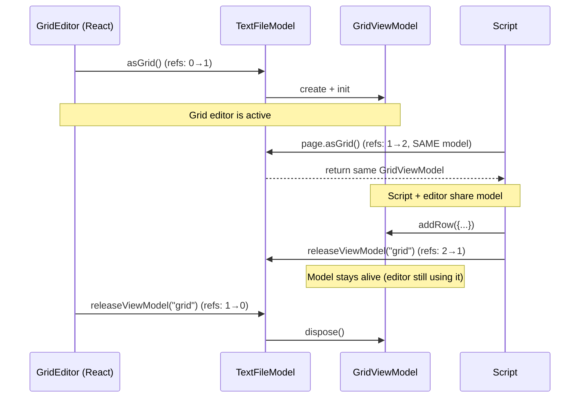

# Phase 5 Foundation: Content View Models

## Problem Statement

Editor-specific models (GridPageModel, NotebookEditorModel, TodoEditorModel) are currently created inside React components via `useComponentModel`. This creates several problems:

1. **No programmatic access** — Scripts and future AI integration cannot call `page.asGrid().addRow()` or `page.asNotebook().addNote()`
2. **Models are transient** — Switching editors destroys the model and recreates it, requiring save/restore state dances
3. **Content re-parsing on every switch** — Switching grid→monaco→grid re-parses the entire JSON each time
4. **Tied to React lifecycle** — Models exist only while their component is mounted
5. **Duck-typed compatibility hack** — `NoteItemEditModel` must be cast as `model as unknown as TextFileModel` because there's no formal interface

## Current Architecture

### Two-tier model hierarchy

```
Tier 1 — Page Models (persistent, per-tab)
├── PageModel<T, R>              — abstract base
├── TextFileModel                — text content + editor field
│   ├── .editor: TextEditorModel — Monaco state (page-owned, always alive)
│   └── .script: ScriptPanelModel — script panel (page-owned, always alive)
├── BrowserPageModel             — web browser
├── PdfPageModel                 — PDF viewer
└── ImagePageModel               — image viewer

Tier 2 — Editor View Models (transient, React-lifecycle-tied)
├── GridPageModel                — created via useComponentModel in GridEditor
├── NotebookEditorModel          — created via useComponentModel in NotebookEditor
└── TodoEditorModel              — created via useComponentModel in TodoEditor
```

### Current lifecycle (the problem)

```
TextFileModel (persistent)
  → ActiveEditor reads state.editor = "grid-json"
    → GridEditor mounts → useComponentModel creates GridPageModel
      → Parse JSON → rows/columns
      → User edits...
    → User switches to Monaco → GridEditor unmounts → GridPageModel DISPOSED
      → Must save state (columns, filters, focus) before disposal
    → User switches back to grid → NEW GridPageModel created
      → Must restore state + re-parse entire content
```

### Existing page-owned models (the pattern we want to standardize)

`TextEditorModel` and `ScriptPanelModel` are already page-owned — created in the TextFileModel constructor and living for the page's lifetime. They demonstrate the correct pattern. The Tier 2 models should follow the same approach.

### The embedded editor hack

`NoteItemEditModel` adapts a notebook note to look like `TextFileModel` so that existing editors (Grid, Markdown) can render note content. Currently uses an unsafe cast:

```typescript
// NoteItemActiveEditor.tsx
<AsyncEditor
    model={model as unknown as TextFileModel}  // ← duck typing
/>
```

This works because `NoteItemEditModel` manually replicates the `TextFileModel` interface (state, changeContent, changeEditor, changeLanguage, portal refs, etc.). There is no formal shared interface.

---

## New Architecture: Content View Models

### Core idea

Move editor models from React lifecycle (Tier 2) to page lifecycle (Tier 1). Models are lazily created on first access, cached, and managed via **reference counting**. Each consumer (React component, script) acquires a reference and releases it when done. When the last consumer releases, the model is disposed and removed from cache.

### Shared content host interface

Define `IContentHost` — the interface that both `TextFileModel` and `NoteItemEditModel` implement. This replaces the duck-typing cast.

```typescript
interface IContentHost {
    /** Unique identifier for state persistence (page ID or note ID) */
    readonly id: string;

    /** Reactive state containing content, language, and editor type */
    readonly state: IState<IContentHostState>;

    /** Update the text content */
    changeContent(content: string, byUser?: boolean): void;

    /** Change the active editor type */
    changeEditor(editor: PageEditor): void;

    /** Change the language */
    changeLanguage(language: string): void;

    /** State storage for persisting editor-specific state (column widths, filters, etc.) */
    readonly stateStorage: EditorStateStorage;
}

interface IContentHostState {
    content: string;
    language: string;
    editor: PageEditor;
}
```

`TextFileModel` implements `IContentHost` naturally (its state already has content/language/editor). `NoteItemEditModel` also implements it (replacing the current duck-typed hack).

### Content view model base class

```typescript
abstract class ContentViewModel<TState> {
    readonly state: TOneState<TState>;
    protected host: IContentHost;

    constructor(host: IContentHost, defaultState: TState);

    /** Called once when the model is first created. Sets up subscriptions. */
    init(): void;

    /** Cleanup. Called when reference count reaches zero. */
    dispose(): void;

    /** Subclass hooks */
    protected abstract onInit(): void;
    protected abstract onContentChanged(content: string): void;
    protected onDispose(): void;

    /** Register a subscription for automatic cleanup on dispose */
    protected addSubscription(unsubscribe: () => void): void;
}
```

The base class:
- Automatically subscribes to `host.state` content changes and calls `onContentChanged()`
- Manages subscription cleanup on dispose
- Provides reactive `state` (TOneState) that React components subscribe to via `.use()`
- Does NOT manage its own reference count — that responsibility belongs to the host (TextFileModel)

### Reference-counted lifecycle

Content view models use **reference counting** to manage their lifetime. This avoids two problems:

1. **Keeping unused models alive** wastes memory and causes unnecessary content parsing (e.g., every keystroke in Monaco would trigger JSON parsing in a sleeping GridViewModel)
2. **Eagerly disposing on editor switch** breaks scripts that hold a reference across editor switches

The host (TextFileModel) tracks consumer count per view model:

```typescript
class TextFileModel extends PageModel {
    private _viewModels = new Map<string, { vm: ContentViewModel<any>; refs: number }>();

    asGrid(): GridViewModel {
        return this._acquire("grid", () => new GridViewModel(this));
    }

    /** Release a reference. When refs reach 0, the model is disposed. */
    releaseViewModel(key: string): void {
        const entry = this._viewModels.get(key);
        if (!entry) return;
        entry.refs--;
        if (entry.refs <= 0) {
            entry.vm.dispose();
            this._viewModels.delete(key);
        }
    }

    private _acquire<T extends ContentViewModel<any>>(
        key: string, factory: () => T
    ): T {
        let entry = this._viewModels.get(key);
        if (!entry) {
            const vm = factory();
            vm.init();
            entry = { vm, refs: 0 };
            this._viewModels.set(key, entry);
        }
        entry.refs++;
        return entry.vm as T;
    }

    dispose(): void {
        for (const { vm } of this._viewModels.values()) vm.dispose();
        this._viewModels.clear();
        super.dispose();
    }
}
```

### Consumer patterns

**React component** — acquire on mount, release on unmount:

```typescript
function GridEditor({ model }: { model: TextFileModel }) {
    const grid = useMemo(() => model.asGrid(), [model]);

    useEffect(() => {
        return () => model.releaseViewModel("grid");
    }, [model]);

    const state = grid.state.use();
    // render...
}
```

**Script** — acquire, use, release:

```typescript
// ScriptContext wrapper auto-manages lifecycle:
asGrid() {
    const grid = page.asGrid();      // refs: 0→1
    // ... script uses grid ...
    // Script wrapper auto-releases when script completes
}
```

The script wrapper acquires the view model at the start and releases it when the script finishes (including after `await`). This is handled by the ScriptContext, not by the script author.

### What happens on editor switch

```
User is in grid view:
  GridEditor mounted → asGrid() → refs: 1
  GridViewModel alive, subscribed to content changes

User switches to Monaco:
  GridEditor unmounts → releaseViewModel("grid") → refs: 0
  GridViewModel.dispose() — unsubscribes from content, frees parsed data
  Typing in Monaco does NOT trigger grid parsing

User switches back to grid:
  GridEditor mounts → asGrid() → NEW GridViewModel created → refs: 1
  Re-parses content (one-time cost), restores saved state from storage

Script runs while in Monaco:
  Script calls page.asGrid() → refs: 0→1 (new model created)
  Script does page.asGrid().addRow({...})
  Script completes → auto-release → refs: 0 → disposed
```

### Concurrent consumers

```
GridEditor mounted (refs: 1)
Script calls page.asGrid() (refs: 2 — SAME model reused)
Script completes → release (refs: 1 — model stays alive)
GridEditor unmounts → release (refs: 0 → disposed)
```

When a script runs while the grid editor is open, they share the same model. The model stays alive until both release.

### TextFileModel integration

The `_acquire` / `releaseViewModel` / `dispose` methods shown in "Reference-counted lifecycle" above are added to TextFileModel. Public accessors:

```typescript
class TextFileModel extends PageModel {
    // Monaco text editor (replaces eagerly-created TextEditorModel)
    asText(): TextViewModel { return this._acquire("text", () => new TextViewModel(this)); }

    // Structured data editors
    asGrid(): GridViewModel { return this._acquire("grid", () => new GridViewModel(this)); }
    asNotebook(): NotebookViewModel { return this._acquire("notebook", () => new NotebookViewModel(this)); }
    asTodo(): TodoViewModel { return this._acquire("todo", () => new TodoViewModel(this)); }

    // Pure renderers
    asMarkdown(): MarkdownViewModel { return this._acquire("markdown", () => new MarkdownViewModel(this)); }
    asSvg(): SvgViewModel { return this._acquire("svg", () => new SvgViewModel(this)); }

    releaseViewModel(key: string): void { /* decrement refs, dispose if zero */ }
}
```

### Embedded editors (notebook notes)

`NoteItemEditModel` implements `IContentHost`, so the same `GridViewModel` works for both standalone and embedded contexts:

```typescript
// NoteItemEditModel implements IContentHost
class NoteItemEditModel implements IContentHost {
    readonly id: string;
    readonly state: TComponentState<IContentHostState>;
    readonly stateStorage: EditorStateStorage;  // backed by notebook data.state

    // Existing methods: changeContent, changeEditor, changeLanguage
    // No more `as unknown as TextFileModel` cast needed
}
```

The embedded editor component:
```typescript
// NoteItemActiveEditor.tsx — AFTER
<AsyncEditor
    model={model}  // model: IContentHost — no cast needed
/>
```

### New lifecycle (the solution)

```
TextFileModel (persistent)
  → user opens .json file, editor = "grid-json"
  → ActiveEditor renders GridEditor
    → GridEditor calls model.asGrid() → GridViewModel created, refs: 1
      → Parses JSON, caches rows/columns
  → User switches to Monaco
    → GridEditor unmounts → releaseViewModel("grid") → refs: 0
    → GridViewModel disposed — no more content subscriptions
    → Typing in Monaco is fast (no grid parsing)
  → User switches back to grid
    → GridEditor mounts → model.asGrid() → NEW GridViewModel, refs: 1
      → Re-parses JSON (one-time), restores state from storage
  → Page closed
    → TextFileModel.dispose() → any remaining view models disposed
```

**Key trade-off**: Re-parsing on editor switch (same as current behavior) vs. wasted CPU on every keystroke. Re-parsing is a one-time cost when switching; keystroke parsing would be continuous overhead. Reference counting gives us the clean disposal of the current architecture while enabling programmatic access and shared models when needed.

---

## IContentHost — Detailed Design

### What it abstracts

| Concern | TextFileModel | NoteItemEditModel |
|---------|--------------|-------------------|
| Content source | File on disk | Note item in notebook JSON |
| State storage | File cache (`fs.getCacheFile`) | Notebook `data.state` map |
| ID scope | Page UUID | Note UUID |
| Language | File extension → detected | Per-note setting |
| Editor type | User choice / auto-detected | Per-note setting |
| Content sync | File → state → editors | Notebook model → note → editors |

The `IContentHost` interface captures what's common: reactive state with content/language/editor, mutation methods, and state storage.

### EditorStateStorage integration

Currently `EditorStateStorage` is provided via React context (`useEditorStateStorage()`). In the new architecture, it becomes part of `IContentHost`:

- **TextFileModel**: provides default file-cache storage (`fs.getCacheFile`/`fs.saveCacheFile`)
- **NoteItemEditModel**: provides notebook-backed storage (`notebookModel.getNoteState`/`setNoteState`)

This removes the need for React context to configure storage. The ContentViewModel reads it from its host.

### EditorConfig stays in React

`EditorConfig` (maxEditorHeight, disableAutoFocus, compact, hideMinimap, highlightText) remains a React context concern. These are rendering hints, not model-level configuration. The ContentViewModel doesn't need them — only the React component does.

### Portal refs

Portal refs (`editorToolbarRefFirst`, `editorToolbarRefLast`, `editorFooterRefLast`, `editorOverlayRef`) remain on the content host. They are set by the React container (TextPageView or NoteItemView) and read by the editor component for rendering toolbar/footer content.

Portal refs are NOT part of `IContentHost` — they are a React rendering concern. Editor components access them from the concrete host type they receive as a prop.

---

## Content View Models — Concrete Implementations

### GridViewModel

Replaces: `GridPageModel` (TComponentModel → ContentViewModel)

```
State: { rows, columns, focus, search, filters, csvDelimiter, csvWithColumns, error }

Content sync:
  host.content → parseContent() → rows/columns (on init + content changes)
  editCell/addRow/deleteRow → serializeContent() → host.changeContent()

Key methods (script-accessible):
  editCell(rowIndex, columnKey, value)
  addRow(data?)
  deleteRows(indices)
  addColumn(name)
  deleteColumns(keys)
  setSearch(text)
  setFilters(filters)

Key methods (UI-only, not in .d.ts):
  setFocus(focus)
  setGridRef(ref)
  saveState() / restoreState()
```

### NotebookViewModel

Replaces: `NotebookEditorModel` (TComponentModel → ContentViewModel)

```
State: { data, categories, tags, filteredNotes, selectedCategory, selectedTag,
         searchText, expandedPanel, leftPanelWidth, expandedNoteId, error }

Content sync:
  host.content → JSON.parse() → NotebookData (on init + content changes)
  addNote/deleteNote/updateNote → JSON.stringify() → host.changeContent()

Key methods (script-accessible):
  addNote(options?)
  deleteNote(id)
  findNote(id)
  updateNoteTitle(id, title)
  updateNoteContent(id, content)
  updateNoteCategory(id, category)
  addNoteTag(id, tag)
  removeNoteTag(id, tagIndex)

Key methods (UI-only):
  setSelectedCategory(category)
  setSelectedTag(tag)
  setSearchText(text)
  setExpandedPanel(panel)
  expandNote(id) / collapseNote()
  categoryDrop(dropItem, dragItem)
```

### TodoViewModel

Replaces: `TodoEditorModel` (TComponentModel → ContentViewModel)

```
State: { data, listCounts, selectedList, selectedTag, searchText, filteredItems, error }

Content sync:
  host.content → JSON.parse() → TodoData (on init + content changes)
  addItem/toggleItem/deleteItem → JSON.stringify() → host.changeContent()

Key methods (script-accessible):
  addItem(title, list?)
  toggleItem(id)
  deleteItem(id)
  updateItemTitle(id, title)
  addList(name)
  renameList(oldName, newName)
  deleteList(name)
  addTag(name)

Key methods (UI-only):
  setSelectedList(list)
  setSelectedTag(tag)
  setSearchText(text)
  moveItem(fromId, toId)
```

---

## Replacing the `effect()` System

Current TComponentModel provides an `effect()` system that re-evaluates on each React render (via `setPropsInternal`). ContentViewModel doesn't have React renders, so effects are replaced:

| Current `effect()` usage | ContentViewModel equivalent |
|-------------------------|----------------------------|
| Watch host content changes | Base class auto-subscribes to `host.state`, calls `onContentChanged()` |
| Watch own state changes (CSV options, filteredNotes) | Subscribe to `this.state` in `onInit()` |
| Page focus events | Subscribe to `pagesModel.onFocus` in `onInit()` |
| Grid model update on filter change | Subscribe to `this.state` in `onInit()` |

All effects become simple Zustand subscriptions managed via `addSubscription()`, which are cleaned up automatically on `dispose()`.

### State persistence across dispose/recreate

Since view models are disposed when their last consumer releases (e.g., editor switch), they still need save/restore for UI state (column widths, filters, scroll position, etc.):

- **`onDispose()`** — saves UI state to `host.stateStorage`
- **`onInit()`** — restores UI state from `host.stateStorage`

This is the same pattern as today's `GridPageModel.saveState()`/`restoreState()`. The key improvement is not in the save/restore dance itself, but in:
1. **Shared model when concurrent** — script + editor share one model, no duplication
2. **Clean disposal** — no content parsing overhead when model is unused
3. **Programmatic access** — scripts can acquire/use/release a view model

---

## Script API (Phase 5 Interfaces)

### page object extension

```typescript
// ScriptContext.ts — wrapPage additions
const wrapPage = (page?: PageModel) => ({
    // ... existing: content, language, editor, grouped, data ...

    asGrid() {
        if (isTextFileModel(page)) return wrapGridView(page.asGrid());
        throw new Error("Not a text file page");
    },

    asNotebook() {
        if (isTextFileModel(page)) return wrapNotebookView(page.asNotebook());
        throw new Error("Not a text file page");
    },

    asTodo() {
        if (isTextFileModel(page)) return wrapTodoView(page.asTodo());
        throw new Error("Not a text file page");
    },
});
```

### Script interface declarations

```typescript
// types/page-grid.d.ts
interface IGridView {
    readonly rows: any[];
    readonly columns: IColumnInfo[];
    editCell(rowIndex: number, columnKey: string, value: any): void;
    addRow(data?: Record<string, any>): void;
    deleteRows(indices: number[]): void;
    addColumn(name: string): void;
    deleteColumns(keys: string[]): void;
}

// types/page-notebook.d.ts
interface INotebookView {
    readonly notes: INote[];
    addNote(options?: { title?: string; category?: string; tags?: string[] }): INote;
    deleteNote(id: string): Promise<void>;
    findNote(id: string): INote | undefined;
    updateNoteTitle(id: string, title: string): void;
    updateNoteContent(id: string, content: string): void;
}

// types/page-todo.d.ts
interface ITodoView {
    readonly items: ITodoItem[];
    readonly lists: string[];
    addItem(title: string, list?: string): ITodoItem;
    toggleItem(id: string): void;
    deleteItem(id: string): Promise<void>;
    addList(name: string): boolean;
    deleteList(name: string): Promise<void>;
}
```

---

## React Component Changes

### Before (GridEditor)

```typescript
export function GridEditor(props: GridPageProps) {
    const { model } = props;
    const editorConfig = useEditorConfig();
    const stateStorage = useEditorStateStorage();
    const mergedProps = { ...props, disableAutoFocus: editorConfig.disableAutoFocus, stateStorage };
    const pageModel = useComponentModel(mergedProps, GridPageModel, defaultGridPageState);
    const pageState = pageModel.state.use();
    // render...
}
```

### After (GridEditor)

```typescript
export function GridEditor({ model }: { model: IContentHost }) {
    const grid = useMemo(() => model.asGrid(), [model]);   // acquire ref

    useEffect(() => {
        return () => model.releaseViewModel("grid");        // release on unmount
    }, [model]);

    const gridState = grid.state.use();                     // reactive subscription
    const editorConfig = useEditorConfig();                  // rendering hints only
    // render using grid methods and gridState...
}
```

Key changes:
- `useComponentModel` call replaced with `useMemo` + `useEffect` cleanup
- Model comes from `model.asGrid()` instead of being created locally
- Cleanup releases the reference — model disposed when no consumers remain
- `EditorStateStorage` no longer from React context — provided by IContentHost
- `EditorConfig` stays in React context (rendering concern)
- Component accepts `IContentHost` instead of `TextFileModel`

### NoteItemActiveEditor — no more cast

```typescript
// BEFORE:
<AsyncEditor model={model as unknown as TextFileModel} />

// AFTER:
<AsyncEditor model={model} />  // model: IContentHost — proper typing
```

---

## File Changes Overview

### New files

```
src/renderer/editors/base/
├── IContentHost.ts              — IContentHost interface definition
└── ContentViewModel.ts          — Base class for content view models

src/renderer/api/types/
├── page-grid.d.ts               — IGridView script interface
├── page-notebook.d.ts           — INotebookView script interface
└── page-todo.d.ts               — ITodoView script interface
```

### Major refactors

```
src/renderer/editors/text/
├── TextEditorModel.ts           → TextViewModel.ts (extends ContentViewModel)
└── TextPageView.tsx             — Use model.asText() instead of direct TextEditorModel

src/renderer/editors/grid/
├── GridPageModel.ts             → GridViewModel.ts (extends ContentViewModel)
└── GridEditor.tsx               — Use model.asGrid() instead of useComponentModel

src/renderer/editors/notebook/
├── NotebookEditorModel.ts       → NotebookViewModel.ts (extends ContentViewModel)
├── NotebookEditor.tsx           — Use model.asNotebook() instead of useComponentModel
└── note-editor/
    └── NoteItemEditModel.ts     — Implement IContentHost formally

src/renderer/editors/todo/
├── TodoEditorModel.ts           → TodoViewModel.ts (extends ContentViewModel)
└── TodoEditor.tsx               — Use model.asTodo() instead of useComponentModel

src/renderer/editors/markdown/
└── MarkdownView.tsx             — MarkdownViewModel (extends ContentViewModel)

src/renderer/editors/svg/
└── SvgView.tsx                  — SvgViewModel (extends ContentViewModel)
```

### Modified files

```
src/renderer/editors/text/TextPageModel.ts
  — Implement IContentHost
  — Add asText(), asGrid(), asNotebook(), asTodo(), asMarkdown(), asSvg() accessors
  — Add _viewModels map + dispose cleanup
  — Remove eagerly-created TextEditorModel

src/renderer/editors/text/ActiveEditor.tsx
  — Accept IContentHost instead of TextFileModel

src/renderer/ui/app/AsyncEditor.tsx
  — Accept IContentHost instead of PageModel

src/renderer/core/services/scripting/ScriptContext.ts
  — Add asGrid(), asNotebook(), asTodo() to page wrapper
```

---

## Migration Strategy

### Order

1. **IContentHost + ContentViewModel** — Create base interface and class
2. **TextViewModel** — Refactor TextEditorModel (Monaco) — validates the base class design
3. **GridViewModel** — Refactor GridPageModel (most commonly used structured editor)
4. **NotebookViewModel** — Refactor NotebookEditorModel
5. **TodoViewModel** — Refactor TodoEditorModel
6. **Pure renderers** — MarkdownViewModel, SvgViewModel, etc.
7. **NoteItemEditModel** — Implement IContentHost, remove cast
8. **Script interfaces** — Add .d.ts files, update ScriptContext

Each step compiles and works independently. The old `useComponentModel` pattern can coexist with the new pattern during migration.

### Backward compatibility

- The `page` object in scripts keeps all existing properties (`content`, `language`, `editor`, `grouped`, `data`)
- New `asGrid()`, `asNotebook()`, `asTodo()` are additions, not replacements
- Existing editor registration and async loading remains unchanged

---

## Architecture Diagram

```mermaid
block-beta
    columns 3

    %% ── IContentHost implementations ──────────────────────
    block:TextFileModel:2
        columns 2
        tfmTitle["TextFileModel\n(implements IContentHost)"]
        tfmState["state: { content, language, editor, ... }\nstateStorage: file-cache"]
        ScriptPanelModel["ScriptPanelModel\n(always alive)"]
        space1["&nbsp;"]
        block:ViewModels:2
            vmTitle["Content View Models\n(lazy, reference-counted)"]
            TextVM[".asText() → TextViewModel (Monaco)"]
            GridVM[".asGrid() → GridViewModel"]
            NotebookVM[".asNotebook() → NotebookViewModel"]
            TodoVM[".asTodo() → TodoViewModel"]
            MarkdownVM[".asMarkdown() → MarkdownViewModel"]
            SvgVM[".asSvg() → SvgViewModel"]
        end
    end

    block:NoteItemEditModel:1
        niemTitle["NoteItemEditModel\n(implements IContentHost)"]
        niemState["state: { content, language, editor }\nstateStorage: notebook data.state"]
        niemNote["No .asX() accessors\nUsed directly by React editors\nvia IContentHost interface"]
    end

    %% ── Consumer layers ───────────────────────────────────
    block:ReactLayer:2
        columns 1
        reactTitle["React Layer (presentation only)"]
        reactGrid["GridEditor: model.asGrid() → grid.state.use()"]
        reactNotebook["NotebookEditor: model.asNotebook() → notebook.state.use()"]
        reactConfig["EditorConfig context: rendering hints\n(maxEditorHeight, disableAutoFocus, compact)"]
    end

    block:ScriptLayer:1
        columns 1
        scriptTitle["Script Layer"]
        scriptRaw["page.content = '...'  (existing)"]
        scriptGrid["page.asGrid().addRow({...})  (new)"]
        scriptNotebook["page.asNotebook().addNote()  (new)"]
    end

    %% ── Relationships ─────────────────────────────────────
    ReactLayer -- "acquire / release refs" --> ViewModels
    ScriptLayer -- "acquire / release refs" --> ViewModels
```



### Lifecycle flow



### Concurrent consumers



---

## Benefits Summary

| Aspect | Before | After |
|--------|--------|-------|
| Model lifecycle | React (dispose on editor switch) | Reference-counted (dispose when unused) |
| State across switches | Save/restore dance | Save/restore (same), but shared when concurrent |
| Unused model overhead | N/A (always disposed) | None — disposed when refs reach 0 |
| Concurrent access | Impossible (React-owned) | Shared model when script + editor both active |
| Programmatic access | Impossible | `page.asGrid().addRow()` |
| Script API | Raw text only (`page.content`) | Rich typed API per editor |
| Embedded editors | `as unknown as TextFileModel` cast | `IContentHost` — proper typing |
| Testability | Requires React mount | Pure TypeScript, no React needed |
| Model creation | React render → useComponentModel | Lazy on first `.asX()` call |

---

## Open Questions

(none remaining — all resolved, see below)

---

## Resolved Design Decisions

### Reference counting vs. persistent models

**Decision:** Reference counting.

**Problem with persistent models:** If a GridViewModel stays alive while the user edits JSON in Monaco, every keystroke triggers the content subscription → `onContentChanged()` → JSON parsing in GridViewModel. For large JSON files, this is a continuous performance overhead on every keystroke.

**Reference counting solves this:** When the user switches from grid to Monaco, the GridEditor component unmounts, releases its reference, refs reach 0, and the GridViewModel is disposed. The content subscription is removed — typing in Monaco has zero grid-related overhead.

**Trade-off accepted:** Switching back to grid requires re-parsing (same as current behavior). This is a one-time cost, acceptable compared to per-keystroke overhead.

**Concurrent access works correctly:** If a script calls `page.asGrid()` while the GridEditor is mounted, both share the same model (refs: 2). The model stays alive until both release.

### `asGrid()` does not auto-switch editor type

**Decision:** Keep separate.

Calling `asGrid()` only creates/returns the view model — it does not change `state.editor` to `"grid-json"`. The accessor is a data access operation, not a UI navigation action. If a script wants to switch the visible editor, it sets `page.editor = "grid-json"` explicitly.

### View model accessors live on TextFileModel only

**Decision:** `asGrid()`, `asNotebook()`, `asTodo()`, etc. are defined on `TextFileModel`, not on `IContentHost`.

`IContentHost` stays minimal — it provides content state, mutation methods, and state storage. View model accessors are a higher-level concern. `NoteItemEditModel` implements `IContentHost` but does not expose `asGrid()` / `asNotebook()` for scripts. Notebooks can have 1000+ notes; dynamically creating `IContentHost`-based view models for each note via scripting would be wasteful. Embedded editors (grid inside a notebook note) still work at the React level: the React component receives the `NoteItemEditModel` as `IContentHost` and uses it directly.

### All editors use ContentViewModel — including pure renderers and TextEditorModel

**Decision:** Uniform pattern for all editor types.

Every editor view gets a `ContentViewModel` subclass, even "pure renderers" (Markdown, SVG, HTML, Mermaid) and the Monaco text editor. This avoids a mix of different patterns and enables script API for all editors (e.g., `page.asSvg().copyToClipboard()`, `page.asMarkdown().toHtml()`).

Pure renderers have minimal state (just the rendered output or parsed result), but the uniform pattern means:
- Same acquire/release lifecycle
- Same `addSubscription()` cleanup
- Same `host.stateStorage` for persisting UI state (e.g., scroll position)
- Script API surface for each editor type

`TextEditorModel` (Monaco) also becomes a `ContentViewModel` subclass — it matches the pattern exactly (manages Monaco instance, tracks selection, content height). It is no longer created eagerly in the TextFileModel constructor; instead it's created lazily via `asText()` like all other view models.

### Script auto-release: explicit for now

**Decision:** Scripts explicitly release view models by calling `page.releaseViewModel(key)`. No auto-release mechanism in this migration phase.

The current migration focuses on refactoring the architecture. Script API enhancements (auto-release via ScriptContext wrapper, tracking acquired view models) will be designed in a later phase. For now, script authors are responsible for acquiring and releasing view models properly.
