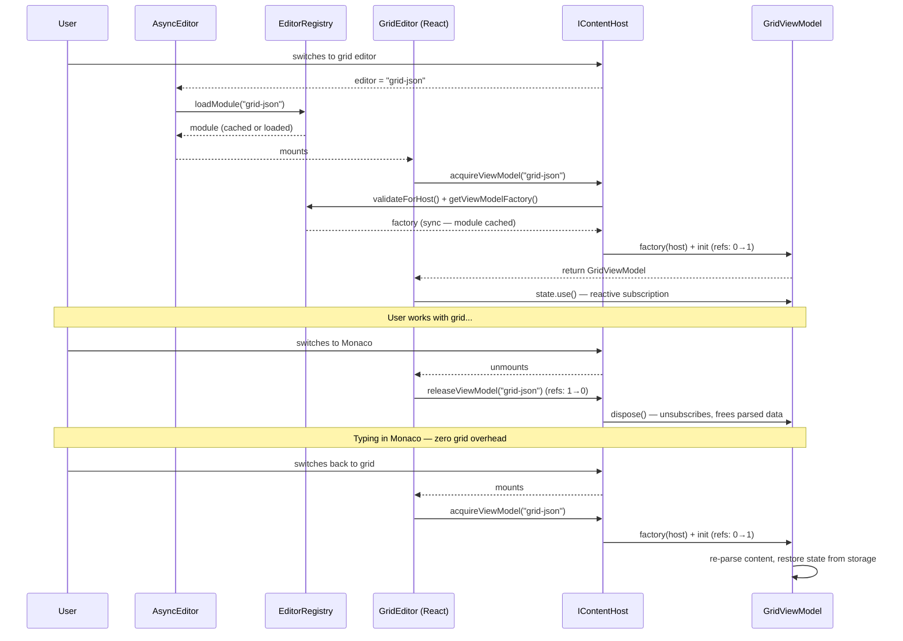
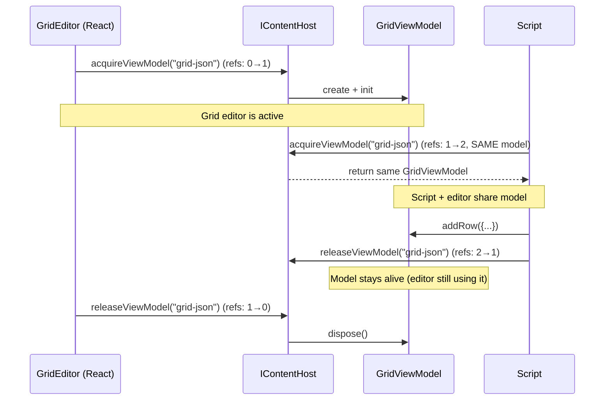

# Phase 5 Foundation: Content View Models

## Problem Statement

Editor-specific models (GridPageModel, NotebookEditorModel, TodoEditorModel) are currently created inside React components via `useComponentModel`. This creates several problems:

1. **No programmatic access** — Scripts and future AI integration cannot call `page.asGrid().addRow()` or `page.asNotebook().addNote()`
2. **Models are transient** — Switching editors destroys the model and recreates it, requiring save/restore state dances
3. **Content re-parsing on every switch** — Switching grid→monaco→grid re-parses the entire JSON each time
4. **Tied to React lifecycle** — Models exist only while their component is mounted
5. **Duck-typed compatibility hack** — `NoteItemEditModel` must be cast as `model as unknown as TextFileModel` because there's no formal interface

## Current Architecture

### Two-tier model hierarchy

```
Tier 1 — Page Models (persistent, per-tab)
├── PageModel<T, R>              — abstract base
├── TextFileModel                — implements IContentHost, text content + editor field
│   ├── .io: TextFileIOModel     — file save/load/watch/cache/rename
│   ├── .encryption: TextFileEncryptionModel — encrypt/decrypt/password
│   ├── .actions: TextFileActionsModel — keyboard, scripts, nav panel, compare
│   ├── .script: ScriptPanelModel — script panel (page-owned, always alive)
│   ├── ._vmHost: ContentViewModelHost — ref-counted view model lifecycle
│   ├── (TextViewModel managed by _vmHost — lazy, ref-counted via "monaco" key)
│   └── (GridViewModel managed by _vmHost — lazy, ref-counted via "grid-json"/"grid-csv" key)
├── BrowserPageModel             — web browser
├── PdfPageModel                 — PDF viewer
└── ImagePageModel               — image viewer

Tier 2 — Editor View Models (transient, React-lifecycle-tied)
├── NotebookEditorModel          — created via useComponentModel in NotebookEditor
└── TodoEditorModel              — created via useComponentModel in TodoEditor
```

### Current lifecycle (the problem)

```
TextFileModel (persistent)
  → ActiveEditor reads state.editor = "grid-json"
    → GridEditor mounts → useComponentModel creates GridPageModel
      → Parse JSON → rows/columns
      → User edits...
    → User switches to Monaco → GridEditor unmounts → GridPageModel DISPOSED
      → Must save state (columns, filters, focus) before disposal
    → User switches back to grid → NEW GridPageModel created
      → Must restore state + re-parse entire content
```

### Existing page-owned models (the pattern we want to standardize)

`ScriptPanelModel` is page-owned — created in the TextFileModel constructor and living for the page's lifetime. `TextEditorModel` has been migrated to `TextViewModel extends ContentViewModel`, and `GridPageModel` has been migrated to `GridViewModel extends ContentViewModel` — both lazily created via `ContentViewModelHost`, ref-counted, and managed by the `useContentViewModel` hook. The remaining Tier 2 models should follow the same ContentViewModel pattern.

### The embedded editor hack

`NoteItemEditModel` adapts a notebook note to look like `TextFileModel` so that existing editors (Grid, Markdown) can render note content. Currently uses an unsafe cast:

```typescript
// NoteItemActiveEditor.tsx
<AsyncEditor
    model={model as unknown as TextFileModel}  // ← duck typing
/>
```

This works because `NoteItemEditModel` manually replicates the `TextFileModel` interface (state, changeContent, changeEditor, changeLanguage, portal refs, etc.). There is no formal shared interface.

---

## New Architecture: Content View Models

### Core idea

Move editor models from React lifecycle (Tier 2) to page lifecycle (Tier 1). Models are lazily created on first access, cached, and managed via **reference counting**. Each consumer (React component, script) acquires a reference and releases it when done. When the last consumer releases, the model is disposed and removed from cache.

### Shared content host interface

Define `IContentHost` — the interface that both `TextFileModel` and `NoteItemEditModel` implement. This replaces the duck-typing cast.

```typescript
interface IContentHostState {
    content: string;
    language: string;
    editor: PageEditor;
}

interface IContentHost {
    /** Unique identifier for state persistence (page ID or note ID) */
    readonly id: string;

    /** Reactive state containing content, language, and editor type */
    readonly state: IState<IContentHostState>;

    /** Update the text content */
    changeContent(content: string, byUser?: boolean): void;

    /** Change the active editor type */
    changeEditor(editor: PageEditor): void;

    /** Change the language */
    changeLanguage(language: string): void;

    /** State storage for persisting editor-specific state (column widths, filters, etc.) */
    readonly stateStorage: EditorStateStorage;

    /** Acquire a view model by editor ID. Creates on first call, increments refs. Async because editor modules are lazy-loaded. */
    acquireViewModel(editorId: PageEditor): Promise<ContentViewModel<any>>;

    /** Release a reference. When refs reach 0, the model is disposed. */
    releaseViewModel(editorId: PageEditor): void;
}
```

`TextFileModel` implements `IContentHost` naturally (its state already has content/language/editor). `NoteItemEditModel` also implements it (replacing the current duck-typed hack). Both get view model acquisition via composition (see `ContentViewModelHost` below).

### Content view model base class

```typescript
abstract class ContentViewModel<TState> {
    readonly state: TOneState<TState>;
    protected host: IContentHost;

    constructor(host: IContentHost, defaultState: TState);

    /** Called once when the model is first created. Sets up subscriptions. */
    init(): void;

    /** Cleanup. Called when reference count reaches zero. */
    dispose(): void;

    /** Subclass hooks */
    protected abstract onInit(): void;
    protected abstract onContentChanged(content: string): void;
    protected onDispose(): void;

    /** Register a subscription for automatic cleanup on dispose */
    protected addSubscription(unsubscribe: () => void): void;
}
```

The base class:
- Automatically subscribes to `host.state` content changes and calls `onContentChanged()`
- Manages subscription cleanup on dispose
- Provides reactive `state` (TOneState) that React components subscribe to via `.use()`
- Does NOT manage its own reference count — that responsibility belongs to the host via `ContentViewModelHost`

### Reference-counted lifecycle

Content view models use **reference counting** to manage their lifetime. This avoids two problems:

1. **Keeping unused models alive** wastes memory and causes unnecessary content parsing (e.g., every keystroke in Monaco would trigger JSON parsing in a sleeping GridViewModel)
2. **Eagerly disposing on editor switch** breaks scripts that hold a reference across editor switches

### ContentViewModelHost (composition helper)

Both `TextFileModel` (extends `PageModel`) and `NoteItemEditModel` (standalone class) need ref-counting. Since TypeScript doesn't have multiple inheritance, both compose a shared `ContentViewModelHost`:

```typescript
class ContentViewModelHost {
    private _viewModels = new Map<PageEditor, { vm: ContentViewModel<any>; refs: number }>();

    /** Acquire: validate via registry, get/load factory, create/cache, refs++ */
    async acquire(editorId: PageEditor, host: IContentHost): Promise<ContentViewModel<any>> {
        let entry = this._viewModels.get(editorId);
        if (!entry) {
            // Validate applicability
            editorRegistry.validateForHost(editorId, host);
            // Get factory (loads module if needed)
            const factory = editorRegistry.getViewModelFactory(editorId)
                ?? await editorRegistry.loadViewModelFactory(editorId);
            const vm = factory(host);
            vm.init();
            entry = { vm, refs: 0 };
            this._viewModels.set(editorId, entry);
        }
        entry.refs++;
        return entry.vm;
    }

    /** Release: refs--, dispose if zero */
    release(editorId: PageEditor): void {
        const entry = this._viewModels.get(editorId);
        if (!entry) return;
        entry.refs--;
        if (entry.refs <= 0) {
            entry.vm.dispose();
            this._viewModels.delete(editorId);
        }
    }

    /** Dispose all cached models (called when host is disposed) */
    disposeAll(): void {
        for (const { vm } of this._viewModels.values()) vm.dispose();
        this._viewModels.clear();
    }
}
```

Both implementations delegate:

```typescript
class TextFileModel extends PageModel implements IContentHost {
    private _vmHost = new ContentViewModelHost();
    acquireViewModel(editorId: PageEditor) { return this._vmHost.acquire(editorId, this); }
    releaseViewModel(editorId: PageEditor) { this._vmHost.release(editorId); }
    dispose() { this._vmHost.disposeAll(); super.dispose(); }
}

class NoteItemEditModel implements IContentHost {
    private _vmHost = new ContentViewModelHost();
    acquireViewModel(editorId: PageEditor) { return this._vmHost.acquire(editorId, this); }
    releaseViewModel(editorId: PageEditor) { this._vmHost.release(editorId); }
    dispose() { this._vmHost.disposeAll(); }
}
```

### Editor Registry integration

The `EditorRegistry` provides view model factories and validation. This is a natural extension — the registry already controls which editors are applicable via `switchOption()` and `validForLanguage()`.

```typescript
// EditorModule — extended with optional factory
interface EditorModule {
    Editor: FileEditorPage;
    createViewModel?: (host: IContentHost) => ContentViewModel<any>;
    // ... existing page model factories ...
}

// EditorRegistry — new methods
class EditorRegistry {
    private loadedModules = new Map<PageEditor, EditorModule>();

    /** Sync: returns factory if module already loaded */
    getViewModelFactory(editorId: PageEditor): ((host: IContentHost) => ContentViewModel<any>) | undefined {
        return this.loadedModules.get(editorId)?.createViewModel;
    }

    /** Async: loads module if needed, returns factory */
    async loadViewModelFactory(editorId: PageEditor): Promise<(host: IContentHost) => ContentViewModel<any>> {
        if (!this.loadedModules.has(editorId)) {
            const def = this.getById(editorId);
            if (!def) throw new Error(`Editor "${editorId}" not registered`);
            const module = await def.loadModule();
            this.loadedModules.set(editorId, module);
        }
        const factory = this.loadedModules.get(editorId)?.createViewModel;
        if (!factory) throw new Error(`Editor "${editorId}" has no view model factory`);
        return factory;
    }

    /** Validate editor is applicable for host's current content */
    validateForHost(editorId: PageEditor, host: IContentHost): void {
        const def = this.getById(editorId);
        if (!def) throw new Error(`Editor "${editorId}" not registered`);
        if (def.category !== "content-view") throw new Error(`"${editorId}" is not a content view editor`);
        const language = host.state.get().language || "";
        if (def.validForLanguage && !def.validForLanguage(language)) {
            throw new Error(`Editor "${editorId}" is not applicable for "${language}" content`);
        }
    }
}
```

Factory registration happens in `register-editors.ts` when each editor is migrated (Tasks 2–9):

```typescript
// register-editors.ts — example for grid-json (added in Task 3)
editorRegistry.register({
    id: "grid-json",
    // ... existing fields ...
    loadModule: async () => {
        const [editorModule, { GridViewModel }] = await Promise.all([
            import("./grid/GridEditor"),
            import("./grid/GridViewModel"),
        ]);
        return {
            Editor: editorModule.GridEditor,
            createViewModel: (host: IContentHost) => new GridViewModel(host),
            // ... existing page model factories ...
        };
    },
});
```

### Consumer patterns

**React component** — async acquire via hook:

```typescript
function GridEditor({ model }: { model: IContentHost }) {
    const grid = useContentViewModel<GridViewModel>(model, "grid-json");
    if (!grid) return null;  // loading (typically instant — module pre-loaded by AsyncEditor)

    const gridState = grid.state.use();
    const editorConfig = useEditorConfig();  // rendering hints only
    // render using grid methods and gridState...
}
```

The `useContentViewModel` hook handles the full lifecycle:

```typescript
function useContentViewModel<T extends ContentViewModel<any>>(
    host: IContentHost, editorId: PageEditor
): T | null {
    const [vm, setVm] = useState<T | null>(null);
    const vmRef = useRef<T | null>(null);

    useEffect(() => {
        let cancelled = false;
        host.acquireViewModel(editorId).then((model) => {
            if (!cancelled) {
                vmRef.current = model as T;
                setVm(model as T);
            }
        });
        return () => {
            cancelled = true;
            if (vmRef.current) {
                host.releaseViewModel(editorId);
                vmRef.current = null;
            }
        };
    }, [host, editorId]);

    return vm;
}
```

**Script** — async acquire, use, release:

```typescript
// ScriptContext wrapper (Task 10):
async asGrid() {
    const grid = await host.acquireViewModel("grid-json");  // loads module if needed
    // ... wrap for script API ...
    // Script wrapper auto-releases when script completes
}
```

### What happens on editor switch

```
User is in grid view:
  GridEditor mounted → asGrid() → refs: 1
  GridViewModel alive, subscribed to content changes

User switches to Monaco:
  GridEditor unmounts → releaseViewModel("grid") → refs: 0
  GridViewModel.dispose() — unsubscribes from content, frees parsed data
  Typing in Monaco does NOT trigger grid parsing

User switches back to grid:
  GridEditor mounts → asGrid() → NEW GridViewModel created → refs: 1
  Re-parses content (one-time cost), restores saved state from storage

Script runs while in Monaco:
  Script calls page.asGrid() → refs: 0→1 (new model created)
  Script does page.asGrid().addRow({...})
  Script completes → auto-release → refs: 0 → disposed
```

### Concurrent consumers

```
GridEditor mounted (refs: 1)
Script calls page.asGrid() (refs: 2 — SAME model reused)
Script completes → release (refs: 1 — model stays alive)
GridEditor unmounts → release (refs: 0 → disposed)
```

When a script runs while the grid editor is open, they share the same model. The model stays alive until both release.

### TextFileModel integration

TextFileModel delegates view model management to `ContentViewModelHost` (composition). No typed `asGrid()` methods on the class itself — the `acquireViewModel(editorId)` method handles all editor types via the registry:

```typescript
class TextFileModel extends PageModel<TextFilePageModelState> implements IContentHost {
    private _vmHost = new ContentViewModelHost();

    // ── IContentHost ─────────────────────────────────
    changeContent = (newContent: string, byUser?: boolean) => { ... };
    changeEditor = (editor: PageEditor) => { ... };
    changeLanguage = (language: string) => { ... };
    get stateStorage(): EditorStateStorage { ... }

    // ── View model lifecycle (delegates to _vmHost) ──
    acquireViewModel(editorId: PageEditor) { return this._vmHost.acquire(editorId, this); }
    releaseViewModel(editorId: PageEditor) { this._vmHost.release(editorId); }

    dispose(): void {
        this._vmHost.disposeAll();
        super.dispose();
    }
}
```

### Embedded editors (notebook notes)

`NoteItemEditModel` also implements `IContentHost` with the same `acquireViewModel` / `releaseViewModel`, so the same `GridViewModel` works for both standalone and embedded contexts:

```typescript
class NoteItemEditModel implements IContentHost {
    private _vmHost = new ContentViewModelHost();

    readonly id: string;
    readonly state: TComponentState<IContentHostState>;
    readonly stateStorage: EditorStateStorage;  // backed by notebook data.state

    // Existing methods: changeContent, changeEditor, changeLanguage

    // View model lifecycle (same as TextFileModel)
    acquireViewModel(editorId: PageEditor) { return this._vmHost.acquire(editorId, this); }
    releaseViewModel(editorId: PageEditor) { this._vmHost.release(editorId); }
    dispose() { this._vmHost.disposeAll(); }
}
```

The embedded editor component:
```typescript
// NoteItemActiveEditor.tsx — AFTER
<AsyncEditor
    model={model}  // model: IContentHost — no cast needed
/>
```

GridEditor works identically for both hosts — it just calls `useContentViewModel(model, "grid-json")`.

### New lifecycle (the solution)

```
TextFileModel (persistent)
  → user opens .json file, editor = "grid-json"
  → ActiveEditor renders GridEditor
    → GridEditor calls model.asGrid() → GridViewModel created, refs: 1
      → Parses JSON, caches rows/columns
  → User switches to Monaco
    → GridEditor unmounts → releaseViewModel("grid") → refs: 0
    → GridViewModel disposed — no more content subscriptions
    → Typing in Monaco is fast (no grid parsing)
  → User switches back to grid
    → GridEditor mounts → model.asGrid() → NEW GridViewModel, refs: 1
      → Re-parses JSON (one-time), restores state from storage
  → Page closed
    → TextFileModel.dispose() → any remaining view models disposed
```

**Key trade-off**: Re-parsing on editor switch (same as current behavior) vs. wasted CPU on every keystroke. Re-parsing is a one-time cost when switching; keystroke parsing would be continuous overhead. Reference counting gives us the clean disposal of the current architecture while enabling programmatic access and shared models when needed.

---

## IContentHost — Detailed Design

### What it abstracts

| Concern | TextFileModel | NoteItemEditModel |
|---------|--------------|-------------------|
| Content source | File on disk | Note item in notebook JSON |
| State storage | File cache (`fs.getCacheFile`) | Notebook `data.state` map |
| ID scope | Page UUID | Note UUID |
| Language | File extension → detected | Per-note setting |
| Editor type | User choice / auto-detected | Per-note setting |
| Content sync | File → state → editors | Notebook model → note → editors |

The `IContentHost` interface captures what's common: reactive state with content/language/editor, mutation methods, and state storage.

### EditorStateStorage integration

Currently `EditorStateStorage` is provided via React context (`useEditorStateStorage()`). In the new architecture, it becomes part of `IContentHost`:

- **TextFileModel**: provides default file-cache storage (`fs.getCacheFile`/`fs.saveCacheFile`)
- **NoteItemEditModel**: provides notebook-backed storage (`notebookModel.getNoteState`/`setNoteState`)

This removes the need for React context to configure storage. The ContentViewModel reads it from its host.

### EditorConfig stays in React

`EditorConfig` (maxEditorHeight, disableAutoFocus, compact, hideMinimap, highlightText) remains a React context concern. These are rendering hints, not model-level configuration. The ContentViewModel doesn't need them — only the React component does.

### Portal refs

Portal refs (`editorToolbarRefFirst`, `editorToolbarRefLast`, `editorFooterRefLast`, `editorOverlayRef`) remain on the content host. They are set by the React container (TextPageView or NoteItemView) and read by the editor component for rendering toolbar/footer content.

Portal refs are NOT part of `IContentHost` — they are a React rendering concern. Editor components access them from the concrete host type they receive as a prop.

---

## Content View Models — Concrete Implementations

### GridViewModel

Replaces: `GridPageModel` (TComponentModel → ContentViewModel)

```
State: { rows, columns, focus, search, filters, csvDelimiter, csvWithColumns, error }

Content sync:
  host.content → parseContent() → rows/columns (on init + content changes)
  editCell/addRow/deleteRow → serializeContent() → host.changeContent()

Key methods (script-accessible):
  editCell(rowIndex, columnKey, value)
  addRow(data?)
  deleteRows(indices)
  addColumn(name)
  deleteColumns(keys)
  setSearch(text)
  setFilters(filters)

Key methods (UI-only, not in .d.ts):
  setFocus(focus)
  setGridRef(ref)
  saveState() / restoreState()
```

### NotebookViewModel

Replaces: `NotebookEditorModel` (TComponentModel → ContentViewModel)

```
State: { data, categories, tags, filteredNotes, selectedCategory, selectedTag,
         searchText, expandedPanel, leftPanelWidth, expandedNoteId, error }

Content sync:
  host.content → JSON.parse() → NotebookData (on init + content changes)
  addNote/deleteNote/updateNote → JSON.stringify() → host.changeContent()

Key methods (script-accessible):
  addNote(options?)
  deleteNote(id)
  findNote(id)
  updateNoteTitle(id, title)
  updateNoteContent(id, content)
  updateNoteCategory(id, category)
  addNoteTag(id, tag)
  removeNoteTag(id, tagIndex)

Key methods (UI-only):
  setSelectedCategory(category)
  setSelectedTag(tag)
  setSearchText(text)
  setExpandedPanel(panel)
  expandNote(id) / collapseNote()
  categoryDrop(dropItem, dragItem)
```

### TodoViewModel

Replaces: `TodoEditorModel` (TComponentModel → ContentViewModel)

```
State: { data, listCounts, selectedList, selectedTag, searchText, filteredItems, error }

Content sync:
  host.content → JSON.parse() → TodoData (on init + content changes)
  addItem/toggleItem/deleteItem → JSON.stringify() → host.changeContent()

Key methods (script-accessible):
  addItem(title, list?)
  toggleItem(id)
  deleteItem(id)
  updateItemTitle(id, title)
  addList(name)
  renameList(oldName, newName)
  deleteList(name)
  addTag(name)

Key methods (UI-only):
  setSelectedList(list)
  setSelectedTag(tag)
  setSearchText(text)
  moveItem(fromId, toId)
```

---

## Replacing the `effect()` System

Current TComponentModel provides an `effect()` system that re-evaluates on each React render (via `setPropsInternal`). ContentViewModel doesn't have React renders, so effects are replaced:

| Current `effect()` usage | ContentViewModel equivalent |
|-------------------------|----------------------------|
| Watch host content changes | Base class auto-subscribes to `host.state`, calls `onContentChanged()` |
| Watch own state changes (CSV options, filteredNotes) | Subscribe to `this.state` in `onInit()` |
| Page focus events | Subscribe to `pagesModel.onFocus` in `onInit()` |
| Grid model update on filter change | Subscribe to `this.state` in `onInit()` |

All effects become simple Zustand subscriptions managed via `addSubscription()`, which are cleaned up automatically on `dispose()`.

### State persistence across dispose/recreate

Since view models are disposed when their last consumer releases (e.g., editor switch), they still need save/restore for UI state (column widths, filters, scroll position, etc.):

- **`onDispose()`** — saves UI state to `host.stateStorage`
- **`onInit()`** — restores UI state from `host.stateStorage`

This is the same pattern as today's `GridPageModel.saveState()`/`restoreState()`. The key improvement is not in the save/restore dance itself, but in:
1. **Shared model when concurrent** — script + editor share one model, no duplication
2. **Clean disposal** — no content parsing overhead when model is unused
3. **Programmatic access** — scripts can acquire/use/release a view model

---

## TextFileModel Decomposition

TextFileModel is already 567 lines and will grow with the view model infrastructure (`_viewModels` map, `_acquire`, `releaseViewModel`, `asX()` accessors). Following the same submodel pattern used for PagesModel, we split TextFileModel into a core model + focused submodels.

### Submodel structure

```
TextFileModel (core, ~150 lines)
├── state: TextFilePageModelState
├── IContentHost implementation (changeContent, changeEditor, changeLanguage, stateStorage)
├── View model lifecycle (acquireViewModel/releaseViewModel via ContentViewModelHost)
├── Portal refs (editorToolbarRefFirst/Last, editorFooterRefLast, editorOverlayRef)
├── dispose(), getRestoreData(), applyRestoreData()
│
├── io: TextFileIOModel (~150 lines)
│   ├── saveFile(), saveFile(saveAs)
│   ├── renameFile(), applyRenamedPath()
│   ├── restore() — file loading, cache restore, fileWatcher setup
│   ├── saveState() — cache persistence on modify
│   ├── onFileChanged() — external file modification handling
│   ├── mapContentToSave() / mapContentFromFile() — encryption-aware I/O
│   └── FileWatcher management
│
├── encryption: TextFileEncryptionModel (~80 lines)
│   ├── encripted / decripted / withEncription (getters)
│   ├── encript(password), decript(password)
│   ├── encryptWithCurrentPassword()
│   ├── showEncryptionDialog()
│   └── makeUnencrypted()
│
└── actions: TextFileActionsModel (~60 lines)
    ├── handleKeyDown() — Ctrl+S, F5, Ctrl+Shift+F
    ├── runScript(), runRelatedScript()
    ├── openSearchInNavPanel()
    ├── setCompareMode()
    └── confirmRelease(), canClose()
```

### Core model (TextFileModel)

```typescript
class TextFileModel extends PageModel<TextFilePageModelState> {
    // ── IContentHost ─────────────────────────────────
    changeContent = (newContent: string, byUser?: boolean) => { ... };
    changeEditor = (editor: PageEditor) => { ... };
    changeLanguage = (language: string) => { ... };
    get stateStorage(): EditorStateStorage { ... }

    // ── View model lifecycle (delegates to _vmHost) ──
    private _vmHost = new ContentViewModelHost();
    acquireViewModel(editorId: PageEditor) { return this._vmHost.acquire(editorId, this); }
    releaseViewModel(editorId: PageEditor) { this._vmHost.release(editorId); }

    // ── Portal refs ──────────────────────────────────
    editorToolbarRefFirst: HTMLDivElement | null = null;
    // ... setters ...

    // ── Submodels ────────────────────────────────────
    readonly script = new ScriptPanelModel(this);
    readonly io: TextFileIOModel;
    readonly encryption: TextFileEncryptionModel;
    readonly actions: TextFileActionsModel;

    constructor(state: TComponentState<TextFilePageModelState>) {
        super(state);
        this.io = new TextFileIOModel(this);
        this.encryption = new TextFileEncryptionModel(this);
        this.actions = new TextFileActionsModel(this);
    }

    dispose(): void {
        this._vmHost.disposeAll();
        this.io.dispose();
        this.script.dispose();
        super.dispose();
    }
}
```

### Public API delegation (same pattern as PagesModel)

```typescript
// TextFileModel — flat API delegates for backward compatibility
class TextFileModel {
    // IO delegates
    saveFile = (saveAs?: boolean) => this.io.saveFile(saveAs);
    renameFile = (newName: string) => this.io.renameFile(newName);
    restore = () => this.io.restore();

    // Encryption delegates
    get encripted() { return this.encryption.encripted; }
    get decripted() { return this.encryption.decripted; }
    showEncryptionDialog = () => this.encryption.showEncryptionDialog();

    // Action delegates
    handleKeyDown = (e: React.KeyboardEvent) => this.actions.handleKeyDown(e);
    runScript = (all?: boolean) => this.actions.runScript(all);
    canClose = () => this.actions.canClose();
}
```

This keeps the external API unchanged — consumers call `model.saveFile()` not `model.io.saveFile()`. The submodels are internal implementation details.

### File layout

```
src/renderer/editors/text/
├── TextPageModel.ts              — TextFileModel core (IContentHost + view models)
├── TextFileIOModel.ts            — File save/load/watch/cache
├── TextFileEncryptionModel.ts    — Encryption/decryption
├── TextFileActionsModel.ts       — Keyboard, scripts, nav panel, compare
├── TextEditor.ts                 → TextViewModel.ts (ContentViewModel)
└── ScriptPanel.ts                — ScriptPanelModel (unchanged)
```

---

## Script API (Phase 5 Interfaces)

### page object extension

```typescript
// ScriptContext.ts — wrapPage additions
const wrapPage = (page?: PageModel) => ({
    // ... existing: content, language, editor, grouped, data ...

    asGrid() {
        if (isTextFileModel(page)) return wrapGridView(page.asGrid());
        throw new Error("Not a text file page");
    },

    asNotebook() {
        if (isTextFileModel(page)) return wrapNotebookView(page.asNotebook());
        throw new Error("Not a text file page");
    },

    asTodo() {
        if (isTextFileModel(page)) return wrapTodoView(page.asTodo());
        throw new Error("Not a text file page");
    },
});
```

### Script interface declarations

```typescript
// types/page-grid.d.ts
interface IGridView {
    readonly rows: any[];
    readonly columns: IColumnInfo[];
    editCell(rowIndex: number, columnKey: string, value: any): void;
    addRow(data?: Record<string, any>): void;
    deleteRows(indices: number[]): void;
    addColumn(name: string): void;
    deleteColumns(keys: string[]): void;
}

// types/page-notebook.d.ts
interface INotebookView {
    readonly notes: INote[];
    addNote(options?: { title?: string; category?: string; tags?: string[] }): INote;
    deleteNote(id: string): Promise<void>;
    findNote(id: string): INote | undefined;
    updateNoteTitle(id: string, title: string): void;
    updateNoteContent(id: string, content: string): void;
}

// types/page-todo.d.ts
interface ITodoView {
    readonly items: ITodoItem[];
    readonly lists: string[];
    addItem(title: string, list?: string): ITodoItem;
    toggleItem(id: string): void;
    deleteItem(id: string): Promise<void>;
    addList(name: string): boolean;
    deleteList(name: string): Promise<void>;
}
```

---

## React Component Changes

### Before (GridEditor)

```typescript
export function GridEditor(props: GridPageProps) {
    const { model } = props;
    const editorConfig = useEditorConfig();
    const stateStorage = useEditorStateStorage();
    const mergedProps = { ...props, disableAutoFocus: editorConfig.disableAutoFocus, stateStorage };
    const pageModel = useComponentModel(mergedProps, GridPageModel, defaultGridPageState);
    const pageState = pageModel.state.use();
    // render...
}
```

### After (GridEditor) ✅

```typescript
export function GridEditor({ model }: { model: TextFileModel }) {
    const editorId = model.state.get().editor as PageEditor;
    const vm = useContentViewModel<GridViewModel>(model, editorId);
    const editorConfig = useEditorConfig();

    // Unconditional hook (Rules of Hooks) — no-op when vm is null
    const gridState: GridViewState = useSyncExternalStore(
        vm ? (cb) => vm.state.subscribe(cb) : noopUnsubscribe,
        vm ? () => vm.state.get() : getDefaultState,
    );

    if (!vm) return null;
    // render using vm methods and gridState...
}
```

Key changes:
- `useComponentModel` replaced with `useContentViewModel` hook (async acquire/release)
- Model comes from `host.acquireViewModel(editorId)` via registry — validated and factory-created
- Cleanup releases the reference — model disposed when no consumers remain
- `EditorStateStorage` no longer from React context — provided by IContentHost
- `EditorConfig` stays in React context (rendering concern)
- Component keeps `TextFileModel` prop (for portal refs); uses it as `IContentHost` for `useContentViewModel`
- `vm.state.use()` replaced with `useSyncExternalStore` to satisfy Rules of Hooks (cannot call after early return)
- Same factory for both `"grid-json"` and `"grid-csv"` — GridViewModel reads editor type from host state

### NoteItemActiveEditor — no more cast

```typescript
// BEFORE:
<AsyncEditor model={model as unknown as TextFileModel} />

// AFTER:
<AsyncEditor model={model} />  // model: IContentHost — proper typing
```

---

## File Changes Overview

### New files (completed — Tasks 0 & 1)

```
src/renderer/editors/base/
├── IContentHost.ts              — IContentHost interface + IContentHostState type ✅
├── ContentViewModel.ts          — Abstract base class for content view models ✅
├── ContentViewModelHost.ts      — Ref-counting helper (composition, uses EditorRegistry) ✅
└── useContentViewModel.ts       — React hook: async acquire on mount, release on unmount ✅

src/renderer/editors/text/
├── TextFileIOModel.ts           — File save/load/watch/cache (extracted from TextPageModel) ✅
├── TextFileEncryptionModel.ts   — Encryption/decryption (extracted from TextPageModel) ✅
└── TextFileActionsModel.ts      — Keyboard, scripts, nav panel (extracted from TextPageModel) ✅
```

### New files (remaining — Tasks 10 & 11)

```
src/renderer/api/types/
├── page-grid.d.ts               — IGridView script interface
├── page-notebook.d.ts           — INotebookView script interface
└── page-todo.d.ts               — ITodoView script interface
```

### Major refactors

```
src/renderer/editors/text/
├── TextEditorModel.ts           → TextViewModel.ts (extends ContentViewModel)
└── TextPageView.tsx             — Use model.asText() instead of direct TextEditorModel

src/renderer/editors/grid/
├── GridPageModel.ts             → GridViewModel.ts (extends ContentViewModel) ✅
└── GridEditor.tsx               — useContentViewModel(model, editorId) ✅

src/renderer/editors/notebook/
├── NotebookEditorModel.ts       → NotebookViewModel.ts (extends ContentViewModel)
├── NotebookEditor.tsx           — Use model.asNotebook() instead of useComponentModel
└── note-editor/
    └── NoteItemEditModel.ts     — Implement IContentHost formally

src/renderer/editors/todo/
├── TodoEditorModel.ts           → TodoViewModel.ts (extends ContentViewModel)
└── TodoEditor.tsx               — Use model.asTodo() instead of useComponentModel

src/renderer/editors/markdown/
└── MarkdownView.tsx             — MarkdownViewModel (extends ContentViewModel)

src/renderer/editors/svg/
└── SvgView.tsx                  — SvgViewModel (extends ContentViewModel)
```

### Modified files (completed — Tasks 0 & 1)

```
src/renderer/editors/types.ts ✅
  — Added ViewModelFactory type, optional createViewModel to EditorModule

src/renderer/editors/registry.ts ✅
  — Added module cache, cacheModule(), getCachedModule(), getViewModelFactory(),
    loadViewModelFactory(), validateForHost()

src/renderer/editors/text/TextPageModel.ts ✅
  — Implements IContentHost (acquireViewModel/releaseViewModel via ContentViewModelHost)
  — Extracted I/O, encryption, actions into submodels
  — Added stateStorage property, flat API delegates for backward compatibility

src/renderer/editors/base/index.ts ✅
  — Added exports for IContentHost, ContentViewModel, ContentViewModelHost, useContentViewModel
```

### Modified files (remaining — Tasks 2–10)

```
src/renderer/editors/text/ActiveEditor.tsx
  — Accept IContentHost instead of TextFileModel

src/renderer/ui/app/AsyncEditor.tsx
  — Accept IContentHost instead of PageModel

src/renderer/core/services/scripting/ScriptContext.ts
  — Add asGrid(), asNotebook(), asTodo() to page wrapper
```

---

## Implementation Tasks

Each task is independently testable. Tasks 3–9 are independent of each other (any order after Task 2). The old `useComponentModel` pattern coexists with the new pattern during migration.

### Backward compatibility

- The `page` object in scripts keeps all existing properties (`content`, `language`, `editor`, `grouped`, `data`)
- New `asGrid()`, `asNotebook()`, `asTodo()` are additions, not replacements
- Existing editor registration and async loading remains unchanged

### Task 0: Foundation — IContentHost + ContentViewModel base ([US-052](../../tasks/US-052-content-view-models-foundation/)) ✅
- [x] Create `IContentHost` interface + `IContentHostState` in `editors/base/IContentHost.ts`
- [x] Create `ContentViewModel` abstract base class in `editors/base/ContentViewModel.ts`
- [x] Create `ContentViewModelHost` ref-counting helper in `editors/base/ContentViewModelHost.ts`
- [x] Create `useContentViewModel` React hook in `editors/base/useContentViewModel.ts`
- [x] Extend `EditorModule` with optional `createViewModel` in `editors/types.ts`
- [x] Extend `EditorRegistry` with module cache, `getViewModelFactory()`, `loadViewModelFactory()`, `validateForHost()`
- [x] Export from `editors/base/index.ts`
- **Test:** app compiles, all editors work unchanged (purely additive) ✅

### Task 1: TextFileModel decomposition + IContentHost ([US-054](../../tasks/US-054-textfilemodel-decomposition/) + [US-053](../../tasks/US-053-textfilemodel-icontent-host/)) ✅
- [x] Extract `TextFileIOModel` (save/load/watch/cache) — includes `mapContentToSave`/`mapContentFromFile`, `markModificationUnsaved()`
- [x] Extract `TextFileEncryptionModel` (encrypt/decrypt) — includes `mapContentToSave`/`mapContentFromFile` helpers
- [x] Extract `TextFileActionsModel` (keyboard, scripts, nav panel)
- [x] Implement `IContentHost` on `TextFileModel` (acquireViewModel/releaseViewModel via ContentViewModelHost)
- [x] Add `stateStorage` property (file-based EditorStateStorage)
- [x] Add flat API delegates for backward compatibility
- **Test:** all file operations, encryption, keyboard shortcuts work as before ✅
- **Note:** Done as US-054 (decomposition first) then US-053 (IContentHost), reversed from original order for cleaner implementation

### Task 2: TextViewModel (Monaco) ✅
- [x] Refactor `TextEditorModel` → `TextViewModel extends ContentViewModel`
- [x] Register `createViewModel` factory for `"monaco"` in `register-editors.ts`
- [x] `TextEditor` component uses `useContentViewModel(model, "monaco")` hook
- [x] `TextToolbar` uses `tryGet` + `useOptionalModelState` — no extra ref
- [x] External consumers migrated to TextFileModel delegate methods (focusEditor, revealLine, setHighlightText, getSelectedText)
- [x] `ContentViewModelHost.tryGet()` added for synchronous cached access
- [x] Pending operations (revealLine, setHighlightText) work when called before Monaco mounts
- **Test:** open/edit text files, Monaco selection, switch editors, nav panel search ✅
- **Note:** Done as US-055. Factory loaded via `await import()` in `loadModule` (not `require()` — Vite ESM compatibility)

### Task 3: GridViewModel ✅
- [x] Refactor `GridPageModel` → `GridViewModel extends ContentViewModel`
- [x] Register `createViewModel` factory for `"grid-json"` and `"grid-csv"` in `register-editors.ts`
- [x] Update `GridEditor` to use `useContentViewModel(model, editorId)` instead of `useComponentModel`
- [x] Update `CsvOptions` to use `GridViewModel` type
- [x] `GridPageModel.ts` deleted, `GridViewModel.ts` created
- **Test:** open JSON/CSV, edit cells, add/delete rows, sorting, filtering, switch grid↔Monaco ✅
- **Note:** Done as US-056. `vm.state.use()` after early return violates Rules of Hooks — replaced with `useSyncExternalStore` (same pattern as `useOptionalModelState`). Auto-focus moved from model to component `useEffect`. Same factory serves both grid-json and grid-csv (reads editor type from host state at runtime).

### Task 4: NotebookViewModel ✅
- [x] Refactor `NotebookEditorModel` → `NotebookViewModel extends ContentViewModel`
- [x] Register `createViewModel` factory for `"notebook-view"` in `register-editors.ts`
- [x] Update `NotebookEditor` to use `useContentViewModel(model, "notebook-view")`
- [x] `NoteItemViewModel` and `ExpandedNoteView` updated to reference `NotebookViewModel`
- [x] `NoteItemEditModel` updated: `notebookModel.props.model` → `notebookModel.pageModel`
- [x] `NoteItemEditModel` partial `IContentHost`: added `acquireViewModel`/`releaseViewModel` via `ContentViewModelHost` + `stateStorage` (required for embedded grid/markdown editors that use `useContentViewModel`)
- [x] `gridModel?.update({ all: true })` moved from model to `useEffect` in component (React rendering concern)
- [x] `NotebookEditorModel.ts` deleted, `NotebookViewModel.ts` created
- **Test:** notebook CRUD, categories, tags, search, drag-drop, expanded note view, embedded grid/markdown editors in notes ✅
- **Note:** Done as US-057. Debounced save flushed in `onDispose()`. Self-change loop prevention via `skipNextContentUpdate` flag. `pageModel` getter casts host to `TextFileModel` for script context access. `useSyncExternalStore` pattern (same as US-056). Partial Task 9 work: `NoteItemEditModel` got `acquireViewModel`/`releaseViewModel`/`stateStorage` because embedded content-view editors (grid, markdown) already use `useContentViewModel` since US-056.

### Task 5: TodoViewModel ✅
- [x] Refactor `TodoEditorModel` → `TodoViewModel extends ContentViewModel`
- [x] Register `createViewModel` factory for `"todo-view"` in `register-editors.ts`
- [x] Update `TodoEditor` to use `useContentViewModel(model, "todo-view")`
- [x] Child components (`TodoListPanel`, `TodoItemView`) updated to reference `TodoViewModel`
- [x] `gridModel?.update()` moved from model to `useEffect` in component (React rendering concern)
- [x] Selection state caching switched from direct `fs` calls to `this.host.stateStorage` (consistency with GridViewModel)
- [x] `TodoEditorModel.ts` deleted, `TodoViewModel.ts` created
- **Test:** todo CRUD, lists, tags, search, drag-drop, height persistence, editor switching ✅
- **Note:** Done as US-058. Straightforward migration — no embedded editors, no Task 9 concerns. Same patterns as US-057 (debounced save flush, skipNextContentUpdate, useSyncExternalStore, pageModel getter). Smart serialization comparison preserved (items/lists/tags only, not UI state heights).

### Task 6: MarkdownViewModel ✅
- [x] Refactor `MarkdownView`'s inline model → `MarkdownViewModel extends ContentViewModel`
- [x] Register `createViewModel` factory for `"md-view"` in `register-editors.ts`
- [x] Update `MarkdownView` to use `useContentViewModel(model, "md-view")`
- **Test:** markdown preview, search highlighting, scroll sync ✅
- **Note:** Done as US-059. Simplest migration — read-only preview, no content parsing, no embedded editors. `effect()` with deps replaced by `state.subscribe()` + `onContentChanged()` hook for search re-evaluation. Container DOM ref kept in reactive state (needed by Minimap component as React prop). Fixed `containerSrollTop` typo → `containerScrollTop`. Parallel import in `loadModule`.

### Task 7: LinkViewModel ✅
- [x] Refactor `LinkEditorModel` → `LinkViewModel extends ContentViewModel`
- [x] Register `createViewModel` factory for `"link-view"` in `register-editors.ts`
- [x] Update `LinkEditor` to use `useContentViewModel(model, "link-view")`
- **Test:** link detection, link list display ✅
- **Note:** Done as US-060. Read-write editor (~775 lines) with CRUD, filtering (categories/tags/hostnames/search), view modes, pinned links, drag-drop. `swapLayout` prop eliminated from model — component calls `vm.initBrowserSelection()` explicitly. `BrowserBookmarks` switched from direct `new LinkViewModel()` to `acquireViewModel("link-view")` for shared ref-counted instance with `BookmarksDrawer`. Required `language: "json"` in BrowserBookmarks state for registry validation. `LinkEditorModel.ts` deleted. Parallel import in `loadModule`.

### Task 8: Pure renderers (SVG, HTML, Mermaid) ✅
- [x] Create thin `ContentViewModel` wrappers: `SvgViewModel`, `HtmlViewModel`, `MermaidViewModel`
- [x] Register `createViewModel` factories for `"svg-view"`, `"html-view"`, `"mermaid-view"`
- [x] Update view components to use `useContentViewModel(model, editorId)`
- **Test:** SVG/HTML/Mermaid preview rendering ✅
- **Note:** Done as US-061. SVG and HTML got near-empty ViewModels (pattern consistency + `pageModel` getter for Task 10). Mermaid got meaningful ViewModel with `svgUrl`/`error`/`loading`/`lightMode` state — 400ms debounced render moved from `useEffect` to `onContentChanged()` + `lightMode` subscription. All three components use `useContentViewModel` + `useSyncExternalStore`. Parallel imports in `loadModule`.

### Task 9: NoteItemEditModel — IContentHost ✅
- [x] Implement `IContentHost` on `NoteItemEditModel` (acquireViewModel/releaseViewModel via ContentViewModelHost) — *done in US-057*
- [x] Remove `as unknown as TextFileModel` cast in `NoteItemActiveEditor`
- [x] Update `AsyncEditor` to accept `IContentHost` instead of `PageModel`
- **Test:** embedded editors in notebook notes (grid-in-note, markdown-in-note)
- **Note:** Done as US-062. `NoteItemEditModel` now formally `implements IContentHost`. Removed `this as any` cast in `acquireViewModel`. Fixed `changeLanguage` signature (`string` → `string | undefined`). `AsyncEditor` prop type widened to `PageModel | IContentHost`. `FileEditorPage` generic constraint widened to match. Individual content-view editors keep `TextFileModel` prop type unchanged.

### Task 10: Script interfaces
- [ ] Add `.d.ts` files: `page-grid.d.ts`, `page-notebook.d.ts`, `page-todo.d.ts`
- [ ] Update `ScriptContext` with `asGrid()`, `asNotebook()`, `asTodo()` wrappers
- **Test:** scripts using `page.asGrid().addRow()`, `page.asNotebook().addNote()`, etc.

### Task 11: PagesModel — type-safe page casting
- [ ] Add `asTextPage(pageId?): TextFileModel` — returns typed model or throws if wrong type
- [ ] Add `asBrowserPage(pageId?): BrowserPageModel` — same pattern
- [ ] Add `asPdfPage(pageId?): PdfPageModel` — same pattern
- [ ] Add `asImagePage(pageId?): ImagePageModel` — same pattern
- [ ] Default `pageId` = active page; throws if page not found or type mismatch
- [ ] Update `pages.d.ts` with new typed accessors
- **Test:** `app.pages.asTextPage()` returns full `TextFileModel` API; calling `asBrowserPage()` on a text page throws

---

## Folder Restructuring

Phase 5 requires minimal folder movement. Per the migration README, `/editors/` "stays, already well-organized" — and almost all Phase 5 work is within `/editors/`.

### What stays in `/editors/` (no movement needed)

| Files | Location | Reason |
|-------|----------|--------|
| `IContentHost.ts`, `ContentViewModel.ts`, `ContentViewModelHost.ts`, `useContentViewModel.ts` | `editors/base/` | Shared editor infrastructure |
| `TextFileIOModel.ts`, `TextFileEncryptionModel.ts`, `TextFileActionsModel.ts` | `editors/text/` | TextFileModel submodels |
| All `*ViewModel.ts` files (Tasks 2–9) | respective `editors/*/` folders | Editor-specific models |
| All React editor components | respective `editors/*/` folders | Editor-specific views |
| `useEditorConfig`, `EditorStateStorage` | `editors/base/` | Already in right place |

### What goes to `/api/` (new files in existing structure)

| Task | Files | Location |
|------|-------|----------|
| Task 10 | `page-grid.d.ts`, `page-notebook.d.ts`, `page-todo.d.ts` | `api/types/` |
| Task 11 | Type-safe casting methods | `api/pages/PagesQueryModel.ts` + `api/types/pages.d.ts` |

### What stays unchanged

- **`useComponentModel`** in `core/state/model.ts` — general-purpose hook used by 20+ UI components (PopupMenu, TreeView, FileExplorer, AVGrid, RenderGrid, PageTabs, Minimap, etc.). Only editor-specific usages are replaced; the hook itself remains.
- **`ScriptContext.ts`** in `core/services/scripting/` — could eventually move to `platform/services/scripting/` per the README's `/core/` → `/platform/` mapping, but Phase 5 only adds methods to it (Task 10). A full move belongs to a dedicated restructuring pass.

---

## Architecture Diagram

```mermaid
block-beta
    columns 3

    %% ── IContentHost implementations ──────────────────────
    block:TextFileModel:2
        columns 2
        tfmTitle["TextFileModel\n(implements IContentHost)"]
        tfmState["state: { content, language, editor, ... }\nstateStorage: file-cache"]
        ScriptPanelModel["ScriptPanelModel\n(always alive)"]
        space1["&nbsp;"]
        block:ViewModels:2
            vmTitle["Content View Models\n(lazy, ref-counted, async via registry)"]
            TextVM["'monaco' → TextViewModel"]
            GridVM["'grid-json' → GridViewModel"]
            NotebookVM["'notebook-view' → NotebookViewModel"]
            TodoVM["'todo-view' → TodoViewModel"]
            MarkdownVM["'md-view' → MarkdownViewModel"]
            SvgVM["'svg-view' → SvgViewModel"]
        end
    end

    block:NoteItemEditModel:1
        niemTitle["NoteItemEditModel\n(implements IContentHost)"]
        niemState["state: { content, language, editor }\nstateStorage: notebook data.state"]
        niemNote["Same acquireViewModel / releaseViewModel\nvia ContentViewModelHost composition\nReact editors work identically"]
    end

    %% ── Consumer layers ───────────────────────────────────
    block:ReactLayer:2
        columns 1
        reactTitle["React Layer (presentation only)"]
        reactGrid["GridEditor: useContentViewModel(model, 'grid-json')"]
        reactNotebook["NotebookEditor: useContentViewModel(model, 'notebook-view')"]
        reactConfig["EditorConfig context: rendering hints\n(maxEditorHeight, disableAutoFocus, compact)"]
    end

    block:ScriptLayer:1
        columns 1
        scriptTitle["Script Layer"]
        scriptRaw["page.content = '...'  (existing)"]
        scriptGrid["await page.asGrid().addRow({...})  (new)"]
        scriptNotebook["await page.asNotebook().addNote()  (new)"]
    end

    %% ── Relationships ─────────────────────────────────────
    ReactLayer -- "acquire / release refs" --> ViewModels
    ScriptLayer -- "acquire / release refs" --> ViewModels
```



### Lifecycle flow



### Concurrent consumers



---

## Benefits Summary

| Aspect | Before | After |
|--------|--------|-------|
| Model lifecycle | React (dispose on editor switch) | Reference-counted (dispose when unused) |
| State across switches | Save/restore dance | Save/restore (same), but shared when concurrent |
| Unused model overhead | N/A (always disposed) | None — disposed when refs reach 0 |
| Concurrent access | Impossible (React-owned) | Shared model when script + editor both active |
| Programmatic access | Impossible | `(await page.asGrid()).addRow()` |
| Script API | Raw text only (`page.content`) | Rich typed API per editor |
| Embedded editors | `as unknown as TextFileModel` cast | `IContentHost` — proper typing |
| Testability | Requires React mount | Pure TypeScript, no React needed |
| Model creation | React render → useComponentModel | Lazy on first `acquireViewModel()` call |
| Editor validation | None | Registry validates applicability, throws meaningful errors |
| Embedded editors | Different code path | Same `acquireViewModel` — works on any IContentHost |

---

## Open Questions

(none remaining — all resolved, see below)

---

## Resolved Design Decisions

### Reference counting vs. persistent models

**Decision:** Reference counting.

**Problem with persistent models:** If a GridViewModel stays alive while the user edits JSON in Monaco, every keystroke triggers the content subscription → `onContentChanged()` → JSON parsing in GridViewModel. For large JSON files, this is a continuous performance overhead on every keystroke.

**Reference counting solves this:** When the user switches from grid to Monaco, the GridEditor component unmounts, releases its reference, refs reach 0, and the GridViewModel is disposed. The content subscription is removed — typing in Monaco has zero grid-related overhead.

**Trade-off accepted:** Switching back to grid requires re-parsing (same as current behavior). This is a one-time cost, acceptable compared to per-keystroke overhead.

**Concurrent access works correctly:** If a script calls `page.asGrid()` while the GridEditor is mounted, both share the same model (refs: 2). The model stays alive until both release.

### `asGrid()` does not auto-switch editor type

**Decision:** Keep separate.

Calling `asGrid()` only creates/returns the view model — it does not change `state.editor` to `"grid-json"`. The accessor is a data access operation, not a UI navigation action. If a script wants to switch the visible editor, it sets `page.editor = "grid-json"` explicitly.

### `acquireViewModel` on IContentHost — both implementations

**Decision:** `acquireViewModel(editorId)` and `releaseViewModel(editorId)` are on the `IContentHost` interface, implemented by both `TextFileModel` and `NoteItemEditModel` via composition (`ContentViewModelHost`).

Originally considered "TextFileModel only" to prevent scripts from creating view models on individual notebook notes. Revised because: (1) React editors need `acquireViewModel` to work uniformly on any IContentHost — GridEditor shouldn't care if it's a page or an embedded note; (2) the script `.d.ts` controls what's exposed to scripts, not the class structure; (3) the ref-counting infrastructure is identical for both hosts.

### Editor registry provides view model factories

**Decision:** Extend `EditorRegistry` with `createViewModel` factories and validation.

The registry already controls editor applicability (`switchOption`, `validForLanguage`). Adding view model factories makes it the single source of truth for "which editors exist, which are applicable, and how to create their models." Benefits:
- No circular dependencies (factories registered at startup in `register-editors.ts`)
- Built-in validation: `acquireViewModel("grid-json")` on a markdown page throws a meaningful error
- Consistent with existing patterns (registry already used to determine switch buttons in toolbar)

### Async `acquireViewModel`

**Decision:** `acquireViewModel` is async (`Promise<ContentViewModel<any>>`).

Content-view editors are lazy-loaded via code splitting. A script calling `acquireViewModel("grid-json")` when the grid module hasn't been loaded yet must trigger an async module load. Making the method async handles both paths transparently:
- **React path:** Module pre-loaded by `AsyncEditor` → factory cached → resolves immediately
- **Script path:** Module not loaded → async load → resolves after load

React editors use the `useContentViewModel` hook which handles async acquisition with a null check while loading (typically instant).

### Module caching in EditorRegistry

**Decision:** Move module caching from `AsyncEditor`'s local Map into `EditorRegistry`.

This makes the registry the single source of truth for loaded modules. `getViewModelFactory()` can find the factory without AsyncEditor involvement. `AsyncEditor`'s local cache may be kept temporarily for backward compatibility but becomes redundant.

### All editors use ContentViewModel — including pure renderers and TextEditorModel

**Decision:** Uniform pattern for all editor types.

Every editor view gets a `ContentViewModel` subclass, even "pure renderers" (Markdown, SVG, HTML, Mermaid) and the Monaco text editor. This avoids a mix of different patterns and enables script API for all editors (e.g., `page.asSvg().copyToClipboard()`, `page.asMarkdown().toHtml()`).

Pure renderers have minimal state (just the rendered output or parsed result), but the uniform pattern means:
- Same acquire/release lifecycle
- Same `addSubscription()` cleanup
- Same `host.stateStorage` for persisting UI state (e.g., scroll position)
- Script API surface for each editor type

`TextEditorModel` (Monaco) also becomes a `ContentViewModel` subclass — it matches the pattern exactly (manages Monaco instance, tracks selection, content height). It is no longer created eagerly in the TextFileModel constructor; instead it's created lazily via `asText()` like all other view models.

### Script auto-release: explicit for now

**Decision:** Scripts explicitly release view models by calling `page.releaseViewModel(key)`. No auto-release mechanism in this migration phase.

The current migration focuses on refactoring the architecture. Script API enhancements (auto-release via ScriptContext wrapper, tracking acquired view models) will be designed in a later phase. For now, script authors are responsible for acquiring and releasing view models properly.
