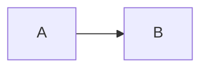

# US-1587: Sanitize Markdown HTML; Mermaid strict mode

**Epic:** [EPIC-118 — Security hardening](../../epics/EPIC-118.md) · finding F1 · **Critical**

## Goal

Markdown content, from any source, must not be able to run script in Persephone's main window.
Raw HTML in Markdown keeps rendering, but only through a tag/attribute/URL allowlist. Mermaid runs
in `strict` mode.

## Background

### The vulnerability (confirmed live 2026-10-01)

A Markdown page with `<script>window.x = typeof require</script>` set `x = "function"`: the script
ran in the main window, which has `nodeIntegration: true` and `contextIsolation: false`
(`src/main/open-window.ts:52-53`). An `<iframe srcdoc="<script>parent…</script>">` reached
`parent.require` the same way. A `href="javascript:…"` survived into the DOM.

Root causes, all in `src/renderer/editors/markdown/`:

- `MarkdownBlockView.ts:346-358` — the pipeline:
  `remarkParse → remarkGfm → remarkRehype({ allowDangerousHtml: true }) → rehypeRaw →
  rehypeMarkdownOverrides → rehypeHeadingIds → [createRehypeHighlight]`. Nothing sanitizes.
- `MarkdownBlockView.ts:124-144` `renderNode` and `:378-388` `renderElement`: every HAST element
  becomes `document.createElement(tagName)` / `createElementNS(svg, tagName)` with no tag check.
  A `<script>` built this way **executes** when the fragment is attached at `:156`.
  (`raw` nodes become text at `:131`, which is safe.)
- `hast-dom.ts:17-19, 121, 140` — the only filter: drop properties whose name starts with `on`.
  URL values (`href`, `src`, `xlink:href`, `action`, `formaction`, `srcdoc`, …) are written as-is
  by `setProperty` (`:75-111`).
- `index.html:7` CSP allows `'unsafe-inline'` and `http:`/`https:` script, so it does not help.
  Tightening it is US-1590, not this task.

### Who renders through this pipeline

All of these build a `MarkdownBlockView`, so one fix covers them all:

- `MarkdownEditor.ts` / `MarkdownBodyView.ts` — `.md` files, `persephone-guide://` pages,
  archive entries, and remote `https://…/x.md`. `resolveHttp` in
  `src/renderer/content/builtin-schemes.ts:136-149,302-330` treats `.md` as a content extension
  and opens it in an editor, not the browser.
- `log-view/items/MarkdownOutputView.ts` — agent-written Log View entries.
- `mcp-inspector/McpInspectorView.ts`, `mcp-inspector/ResourceContentView.ts` — text from remote
  MCP servers.
- `mneme-root/MnemeRootEditorView.ts` — Mneme notes.
- `CodeBlock.ts` renders fenced code through `context.renderElement` / `applyProperties` /
  `toDomProperties`, so it goes through the same sink.

### What the existing pipeline needs to survive sanitizing

- **Code blocks** (`CodeBlock.ts:32-44, 52-54, 64-67`): `className` on `code`/`pre` with
  `language-<id>` (including `language-mermaid`). `toDomProperties` passes every remaining
  property on as rest props to `ColorizedCodeView` (`:70-74`).
- **Task lists** (`rehypeMarkdownOverrides.ts:92-95`): remark-gfm emits
  `<input type="checkbox" checked disabled>`, which the plugin replaces with an inline SVG
  (`svg`/`g`/`rect`/`path`, with `viewBox`, `width`, `height`, `x`, `y`, `rx`, `fill`, `stroke`,
  `strokeWidth`, `d`, `strokeLinecap`, `strokeLinejoin`). It runs **after** the sanitizer, so the
  sanitizer must keep `input[type=checkbox]` with `checked`/`disabled`. The SVG it produces never
  passes through the sanitizer.
- **Links/images** (`rehypeMarkdownOverrides.ts:71-101`): `href` on `a`, `src` on `img`, are
  `decodeURIComponent`-ed and rewritten by `resolveRelatedLink`
  (`src/renderer/core/utils/path-utils.ts:17-47`) or `resolveGuideHref`. That can turn an
  encoded value into a different one (`javascript%3A…` decodes to `javascript:…`), so a URL check
  done only **before** this plugin is not enough. See step 3.
- **Headings** (`rehypeHeadingIds.ts`): adds `id`s after the sanitizer, so heading anchors are
  unaffected. Author-written `id`s (`<a id="x">` targets) must survive for `#x` links
  (`MarkdownBodyView.ts:183-193` → `findAnchorTarget`, `MarkdownBlockView.ts:97-112`).
- **GFM footnotes**: remark-rehype emits `id`/`href` with a `user-content-` prefix plus
  `data-footnotes`, `data-footnote-ref`, `data-footnote-backref`, `aria-describedby`,
  `aria-label`, `className: ["sr-only"]`, and `sup`/`section`/`ol`/`li`. GitHub's schema already
  allows these.
- **Search highlight** (`rehypeHighlight.ts`): adds `span.highlighted-text` after the sanitizer.
- **Images** (`MarkdownImage.ts:30-45, 75-76`): `src` plus rest properties. `data:`/`blob:` are
  shown but not offered for "open".
- **Link clicks**: `MarkdownBodyView.ts:172-216` handles `#…`, local Markdown, and guide links.
  Everything else falls through to the browser default. In the main window that means
  `will-navigate` (`open-window.ts:140-192`: `file:` → open file, `http(s)` and other schemes →
  `eOpenUrl` → `openRawLink`), or `setWindowOpenHandler` for `target=_blank` (`:135-138`).
  **`javascript:` hrefs run in the page and never reach `will-navigate`.** That is why the URL
  filter matters.

### Mermaid

`src/renderer/editors/mermaid/render-mermaid.ts:140-144` initializes Mermaid with
`securityLevel: "loose"`. This affects `MermaidEditor.ts:154,263`, `CodeBlock.ts:130`, and
`log-view/items/MermaidOutputView.ts:83`. The output becomes an `` data URL (safe), but
`mermaid.render` builds the SVG in the live document while measuring. In loose mode it also
allows `click … call fn()` callbacks and HTML labels without sanitizing them.

## Implementation plan

1. **Add the dependency.** `npm install rehype-sanitize@^6` (its `hast-util-sanitize@5` targets
   hast 3 / unified 11, matching `rehype-raw@7` and `remark-rehype@11` in `package.json`).
2. **Create `src/renderer/editors/markdown/markdown-sanitize.ts`.** It owns all policy in one
   place:
   - `markdownSanitizeSchema`: start from `defaultSchema` (GitHub's) in `hast-util-sanitize`,
     re-exported by `rehype-sanitize`, and change it as follows.
     - `clobber: []` and `clobberPrefix: ""`. Author `id`s must keep matching `#fragment` links
       and `findAnchorTarget`. Footnote ids already carry `user-content-` from remark-rehype.
       Drop `name` from every allowed attribute list: `name` on `img`/`a` creates `document`
       named properties, a DOM-clobbering vector in a window with globals.
     - Allow `className` on all elements (`"*": [...defaultSchema.attributes["*"], "className"]`)
       so code blocks keep `language-*` and authors can use classes.
     - Allow the `style` attribute on all elements: user notes use inline colors and sizes.
       Record the accepted UI-redress risk in a comment (`position: fixed` overlays). It cannot
       run script.
     - `protocols`: **remove** the `href`/`src`/`cite`/`longDesc` entries
       (`protocols: {}`). `hast-util-sanitize` takes everything before the first `:` as the
       protocol, so it would read the Windows path `C:\x` as protocol `C` and strip it. It would
       also only see author input, not the values `rehypeMarkdownOverrides` produces. URL policy
       therefore lives in one place: `isSafeMarkdownUrl` at the DOM sink (below).
     - Keep GitHub's tag list (`details`, `summary`, `kbd`, `sup`, `sub`, `img`, `br`, `hr`,
       tables, `div`, `span`, `del`, `ins`, `input[type=checkbox]`, …). Add `figure`,
       `figcaption`, `mark`, `u`, `small`, `abbr`, `center`. These carry no script. Inline
       `<svg>` written by the author is **not** allowed. `` still works.
       `video`, `audio`, `iframe`, `object`, `embed`, `script`, `style`, `link`, `meta`,
       `base`, `form`, `button`, `textarea`, `select`, `template`, `frame`, `frameset`,
       `noscript` are not in the list and get stripped (GitHub's `strip: ["script"]` removes
       script **content** too — keep it, and add `"style"`).
   - `isSafeMarkdownUrl(value: string, kind: "href" | "src"): boolean` — the single URL policy,
     applied to the **final** value at the DOM sink (step 3). First normalize: remove ASCII
     whitespace and control characters (`\u0000-\u0020`, `\u007f`) anywhere in the value. The
     URL parser ignores them, which is how `java\tscript:` slips past naive checks. Then
     `schemeOf` (`src/renderer/content/scheme-registry.ts:49-52`, which requires 2+ characters
     before `:` only by its regex, so check the length explicitly):
     - no scheme (relative path, `#x`, `?q`, `/x`) → allow;
     - a one-letter scheme (Windows drive, `C:\…`, `c:/…`) → allow;
     - `href`: allow only `http`, `https`, `mailto`, `tel`, `file`, `mneme`, `persephone-guide`,
       `persephone-board`;
     - `src`: allow only `http`, `https`, `file`, `mneme`, `blob`, and `data` when the value
       starts with `data:image/`;
     - anything else (`javascript`, `vbscript`, `data` on `href`, unknown schemes) → reject.
   - `BLOCKED_MARKDOWN_TAGS: ReadonlySet<string>` (lowercase): `script`, `iframe`, `frame`,
     `frameset`, `object`, `embed`, `applet`, `base`, `meta`, `link`, `style`, `form`,
     `template`, `noscript`, `portal`, `foreignobject`, `animate`, `set`, `animatemotion`,
     `animatetransform`, `use`. This deny list is the second layer at the DOM sink. Nothing the
     pipeline creates after sanitizing uses these tags (the checkbox SVG uses only
     `svg`/`g`/`rect`/`path`).
3. **Wire the sanitizer and the sink guard.**
   - `MarkdownBlockView.ts:346-355`: insert `.use(rehypeSanitize, markdownSanitizeSchema)`
     **immediately after** `.use(rehypeRaw)`, before `rehypeMarkdownOverrides`.
   - `MarkdownBlockView.ts:124-144` `renderNode`: when `node.tagName.toLowerCase()` is in
     `BLOCKED_MARKDOWN_TAGS`, return `document.createDocumentFragment()`, dropping the element
     and its children. Check before the `code`/`pre`/`img` branches.
   - `MarkdownBlockView.ts:378-388` `renderElement`: the same guard, returning an empty
     `span`, because the signature returns an element. This covers the `CodeBlock.ts:67` path.
   - `hast-dom.ts`: for `href`, `src`, `xlink:href` (`info.attribute` after `find`), skip the
     property when `!isSafeMarkdownUrl(String(value), attribute === "src" ? "src" : "href")`.
     Apply it in **both** `applyHastProperties` (`:114-129`) and `toDomProperties`
     (`:132-151`): the latter feeds `MarkdownImage` and `ColorizedCodeView` rest props. Also
     skip `srcdoc`, `formaction`, and `action` outright. They cannot appear after sanitizing;
     this is defense in depth.
   - Keep the existing `on*` filter.
4. **Mermaid strict.** `render-mermaid.ts:143`: `securityLevel: "strict"`. Update nothing else.
   If any built-in diagram feature visibly breaks in the manual check, record it here rather than
   reverting.
5. **Docs** are done by the completion skills at epic close, not here. Note for `/userdoc`:
   `assets/guides/whats-new.md` 5.0.7 needs a "Security" line saying Markdown no longer runs
   embedded scripts or iframes, and that `<video>`/`<iframe>` embeds are removed.
6. Run `npm run typecheck`, `npm run lint`, `npm run build-prod`.

## Concerns / Open questions

- **Removed embeds (accepted).** `<video>`, `<audio>`, `<iframe>` in Markdown stop rendering.
  The user agreed on 2026-10-01 when the epic was created. `` keeps working, including GIFs.
- **`style` kept (accepted risk).** Inline CSS cannot run script in Chromium, but can draw a
  fixed-position fake UI over the app. Accepted to keep user notes intact. US-1590's CSP work
  does not change this. Revisit only if a concrete abuse appears.
- **`id` without a clobber prefix.** An author `id` becomes a `window` named property only when
  no real global of that name exists. Persephone's globals (`app`, `page`, …) are real
  properties, so an `id` cannot shadow them. Accepted to keep `#anchor` links working.
- **Custom schemes in `href`.** Board-registered schemes (`scheme-registry.ts`) are not in the
  static `protocols` list and will be stripped from Markdown links. If a user relies on one, add
  a dynamic check later. Not needed now.
- **No performance concern.** `hast-util-sanitize` is one tree walk per render, small next to
  parse plus DOM build.

## Acceptance criteria

Open a new Markdown page (`pages.addEditorPage("md-view", "markdown", "probe", …)`) with this
content, run in a **dev build**, and check each line:

```markdown
# Probe
<script>window.__p1 = 1</script>
<iframe srcdoc="<script>parent.__p2 = 1</script>"></iframe>
<object data="x"></object><embed src="x"><base href="https://example.com/">
<a id="js" href="javascript:window.__p3=1">js</a>
<a id="js2" href="JaVaScRiPt&#x3A;window.__p4=1">js2</a>
<a id="enc" href="javascript%3Awindow.__p5=1">enc</a>

<svg><script>window.__p7=1</script></svg>
<details><summary>Details</summary>kept <kbd>Ctrl</kbd> <span style="color:red">red</span></details>
<a id="anchor-target"></a> [to anchor](#anchor-target) · [rel](./other.md) · [web](https://example.com) · [mail](mailto:a@b.c)
- [x] done
- [ ] todo

```js
const a = 1;
```


```

- [ ] `window.__p1` … `__p7` are all `undefined` after render, and after clicking `js`, `js2`
      and `enc`.
- [ ] No `script`, `iframe`, `object`, `embed`, `base` element exists under `.markdown-block`.
- [ ] `#js`, `#js2` have no `href`. `#enc` has no `javascript:` href after rewriting.
- [ ] `details`/`summary`, `kbd`, the red `span`, both task checkboxes (as SVG icons), the
      colorized JS block, and the Mermaid diagram render as before.
- [ ] `[to anchor]` scrolls. `[rel]` opens through the local-Markdown path. `[web]` opens in the
      browser/OS per settings.
- [ ] A Markdown file with a Windows absolute path link (`[x](C:\Windows\win.ini)`) and a
      relative image (``) still resolve as before.
- [ ] Bundled guides (About page → any guide, `persephone-guide://editors/browser`), a footnote
      (`text[^1]` + `[^1]: note`) and a Mneme note render unchanged.
- [ ] Log View markdown entry with the probe's `<script>` line does not run it.
- [ ] `npm run typecheck`, `npm run lint`, `npm run build-prod` pass.

## Progress

- [x] 1. Dependency (`rehype-sanitize@^6.0.0`; installed outside the Codex sandbox, which had no registry access)
- [x] 2. `markdown-sanitize.ts`
- [x] 3. Wire sanitizer + sink guard
- [x] 4. Mermaid strict
- [x] 6. Checks pass (typecheck, lint, build-prod — 2026-10-01)
- [x] Manual acceptance (dev build, 2026-10-01): probe flags `__p1`–`__p8` all unset (an extra
      `java&#x09;script:` case was added); no `script`/`iframe`/`object`/`embed`/`base` left; the four
      script links have no `href`; `details`, `kbd`, styled `span`, anchor target, relative/web/mail/
      Windows-path links, task-list SVGs, colorized code, Mermaid image and footnotes render; the
      `persephone-guide://editors/browser` guide renders with no stripped links. Log View and Mneme
      use the same `MarkdownBlockView` sink and were not probed separately.
